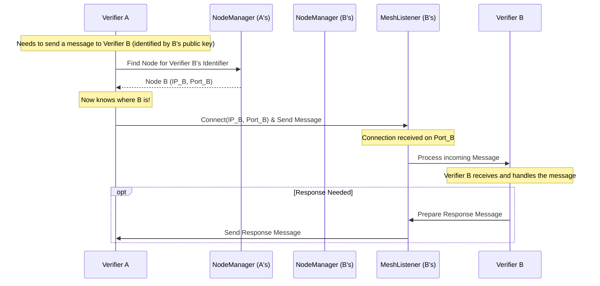

# Chapter 2: Node

In [Chapter 1: Verifier](01_verifier_.md), we met the **Verifiers**, the hard-working accountants of the Nyzo network. We learned that each Verifier has a unique identity (public/private keys) and runs software to maintain the blockchain.

But how do these Verifiers, potentially running on computers all over the world, actually *talk* to each other? If Verifier Alice wants to send a newly created [Block](05_block_.md) to Verifier Bob, how does Alice know *where* Bob is on the internet? This is where the concept of a **Node** comes in.

## What is a Node? The Verifier's Address

Think back to our accountant analogy. A Verifier is like the accountant themselves, identified by their unique license (public key). A **Node** is like the accountant's entry in a shared contact list or address book. It tells everyone how to reach that specific accountant.

A **Node** represents a specific computer on the network that is participating in Nyzo, typically running the Verifier software. It contains the essential information needed to communicate with the Verifier running on that computer:

1.  **Identifier (Public Key):** *Who* is this? This is the public key of the [Verifier](01_verifier_.md) associated with this network address. It's the unique ID we learned about in Chapter 1.
2.  **IP Address:** *Where* is this Verifier located on the internet? This is the standard internet protocol address of the computer (like `192.0.2.1` or `2001:db8::1`).
3.  **Ports (TCP/UDP):** *Which 'door' or 'phone line'* should we use at that address? Computers can run many network services. Ports are numbers (like 9444) that specify which service incoming communication is intended for. Nyzo primarily uses a TCP port (for reliable, ordered messages) and sometimes a UDP port (for faster, but less reliable, messages like votes).

So, a Node is essentially a bundle of information: **Who** (Identifier), **Where** (IP Address), and **How** (Ports).

## The `Node` Class: Storing the Contact Details

In the `nyzoVerifier` code, this information is stored in objects created from the `Node.java` class.

```java
// Simplified snippet from: src/main/java/co/nyzo/verifier/Node.java

public class Node {

    private byte[] identifier; // The Verifier's public key (32 bytes)
    private byte[] ipAddress;  // The computer's IP address (usually 4 bytes for IPv4)
    private int portTcp;       // The TCP port number (e.g., 9444)
    private int portUdp;       // The UDP port number (e.g., 9446)
    // ... other details omitted for simplicity ...

    // Constructor: How to create a new Node object
    public Node(byte[] identifier, byte[] ipAddress, int portTcp, int portUdp) {
        this.identifier = identifier; // Store the Verifier's ID
        this.ipAddress = ipAddress;   // Store the IP address
        this.portTcp = portTcp;       // Store the TCP port
        this.portUdp = portUdp;       // Store the UDP port
        // ... initialize other fields ...
    }

    // Method to get the Verifier's identifier for this Node
    public byte[] getIdentifier() {
        return identifier;
    }

    // Method to get the IP address for this Node
    public byte[] getIpAddress() {
        return ipAddress;
    }

    // Method to get the TCP port for this Node
    public int getPortTcp() {
        return portTcp;
    }
    // ... other methods ...
}
```

This `Node` class is like a template for creating those contact list entries. Each `Node` object holds the `identifier`, `ipAddress`, and `portTcp`/`portUdp` for one specific Verifier running on one specific computer.

## The `NodeManager`: The Network's Address Book

If `Node` objects are the individual entries in the contact list, where is the list itself kept? That's the job of the `NodeManager`.

The **NodeManager** is a component within the `nyzoVerifier` software responsible for keeping track of *all* the other Nodes that this Verifier knows about. Think of it as the master address book or contact list manager.

```java
// Simplified concept from: src/main/java/co/nyzo/verifier/NodeManager.java

public class NodeManager {

    // The main "address book": Maps IP Addresses to Node objects
    // We use the IP address as the key to quickly find the Node info.
    private static final Map<ByteBuffer, Node> ipAddressToNodeMap = new ConcurrentHashMap<>();

    // How a new node might be added or updated in the map
    public static void updateNode(byte[] identifier, byte[] ipAddress, int portTcp, int portUdp, ...) {
        // ... (logic to check if valid, prevent spam, etc.) ...

        ByteBuffer ipBuffer = ByteBuffer.wrap(ipAddress);
        Node newNode = new Node(identifier, ipAddress, portTcp, portUdp);

        // Put the new/updated Node object into our map, using its IP address as the key
        ipAddressToNodeMap.put(ipBuffer, newNode);

        // ... (maybe remove old node if identifier changed for that IP) ...
    }

    // How to get the Node object for a given IP address
    public static Node getNodeForIpAddress(byte[] ipAddress) {
        ByteBuffer ipBuffer = ByteBuffer.wrap(ipAddress);
        return ipAddressToNodeMap.get(ipBuffer); // Retrieve from the map
    }

    // Get a list of all known Nodes (the "mesh")
    public static List<Node> getMesh() {
        return new ArrayList<>(ipAddressToNodeMap.values());
    }

    // ... many other methods for managing nodes, finding active ones, sending join requests etc. ...
}
```

The `NodeManager` uses a data structure (conceptually like `ipAddressToNodeMap`) to store all the `Node` objects it learns about. When a Verifier needs to contact another Verifier, it asks the `NodeManager` for that Verifier's `Node` information (IP and port).

This collection of known Nodes managed by the `NodeManager` forms the **mesh network**. It's not a single central server; each Verifier maintains its own list of peers (other Nodes) it knows about and can communicate with directly.

## How Verifiers Find Each Other

Okay, so Verifiers use Nodes to know where others are, and the `NodeManager` keeps the list. But how does a brand-new Verifier get its first contacts? Or how do Verifiers discover new ones joining the network?

1.  **Trusted Entry Points:** When a Verifier starts up for the first time (like in `Verifier.start()` from Chapter 1), it usually has a small, hard-coded list of "trusted entry point" Nodes. These are stable, well-known Verifiers in the network.
2.  **Mesh Request:** The new Verifier sends a `MeshRequest` [Message](08_message_.md) to one or more of these entry points.
3.  **Mesh Response:** The contacted Node replies with a `MeshResponse` [Message](08_message_.md), which contains a list of *other* `Node` objects that *it* knows about.

```java
// Simplified snippet from: src/main/java/co/nyzo/verifier/messages/MeshResponse.java
public class MeshResponse implements MessageObject {

    private List<Node> mesh; // A list of Node objects

    // Constructor used when creating a response to send
    public MeshResponse(List<Node> mesh) {
        // ... (code to limit the number of nodes sent) ...
        this.mesh = mesh;
    }

    // Method to get the list of Nodes from a received response
    public List<Node> getMesh() {
        return mesh;
    }
    // ... methods to convert to/from bytes for sending over network ...
}
```

4.  **Updating the NodeManager:** The new Verifier takes the list of Nodes from the `MeshResponse` and adds them to its own `NodeManager`.
5.  **Node Join Messages:** Verifiers also periodically send `NodeJoin` messages to Nodes they know about. This serves two purposes:
    *   It tells the other Node "Hey, I'm here at this IP/Port, running with this Identifier." The receiving Node can then update *its* `NodeManager`.
    *   The response (`NodeJoinResponse`) confirms to the sender that the other Node is active and provides its current details.

This process allows Verifiers to gradually discover more and more peers, building up their view of the network mesh.

## Listening for Connections: The `MeshListener`

Just knowing *where* other Verifiers are isn't enough. A Verifier also needs to *listen* for incoming connections and messages on its own IP address and ports. This is the job of the `MeshListener`.

Think of the `MeshListener` as the receptionist at the accountant's office. It sits by the phone (TCP port) and the mailbox (UDP port), waiting for calls or mail.

```java
// Simplified snippet from: src/main/java/co/nyzo/verifier/MeshListener.java

public class MeshListener {

    public static final int standardPortTcp = 9444; // Default TCP port
    // ... other variables ...

    // Starts the TCP listening part
    public static void startSocketThreadTcp() {
        new Thread(() -> { // Run in a background thread
            try {
                // Create a server socket to listen on our designated TCP port
                ServerSocket serverSocketTcp = new ServerSocket(standardPortTcp);
                System.out.println("Listening for TCP connections on port " + standardPortTcp);

                // Loop forever (until program terminates)
                while (true /* !UpdateUtil.shouldTerminate() */) {
                    // Wait for a client (another Verifier) to connect
                    Socket clientSocket = serverSocketTcp.accept();
                    System.out.println("Connection received from: " + clientSocket.getInetAddress());

                    // Handle the connection (read the message, process it, maybe respond)
                    // This is often done in another new thread to handle multiple connections
                    processSocket(clientSocket /*, ... */);
                }
            } catch (Exception e) {
                System.err.println("Error in MeshListener TCP: " + e.getMessage());
                // ... error handling ...
            }
        }).start();
    }

    // Method to handle an incoming connection (simplified)
    private static void processSocket(Socket clientSocket /*, ... */) {
        // 1. Read the incoming Message bytes from the clientSocket
        // 2. Figure out what type of Message it is
        // 3. Perform the action requested by the Message (e.g., store a block, record a vote)
        // 4. Maybe send a response Message back via the clientSocket
        // 5. Close the clientSocket
        // ... (Actual implementation involves Message.readFromStream, MeshListener.response, etc.) ...
    }

    // ... Similar logic exists for UDP listening (startSocketThreadUdp) ...
}
```

The `MeshListener` runs continuously, waiting for other Nodes to connect on the specified TCP port (usually 9444). When a connection arrives, it accepts it and typically passes the handling off to another piece of code (or another thread) to read the incoming [Message](08_message_.md), process it, and potentially send a reply. A similar process happens for UDP messages on the UDP port (usually 9446).

## Visualizing Communication

Here's a simple diagram showing how Verifier A might send a message to Verifier B using the concepts we've discussed:



1.  Verifier A wants to talk to Verifier B. It knows B's `identifier` (public key).
2.  Verifier A asks its `NodeManager` (NMA) to look up the `Node` information for B's identifier.
3.  NMA returns the `Node` object containing B's IP address and TCP Port.
4.  Verifier A uses this IP and Port to establish a connection to Verifier B's `MeshListener` (MLB).
5.  Verifier A sends its [Message](08_message_.md) over the connection.
6.  Verifier B's `MeshListener` receives the connection and message, passing it to Verifier B's main logic for processing.
7.  If needed, Verifier B sends a response back through its `MeshListener` to Verifier A.

## Conclusion

You now understand what a **Node** is in the Nyzo network: it's the network address (IP/Port) and identity (Verifier's public key) of a participant. Nodes are like entries in a contact list.

We saw how the `Node.java` class represents this information and how the `NodeManager` acts as the address book, keeping track of all known Nodes. We also touched upon how Verifiers discover each other (`MeshRequest`/`MeshResponse`, `NodeJoin`) and how the `MeshListener` allows them to receive incoming communications.

Nodes are crucial for enabling the peer-to-peer communication that forms the backbone of the Nyzo blockchain. Without them, Verifiers would be isolated and unable to coordinate.

Now that we know how Verifiers identify themselves ([Verifier](01_verifier_.md)) and how they find each other ([Node](02_node_.md)), let's look at how the network organizes *which* Verifiers are actively working and voting at any given time. This brings us to the concept of the **Cycle**.

Let's proceed to [Chapter 3: CycleInformation / CycleDigest](03_cycleinformation___cycledigest_.md).

---

Generated by [AI Codebase Knowledge Builder](https://github.com/The-Pocket/Tutorial-Codebase-Knowledge)