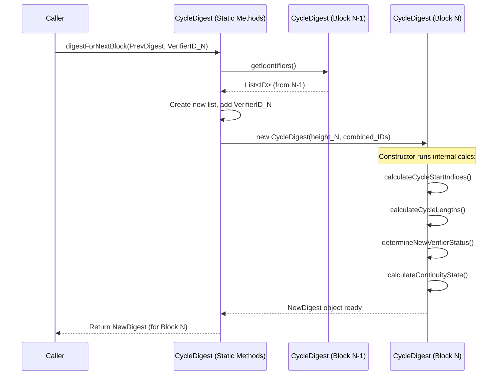

# Chapter 3: CycleInformation / CycleDigest

In [Chapter 1: Verifier](01_verifier_.md), we learned about the Verifiers, the accountants of Nyzo. In [Chapter 2: Node](02_node_.md), we saw how these Verifiers find and talk to each other using network addresses (Nodes).

Now, imagine our group of accountants needs a fair way to decide whose turn it is to add the next page (a [Block](05_block_.md)) to the shared ledger. We can't just let anyone add a page whenever they want; that would be chaos! We need a schedule or a roster. This is where the concept of the **Cycle** comes in.

## Motivation: Who Makes the Next Block?

In Nyzo, not all Verifiers create blocks all the time. There's a specific group of active Verifiers who take turns. This group is called the **Cycle**, and the process of determining this group and their order is fundamental to Nyzo's consensus mechanism, known as **Proof of Diversity**.

Think of it like a rotating duty roster for our accountants. The roster tells us:

1.  **Who is currently on duty?** (Which Verifiers are in the active cycle?)
2.  **How many accountants are on duty?** (What is the length of the cycle?)
3.  **Whose turn is it next?** (Who is expected to create the next block?)
4.  **Is a new accountant joining the rotation?** (Is a new Verifier entering the cycle?)

Knowing this information is crucial for the network to agree on the next valid block. The `CycleInformation` and `CycleDigest` concepts provide this information.

## The Cycle: A Rotating Group of Verifiers

The **Cycle** is the dynamic list of Verifiers that are currently active and responsible for creating and voting on blocks. The size of the cycle changes over time as new Verifiers join and inactive ones potentially leave.

The order within the cycle matters. If Verifier A signed block 100, Verifier B signed block 101, and Verifier C signed block 102, the network expects the Verifier *after* C in the cycle to sign block 103.

## CycleInformation: The Original Calculation

Initially, Nyzo used a concept represented primarily within the [Block](05_block_.md) class itself, often calculated via a method like `calculateCycleInformation`. We'll refer to the result of this calculation conceptually as `CycleInformation`.

```java
// Simplified concept from: src/main/java/co/nyzo/verifier/Block.java

public class Block {
    // ... other fields like height, previousBlockHash, verifierIdentifier ...

    private CycleInformation cycleInformation = null; // Stores the calculated info

    public CycleInformation getCycleInformation(boolean eager) {
        if (cycleInformation == null) {
            calculateCycleInformation(eager); // Calculate if not already done
        }
        return cycleInformation;
    }

    private void calculateCycleInformation(boolean eager) {
        // 1. Start from the current block ('this' block).
        // 2. Look backwards block by block (using getPreviousBlock()).
        // 3. Keep track of the verifier identifiers encountered in reverse order.
        // 4. Stop when you find the *same* verifier identifier repeated.
        //    The sequence of identifiers between the repetitions is one cycle.
        // 5. Continue looking back to find the lengths of the previous few cycles.
        // 6. Determine if the verifier of *this* block was already seen recently
        //    (existing verifier) or if it's the first time in a while (new verifier).
        // 7. Store the cycle lengths and new verifier status in the 'cycleInformation' field.
        // ... complex logic involving Sets and Lists of identifiers ...

        // if calculation successful:
        // cycleInformation = new CycleInformation(height, maxLen, lengths, isNew, isGenesis);
    }

    // ... other methods ...
}
```

**How it worked (conceptually):** To figure out the cycle details for a specific block (say, block 1000), the `calculateCycleInformation` method would trace back through the chain: block 999, 998, 997, and so on. It would record the identifiers of the Verifiers who created each block. When it found an identifier repeating, it knew it had completed one cycle. It did this for several previous cycles to get an idea of the cycle length and stability. It also checked if the verifier of block 1000 was appearing for the first time in this recent history.

**The Problem:** This calculation could be slow, especially on startup or if a node fell behind. It required reading and processing many previous blocks just to determine the cycle state for the current block.

## CycleDigest: The Modern, Efficient Way

To improve efficiency, Nyzo introduced the `CycleDigest`. Think of it as a smart summary or "digest" of the recent cycle history. Instead of recalculating everything from scratch by looking far back into the past, a block's `CycleDigest` can be quickly calculated using just two things:

1.  The `CycleDigest` of the *previous* block.
2.  The identifier of the Verifier who created the *current* block.

This makes determining the cycle status for new blocks much faster. It's like updating the accountant roster by just noting who finished their shift and adding the next person, instead of recounting the entire history of shifts every time.

The `CycleDigest` object stores:

*   The block height it corresponds to.
*   A list of recent Verifier identifiers.
*   Information about where cycles start and end within that list.
*   Calculated lengths of the last few cycles.
*   Whether the latest Verifier is considered "new" to the cycle.
*   Whether the digest calculation is "complete" (goes back far enough).

```java
// Simplified snippet from: src/main/java/co/nyzo/verifier/CycleDigest.java

public class CycleDigest {

    private long blockHeight;
    private List<ByteBuffer> identifiers; // Recent verifier identifiers
    private NewVerifierState[] newVerifierStates; // Tracks new/existing status
    private int[] cycleStartIndices;      // Where cycles start in the list
    private int[] cycleLengths;           // Calculated lengths of recent cycles
    private boolean complete;             // Is the historical data sufficient?
    private ContinuityState continuityState; // Related to consensus rules

    // Constructor used internally when calculating the next digest
    public CycleDigest(long blockHeight, List<ByteBuffer> identifiers) {
        this.blockHeight = blockHeight;
        this.identifiers = identifiers;
        // ... calls internal methods to calculate states, indices, lengths ...
        calculateCycleStartIndicesAndCompleteness();
        calculateCycleLengths();
        // ... determine new verifier status ...
        // ... calculate continuity state ...
    }

    // --- Key method for usage ---
    // Calculates the digest for the *next* block based on the previous one
    public static CycleDigest digestForNextBlock(CycleDigest previousDigest,
                                                 byte[] nextVerifierIdentifier,
                                                 long suggestedBlockHeight) {

        long blockHeight;
        List<ByteBuffer> identifiers;
        if (previousDigest == null) {
            // Special case: Genesis block or starting from scratch
            blockHeight = suggestedBlockHeight; // Usually 0
            identifiers = new ArrayList<>();
        } else {
            // Normal case: Use previous digest's info
            blockHeight = previousDigest.getBlockHeight() + 1L;
            identifiers = new ArrayList<>(previousDigest.getIdentifiers());
        }

        // Add the identifier of the verifier creating the *new* block
        ByteBuffer nextIdentifierBuffer = ByteBuffer.wrap(nextVerifierIdentifier);
        identifiers.add(nextIdentifierBuffer);

        // Create and return the new digest, triggering internal calculations
        return new CycleDigest(blockHeight, identifiers);
    }

    // --- Methods to get information ---
    public int getCycleLength() { return cycleLengths[0]; /* Most recent */ }
    public boolean isNewVerifier() { /* Check state of the last identifier */ }
    public ContinuityState getContinuityState() { return continuityState; }
    public boolean isComplete() { return complete; }
    // ... other getters ...

    // --- Internal calculation helpers (simplified) ---
    private void calculateCycleStartIndicesAndCompleteness() { /* Looks backward in 'identifiers' for repeats */ }
    private void calculateCycleLengths() { /* Uses start indices to find lengths */ }
    private ContinuityState calculateContinuityState() { /* Applies Proof-of-Diversity rules */ }
}
```

**How to Use `CycleDigest`:**

The most common way to interact with this is through the `digestForNextBlock` static method.

*   **Input:**
    *   `previousDigest`: The `CycleDigest` object of the block *before* the one you're interested in (e.g., digest for block 999).
    *   `nextVerifierIdentifier`: The public key (identifier) of the Verifier who created the block you *are* interested in (e.g., Verifier for block 1000).
    *   `suggestedBlockHeight`: Only used if `previousDigest` is null (like for the very first block, Block 0).
*   **Output:** A new `CycleDigest` object calculated for the current block (e.g., digest for block 1000).

Once you have the `CycleDigest` for a block, you can call methods like `getCycleLength()`, `isNewVerifier()`, and `getContinuityState()` to understand the cycle situation at that block height.

## Under the Hood: Calculating the Next Digest

Let's visualize how `digestForNextBlock` leads to a new `CycleDigest`.



**Step-by-step:**

1.  The `digestForNextBlock` method is called with the previous digest and the new verifier's ID.
2.  It gets the list of historical identifiers from the `previousDigest`.
3.  It creates a *new* list, copying the old identifiers and adding the `nextVerifierIdentifier` to the end.
4.  It calls the `CycleDigest` constructor, passing the new block height and the updated identifier list.
5.  The constructor is where the real work happens:
    *   It looks backward through the new identifier list to find where cycles repeat (`calculateCycleStartIndicesAndCompleteness`).
    *   It calculates the lengths of the most recent cycles based on these start points (`calculateCycleLengths`).
    *   It determines if the newest identifier belongs to a "new" verifier based on recent history.
    *   It applies Nyzo's Proof-of-Diversity rules to determine the `ContinuityState`. This checks things like:
        *   **Rule 1:** A new verifier can't join if another new verifier joined too recently.
        *   **Rule 2:** The current cycle length must be sufficiently large compared to previous cycles (preventing cycles from collapsing too quickly).
6.  The fully calculated `NewDigest` object is returned.

## Proof of Diversity and Consensus

The `CycleDigest` (or the older `CycleInformation`) is essential for Nyzo's **Proof of Diversity**. The network uses this information to:

*   **Predict the next verifier:** Based on the current cycle order, nodes can predict who *should* create the next block.
*   **Validate new blocks:** When a block arrives, nodes check if the creator is the expected one according to the cycle.
*   **Enforce rules:** The `ContinuityState` (derived from cycle information) helps enforce rules about new verifiers joining, which is crucial for network security and stability. Blocks with a `Discontinuous` state are generally rejected.
*   **Score blocks:** When multiple blocks are proposed for the same height, the cycle information (like cycle length changes and new verifier status) contributes to a scoring system used in [Consensus (Voting)](07_consensus__voting__.md) to choose the best chain.

## Storage and Management

Because `CycleDigest` is needed frequently, the `nyzoVerifier` software manages it efficiently.

*   **`CycleDigestManager`:** This class handles loading and saving `CycleDigest` objects. It can calculate digests for historical blocks if they are missing.
*   **`CycleDigestFileConsolidator`:** Similar to how blocks are stored, individual `CycleDigest` files can be grouped into larger, consolidated files for efficiency. This process is managed by the consolidator.

These managers ensure that cycle information is readily available without constantly recalculating it from deep history.

## Conclusion

We've learned about the **Cycle**, the rotating group of Verifiers responsible for creating blocks in Nyzo. We explored two ways to understand the cycle:

*   **`CycleInformation`:** The older method, calculated by looking back through block history (less efficient).
*   **`CycleDigest`:** The modern, efficient method that creates a summary of the cycle state, easily updatable from the previous block's digest and the current block's verifier.

The `CycleDigest` provides vital information like cycle length and new verifier status, which is fundamental to Nyzo's **Proof of Diversity** consensus mechanism. It helps determine who should create the next block and validates incoming blocks against the expected cycle order.

Now that we understand how Verifiers are identified ([Verifier](01_verifier_.md)), how they communicate ([Node](02_node_.md)), and how their block creation duties are scheduled (CycleDigest), let's look at the actual data they are putting *into* those blocks.

Let's move on to [Chapter 4: Transaction](04_transaction_.md).

---

Generated by [AI Codebase Knowledge Builder](https://github.com/The-Pocket/Tutorial-Codebase-Knowledge)