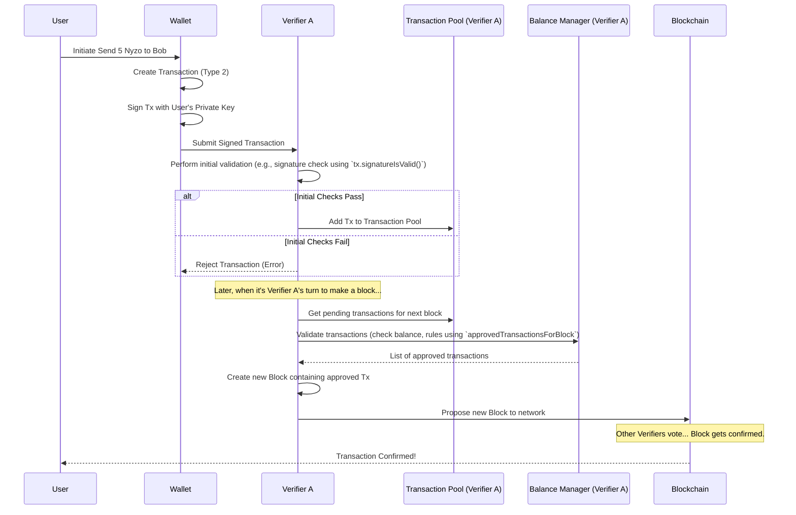

# Chapter 4: Transaction

In the [previous chapter](03_cycleinformation___cycledigest_.md), we learned how the Nyzo network uses the **CycleDigest** to figure out which [Verifier](01_verifier_.md) gets to create the next "page" in the shared ledger. But what exactly gets *written* on those pages?

Think about a traditional bank ledger. Each line records an action, like "Alice paid Bob $10 on Tuesday". In the Nyzo blockchain, the equivalent of these individual ledger lines are called **Transactions**.

## What is a Transaction? An Entry in the Ledger

A **Transaction** represents a single action recorded on the Nyzo blockchain. The most common action is sending Nyzo coins from one account to another, but there are other types too.

Imagine the blockchain as a big, shared notebook (the ledger). Each **Transaction** is like one specific entry written onto a page of that notebook.

Each transaction contains crucial details:

1.  **Sender:** Who initiated the action? (e.g., Alice's account)
2.  **Receiver:** Who is the recipient of the action? (e.g., Bob's account)
3.  **Amount:** How much Nyzo is involved? (e.g., 10 Nyzo coins)
4.  **Timestamp:** When was the transaction created? (e.g., Tuesday at 2:15 PM)
5.  **Type:** What kind of action is this? (e.g., sending standard coins)
6.  **Digital Signature:** A special cryptographic signature from the sender, proving they authorized this transaction. It's like Alice signing the ledger entry with her unique, unforgeable signature.

Nyzo uses different transaction **types** for specific purposes:

*   **Standard (Type 2):** The most common type, used for sending Nyzo between regular user accounts.
*   **Seed (Type 1):** Used historically for the initial distribution of Nyzo coins and potentially for other special system functions.
*   **Cycle (Type 3):** Used by Verifiers involved in the network's [CycleInformation / CycleDigest](03_cycleinformation___cycledigest_.md) mechanism, often related to voting or distributing rewards earned from transaction fees.
*   **Cycle Signature (Type 4):** A specialized transaction used in newer versions of the blockchain for cycle-related voting.
*   **Coin Generation (Type 0):** A unique transaction found only in the very first block (the Genesis block) that created the initial supply of Nyzo.

Before a transaction becomes a permanent part of the blockchain history, it needs to be collected, checked for validity (is the signature correct? does the sender have enough coins?), and then bundled together with other transactions into a [Block](05_block_.md).

## The `Transaction` Class in `nyzoVerifier`

In the `nyzoVerifier` code, the `Transaction.java` file defines how transactions are represented and handled. A `Transaction` object holds all the details we just discussed.

```java
// Simplified structure from: src/main/java/co/nyzo/verifier/Transaction.java

public class Transaction {

    // --- Core Fields ---
    private byte type;                   // 0=CoinGen, 1=Seed, 2=Standard, 3=Cycle, 4=CycleSig
    private long timestamp;              // Milliseconds since Unix epoch
    private long amount;                 // Amount in micronyzos (1 Nyzo = 1,000,000 micronyzos)
    private byte[] receiverIdentifier;   // Public key of the recipient (32 bytes)

    // --- Fields for most types (not CoinGen or CycleSig) ---
    private byte[] senderIdentifier;     // Public key of the sender (32 bytes)
    private byte[] senderData;           // Optional data (up to 32 bytes)
    private long previousHashHeight;     // Block height used for anti-replay
    private byte[] previousBlockHash;    // Hash of that block

    // --- Signature (not CoinGen) ---
    private byte[] signature;            // Sender's digital signature (64 bytes)

    // --- Cycle-specific fields (simplified) ---
    // private Map<ByteBuffer, byte[]> cycleSignatures; // For V1 Cycle Tx
    // private Map<ByteBuffer, Transaction> cycleSignatureTransactions; // For V2 Cycle Tx
    // private byte[] cycleTransactionSignature; // For CycleSig Tx
    // private byte cycleTransactionVote;        // For CycleSig Tx

    // --- Constants ---
    public static final long micronyzoMultiplierRatio = 1000000L; // 1 Nyzo = 1 million microNyzo

    // --- Methods for creating, validating, and serializing transactions ---
    // public static Transaction standardTransaction(...) { ... }
    // public byte[] getBytes(boolean forSigning) { ... }
    // public boolean signatureIsValid() { ... }
    // ... other methods ...
}
```

Let's break down some key parts:

*   **`type`**: A single byte indicating the transaction type (0, 1, 2, 3, or 4).
*   **`timestamp`**: Standard computer timestamp marking when the transaction was created.
*   **`amount`**: The value transferred. Nyzo uses `micronyzos` for precision. `1 Nyzo = 1,000,000 micronyzos`. So, to send 10 Nyzo, the `amount` would be `10 * 1,000,000 = 10,000,000`.
*   **`receiverIdentifier` / `senderIdentifier`**: These are the 32-byte public keys of the accounts involved. They act as the "account numbers".
*   **`signature`**: This 64-byte signature is crucial. It's created using the sender's *private* key (seed) and proves that the owner of the `senderIdentifier` authorized this specific transaction.
*   **`previousBlockHash` / `previousHashHeight`**: These fields link the transaction to a recent block in the blockchain. This helps prevent attackers from replaying old transactions.
*   **`senderData`**: A small field where the sender can include optional extra information, like a memo or reference number (up to 32 bytes).

## Creating a Transaction

How does a user actually create a transaction? They typically use wallet software, which handles the details. Under the hood, the wallet would gather the necessary information and call a method similar to this:

```java
// Simplified Example: Creating a Standard Transaction

// Inputs needed from the user/wallet:
long amountToSend = 5 * Transaction.micronyzoMultiplierRatio; // Send 5 Nyzo
byte[] receiverPublicKey = /* ... Bob's public key ... */;
byte[] senderPrivateKey = /* ... Alice's private seed ... */;
byte[] data = "For lunch".getBytes(StandardCharsets.UTF_8); // Optional memo

// Create the transaction object
Transaction tx = Transaction.standardTransaction(
        System.currentTimeMillis(), // Use current time as timestamp
        amountToSend,
        receiverPublicKey,
        0L, // Previous hash height (often set automatically later)
        null, // Previous block hash (often set automatically later)
        data,
        senderPrivateKey // Wallet uses private key to sign
);

// Now 'tx' holds the complete, signed transaction ready to be sent.
// The tx object automatically calculated:
// - tx.senderIdentifier (from senderPrivateKey)
// - tx.signature (from senderPrivateKey and other tx data)
// - tx.previousBlockHash/Height might be filled in later or use defaults.
```

This simplified example uses `Transaction.standardTransaction(...)`, a "factory" method. The user provides the basic details (amount, receiver, data) and their *private* seed. The method calculates the corresponding public key (`senderIdentifier`) and generates the unique digital `signature` for this specific transaction.

Notice that the `previousBlockHash` details might be handled automatically or use default values initially. The network nodes often ensure this is correctly linked to a recent block.

## Validating Transactions: Keeping Things Honest

Before a transaction is accepted by the network, it must be validated. This is like the bank checking if Alice actually signed the check and if she has enough money in her account.

Verifiers perform several checks:

1.  **Signature Check:** Is the `signature` mathematically valid for the transaction data and the `senderIdentifier` (public key)? This proves the sender authorized it. This is done using `transaction.signatureIsValid()`.
2.  **Funds Check:** Does the `senderIdentifier` account have enough Nyzo to cover the `amount` (plus any transaction fee)? This involves checking the latest [BalanceList](06_balancelist_.md).
3.  **Rule Check:** Does the transaction follow other protocol rules? (e.g., Is the `timestamp` reasonable? Is the `type` valid for the current block? Does it meet anti-spam rules?)

```java
// Simplified check: Verifying the signature
boolean isSignatureGood = tx.signatureIsValid(); // Returns true if signature matches sender and data

// More complex checks happen elsewhere, like in BalanceManager:
// Simplified concept from src/main/java/co/nyzo/verifier/BalanceManager.java
// List<Transaction> approved = BalanceManager.approvedTransactionsForBlock(
//                                     candidateTransactions, // List of potential Txs
//                                     previousBlock,         // The block they'd go into
//                                     true                   // Is this for building a new block?
//                                 );
// This method checks balances, types, timestamps, anti-spam rules, etc.
```

The `BalanceManager.approvedTransactionsForBlock` method is particularly important. When a [Verifier](01_verifier_.md) is building a new [Block](05_block_.md), it uses this method to filter a list of potential transactions, ensuring only valid ones that the senders can afford are included.

## The Journey of a Transaction

Let's follow a transaction from creation to confirmation:



1.  **Creation:** A user uses a wallet to specify the details (receiver, amount).
2.  **Signing:** The wallet uses the user's private seed to sign the transaction.
3.  **Submission:** The wallet sends the signed transaction to a [Verifier](01_verifier_.md) [Node](02_node_.md) in the network.
4.  **Initial Validation:** The receiving Verifier does quick checks (like signature validity).
5.  **Pooling:** If the initial checks pass, the Verifier adds the transaction to its local **Transaction Pool** (`TransactionPool.java`). This is a temporary holding area for transactions waiting to be included in a block.
6.  **Block Inclusion:** When it's the Verifier's turn (based on the [CycleInformation / CycleDigest](03_cycleinformation___cycledigest_.md)), it selects transactions from its pool.
7.  **Final Validation:** The Verifier uses the `BalanceManager` to perform thorough checks, including verifying the sender has sufficient funds according to the latest confirmed [BalanceList](06_balancelist_.md).
8.  **Block Creation:** Valid transactions are bundled into a new [Block](05_block_.md).
9.  **Consensus:** The Verifier proposes the new block to the network. Other Verifiers vote, and if consensus is reached ([Consensus (Voting)](07_consensus__voting__.md)), the block (and the transaction within it) becomes a permanent part of the blockchain.

## Under the Hood: Bytes and Signatures

How does the signature magic work?

*   **Serialization:** To sign or send a transaction, it needs to be converted into a standardized sequence of bytes. The `transaction.getBytes(boolean forSigning)` method does this. The `forSigning=true` version creates the specific byte sequence that is used for signature generation and verification.
*   **Signing:** The `SignatureUtil.signBytes(bytesToSign, privateSeed)` function takes the bytes from `getBytes(true)` and the sender's secret private seed. It performs a mathematical operation (Ed25519 algorithm) to produce the 64-byte `signature`.
*   **Verification:** Anyone can take the transaction's bytes (`getBytes(true)`), the claimed `signature`, and the sender's *public* key (`senderIdentifier`). They use `SignatureUtil.signatureIsValid(signature, bytesToSign, publicKey)` which performs a related mathematical check. It returns `true` only if the signature was correctly generated by the corresponding private key for that exact data.

This ensures that only the owner of the private key can create a valid signature for their transactions, but everyone can verify it using the public key without needing the secret key.

## Conclusion

We've seen that a **Transaction** is the fundamental unit of action on the Nyzo blockchain, much like an entry in a ledger. It details the sender, receiver, amount, timestamp, and type of action, all authorized by the sender's digital signature.

We learned about the different transaction types (Standard, Seed, Cycle) and how transactions are created, validated (checking signatures and balances), pooled, and finally included in blocks by Verifiers. The `Transaction.java`, `TransactionPool.java`, and `BalanceManager.java` files are key players in this process.

Transactions are the "content" of the blockchain. But how are they grouped together and ordered chronologically? That's the job of the next concept we'll explore.

Let's move on to [Chapter 5: Block](05_block_.md) to see how transactions are bundled together to form the pages of the ledger.

---

Generated by [AI Codebase Knowledge Builder](https://github.com/The-Pocket/Tutorial-Codebase-Knowledge)