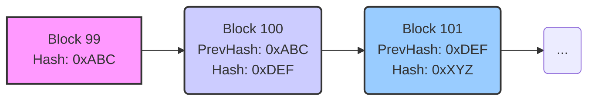

# Chapter 5: Block

In [Chapter 4: Transaction](04_transaction_.md), we learned about **Transactions**, the individual entries in the Nyzo ledger, like sending coins from one account to another. But how do these individual entries become a permanent, ordered part of the shared history? How do we group them together?

Imagine our shared ledger notebook again. You wouldn't just write transactions randomly anywhere! You'd write them neatly on a specific **page**, fill up that page, seal it, and then start a new page that clearly follows the previous one. In Nyzo, these sealed pages are called **Blocks**.

## What is a Block? A Page in the Ledger

A **Block** is the fundamental unit that groups transactions together and links them in chronological order to form the blockchain. Think of it as a single, sealed page in our shared public ledger book.

Each block contains several key pieces of information:

1.  **Block Height:** Like a page number. It tells you the block's position in the sequence (Block 0, Block 1, Block 2, ...).
2.  **List of Transactions:** The actual ledger entries ([Transaction](04_transaction_.md)s) confirmed in this block.
3.  **Previous Block Hash:** A unique "seal" or fingerprint of the *previous* block. This is crucial! It's like a chain linking this page directly to the one before it, ensuring order and preventing tampering.
4.  **Timestamps:** When the block was started and when it was "sealed" (verified).
5.  **Balance List Hash:** A unique fingerprint of the state of all account balances *after* the transactions in this block have been applied. We'll learn more about this in [Chapter 6: BalanceList](06_balancelist_.md).
6.  **Verifier Signature:** The digital signature of the [Verifier](01_verifier_.md) (our accountant) who created and sealed this page. This proves who added the block.

Blocks are added one after another, forming a chain – the **blockchain**. Because each block references the one before it, it's incredibly difficult to change past blocks without breaking the chain, making the history **immutable** (unchangeable).

## The `Block` Class in `nyzoVerifier`

In the code, the `Block.java` file defines how a block is represented. A `Block` object holds all the information for a single block.

```java
// Simplified structure from: src/main/java/co/nyzo/verifier/Block.java

public class Block {

    // --- Key Fields ---
    private int blockchainVersion;       // Version of the rules this block follows
    private long height;                 // The block number (like a page number)
    private byte[] previousBlockHash;    // Hash of the block before this one (32 bytes)
    private long startTimestamp;         // When the block interval started (milliseconds)
    private long verificationTimestamp;  // When the verifier created this block (milliseconds)
    private List<Transaction> transactions; // List of transactions included in this block
    private byte[] balanceListHash;      // Hash of the account balances after this block (32 bytes)

    // --- Verifier Info ---
    private byte[] verifierIdentifier;   // Public key of the verifier who made this block (32 bytes)
    private byte[] verifierSignature;    // Verifier's signature on the block data (64 bytes)

    // --- Constructor (Simplified - how a block object is created) ---
    public Block(int blockchainVersion, long height, byte[] previousBlockHash, /*...other fields...*/
                 List<Transaction> transactions, byte[] balanceListHash,
                 byte[] verifierIdentifier, byte[] verifierSignature) {
        this.blockchainVersion = blockchainVersion;
        this.height = height;
        this.previousBlockHash = previousBlockHash;
        // ... set other fields ...
        this.transactions = transactions;
        this.balanceListHash = balanceListHash;
        this.verifierIdentifier = verifierIdentifier;
        this.verifierSignature = verifierSignature;
    }

    // --- Methods to get information ---
    public long getBlockHeight() { return height; }
    public byte[] getPreviousBlockHash() { return previousBlockHash; }
    public List<Transaction> getTransactions() { return transactions; }
    public byte[] getVerifierIdentifier() { return verifierIdentifier; }
    public byte[] getVerifierSignature() { return verifierSignature; }

    // Method to calculate this block's own unique hash (based on its signature)
    public byte[] getHash() {
        // return HashUtil.doubleSHA256(verifierSignature); // Simplified concept
        return verifierSignature; // In Nyzo, the signature *is* effectively the hash source
    }

    // Method to check if the verifier's signature is valid
    public boolean signatureIsValid() {
        // ... uses verifierIdentifier and block data to check verifierSignature ...
        return true; // Simplified
    }

    // ... other methods related to cycle info, fees, serialization ...
}
```

Let's break down the important fields:

*   `height`: The sequential number of the block, starting from 0 (the "Genesis Block").
*   `previousBlockHash`: The hash (unique fingerprint) of the block that came *before* this one. This links the blocks together. For Block 0, this is all zeros.
*   `transactions`: A list containing all the [Transaction](04_transaction_.md) objects included in this block.
*   `startTimestamp` / `verificationTimestamp`: Timestamps related to the block's creation time.
*   `balanceListHash`: The hash of the [BalanceList](06_balancelist_.md) after processing this block's transactions. It acts as a summary of all account balances at this point in time.
*   `verifierIdentifier`: The public key of the [Verifier](01_verifier_.md) who created the block.
*   `verifierSignature`: The digital signature created by the verifier using their private key. It signs the block's contents (excluding the signature itself), proving its authenticity and integrity.

## How Blocks Are Created

A new block isn't created randomly. A specific [Verifier](01_verifier_.md) gets the responsibility based on the network's schedule, which we learned about in [Chapter 3: CycleInformation / CycleDigest](03_cycleinformation___cycledigest_.md).

When it's a Verifier's turn, it performs these steps (simplified):

1.  **Gather Transactions:** Collects pending, validated [Transaction](04_transaction_.md)s from its Transaction Pool.
2.  **Get Previous Block:** Finds the most recently confirmed block (the current "frozen edge"). Let's say it's Block #99.
3.  **Calculate Balances:** Determines what all account balances will look like *after* processing the gathered transactions. It calculates a unique hash of this balance state (the `balanceListHash`). We'll see more in [Chapter 6: BalanceList](06_balancelist_.md).
4.  **Assemble Block Data:** Puts together the new block's information:
    *   `height`: 100 (since the previous was 99)
    *   `previousBlockHash`: The hash of Block #99.
    *   `transactions`: The list gathered in step 1.
    *   `balanceListHash`: Calculated in step 3.
    *   Timestamps.
    *   `verifierIdentifier`: Its own public key.
5.  **Sign the Block:** Uses its *private key* to create the `verifierSignature` over the assembled block data (excluding the signature field itself). This is like the accountant stamping the page with their unique, secret seal.
6.  **Propose:** Broadcasts the newly created and signed Block #100 to other Verifiers in the network.

```java
// Simplified conceptual logic within Verifier.java when creating a block

// 1. Get necessary info
long currentHeight = BlockManager.getFrozenEdgeHeight(); // e.g., 99
Block previousBlock = BlockManager.frozenBlockForHeight(currentHeight); // Get Block 99
byte[] previousHash = previousBlock.getHash(); // Get hash of Block 99

// 2. Gather and validate transactions (using BalanceManager)
List<Transaction> approvedTransactions = /* ... get valid Txs from pool ... */;

// 3. Calculate the balance list and its hash for the new block (using BalanceManager)
BalanceList newBalanceList = /* ... calculate balances after approvedTransactions ... */;
byte[] newBalanceListHash = newBalanceList.getHash();

// 4. Assemble the main block parts
long newHeight = currentHeight + 1; // 100
long startTime = BlockManager.startTimestampForHeight(newHeight);
int blockVersion = Block.maximumBlockchainVersion; // Use current version

// 5. Create the block object (without signature initially)
Block newBlock = new Block(blockVersion, newHeight, previousHash, startTime,
                           approvedTransactions, newBalanceListHash /*... other args ...*/);

// 6. Sign the block using the Verifier's private key
// This sets the block's verifierIdentifier and verifierSignature fields
newBlock.sign(Verifier.getPrivateSeed()); // Uses private key to create signature

// 7. Broadcast the signed newBlock to the network
// Message.broadcast(new Message(MessageType.NewBlock9, newBlock));
```

This signed `newBlock` object is then sent out for other Verifiers to check and vote on.

## Linking the Pages: The Blockchain

The `previousBlockHash` field is the magic that creates the chain. Each block points firmly to the one before it.



*   Block 100 contains the hash (`0xABC`) of Block 99 in its `previousBlockHash` field.
*   Block 101 contains the hash (`0xDEF`) of Block 100 in its `previousBlockHash` field.
*   And so on...

If someone tried to tamper with Block 99 (e.g., change a transaction amount), its hash (`0xABC`) would change completely. This would break the link, because Block 100 would still be pointing to the *original* `0xABC`. Everyone would immediately see that the chain is broken and reject the tampered version. This makes the blockchain very secure and resistant to modification.

## The Block's Own Hash: The Unique Seal

While `previousBlockHash` links *backward*, each block also gets its *own* unique identifier or seal. In Nyzo, this unique identifier is derived directly from the `verifierSignature`. You can get it using `block.getHash()`. Other verifiers use this hash when they vote on which block should be next.

## Validation and Consensus

When a Verifier receives a new block proposal from another Verifier, it checks several things:

*   Is the `verifierSignature` valid (`block.signatureIsValid()`)?
*   Does the `previousBlockHash` match the hash of the actual preceding block?
*   Are all the `transactions` inside the block valid?
*   Does the `balanceListHash` match what the receiving verifier calculates independently?
*   Does the block follow the cycle rules ([CycleInformation / CycleDigest](03_cycleinformation___cycledigest_.md))?

If everything checks out, the Verifier might vote for this block in the [Consensus (Voting)](07_consensus__voting__.md) process. Once enough Verifiers agree and vote for the same block, it becomes "frozen" – a permanent part of the official blockchain history.

## Storing Blocks

Blocks need to be stored permanently. The `nyzoVerifier` software, using the [BlockManager](09_blockmanager_.md), typically saves blocks in two ways:

1.  **Individual Files:** Initially, a new block might be saved in its own file, named after its height (e.g., `i_000000100.nyzoblock`).
2.  **Consolidated Files:** To save space and improve efficiency, older blocks are grouped together into larger files. For example, blocks 0-999 might be stored in a file like `000/000000.nyzoblock`, blocks 1000-1999 in `000/000001.nyzoblock`, and so on. The `BlockFileConsolidator` component manages this process.

## Conclusion

We've learned that a **Block** is like a sealed page in the Nyzo ledger. It bundles confirmed [Transaction](04_transaction_.md)s, includes timestamps, the creator's signature (`verifierSignature`), and crucially, a link to the previous block (`previousBlockHash`). This linking creates the secure, ordered, and immutable **blockchain**. Understanding blocks is key to seeing how the ledger grows and maintains its integrity.

Inside each block, there's a `balanceListHash`. This hash is a fingerprint representing the state of all account balances *after* that block. How is this state tracked and calculated? That's our next topic.

Let's move on to [Chapter 6: BalanceList](06_balancelist_.md) to explore how the blockchain keeps track of everyone's Nyzo balance.

---

Generated by [AI Codebase Knowledge Builder](https://github.com/The-Pocket/Tutorial-Codebase-Knowledge)