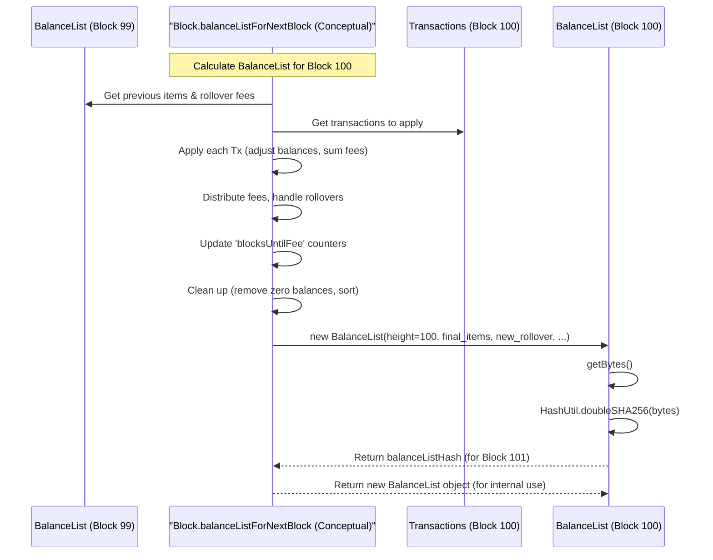

# Chapter 6: BalanceList

In [Chapter 5: Block](05_block_.md), we learned that **Blocks** are like pages in the Nyzo ledger, grouping [Transaction](04_transaction_.md)s together. We also noticed that each block contains a field called `balanceListHash`. What is this hash, and what does it represent?

Imagine our accountants finalizing a page (a block) in the shared ledger. Before starting the next page, they need to agree on the exact balance of *every single account* after accounting for all the transactions on the page they just finished. How do they record and agree on this massive list of balances? This is where the **BalanceList** comes in.

## What is a BalanceList? The Blockchain's Balance Sheet

A **BalanceList** is a complete snapshot of all account balances in the Nyzo network at a specific point in time – namely, right after a [Block](05_block_.md) is finalized. Think of it as the official balance sheet created for the entire network at the conclusion of each block.

Here's what a BalanceList contains:

1.  **Block Height:** The block number this balance sheet corresponds to.
2.  **List of Balances:** A list of every account (identified by its public key or *identifier*) that has a non-zero balance, along with the exact balance amount (in micronyzos).
3.  **Other State Info:** It also includes some other important details needed for calculations, like leftover transaction fees (`rolloverFees`), blockchain version, and information related to cycle transactions (in newer versions).

**Key Properties:**

*   **Complete:** It lists *every* account with a positive balance.
*   **Sorted:** The list of accounts is always sorted by identifier. This ensures that everyone generates the list in the exact same order, which is critical for hashing.
*   **Hashed:** The entire BalanceList (including all account identifiers and balances, sorted consistently) is put through a cryptographic hash function (SHA-256, twice). This produces a unique, fixed-size fingerprint – the `balanceListHash`.

This `balanceListHash` is then included in the *next* block. Why? It acts as a check. When a [Verifier](01_verifier_.md) processes Block 100, it calculates its own version of the BalanceList for height 100. It then calculates the hash of that list. When Block 101 arrives, it contains the *expected* `balanceListHash` for Block 100. If the locally calculated hash matches the hash in Block 101, the Verifier knows it has the same understanding of all account balances as the creator of Block 101. If they don't match, something is wrong!

## The `BalanceList` and `BalanceListItem` Classes

In the `nyzoVerifier` code, the `BalanceList.java` file defines how this snapshot is represented.

```java
// Simplified snippet from: src/main/java/co/nyzo/verifier/BalanceList.java

public class BalanceList implements MessageObject {

    private int blockchainVersion; // Rules version
    private long blockHeight;      // Which block this list corresponds to
    private byte rolloverFees;     // Leftover fees from previous distribution
    // ... other state info like previous verifiers ...
    private List<BalanceListItem> items; // The actual list of account balances

    // Constructor (simplified)
    public BalanceList(int blockchainVersion, long blockHeight, byte rolloverFees, /*...*/
                       List<BalanceListItem> items /*...*/) {
        this.blockchainVersion = blockchainVersion;
        this.blockHeight = blockHeight;
        this.rolloverFees = rolloverFees;
        this.items = normalize(items); // Sorts and removes zero/duplicate entries
        // ... initialize other fields ...
    }

    // Get the list of balance items
    public List<BalanceListItem> getItems() {
        return items;
    }

    // Calculate the unique hash fingerprint of this list
    public byte[] getHash() {
        // 1. Convert the entire BalanceList object to bytes (getBytes())
        // 2. Calculate the double SHA-256 hash of those bytes
        return HashUtil.doubleSHA256(getBytes());
    }

    // Get the balance for a specific account identifier (uses efficient search)
    public long balanceForIdentifier(byte[] identifier) {
        // ... performs a binary search on the sorted 'items' list ...
        long balance = 0L; // Default to zero if not found
        // ... search logic ...
        return balance;
    }

    // Converts the BalanceList object into a standard byte array for hashing or sending
    @Override
    public byte[] getBytes() {
        // ... gathers all fields (height, items, etc.) into a byte buffer ...
        byte[] result = new byte[getByteSize()];
        ByteBuffer buffer = ByteBuffer.wrap(result);
        // ... put height, rolloverFees, items list etc. into buffer ...
        for (BalanceListItem item : items) {
            buffer.put(item.getIdentifier());
            buffer.putLong(item.getBalance());
            buffer.putShort(item.getBlocksUntilFee()); // Include fee counter
        }
        // ... put other version-specific data ...
        return result;
    }

    // Helper method to sort items and remove zero balances/duplicates
    private static List<BalanceListItem> normalize(List<BalanceListItem> balanceItems) {
        // ... sorts by identifier ...
        // ... removes items with balance <= 0 ...
        // ... removes duplicate identifiers ...
        return /* sorted, cleaned list */;
    }
    // ... other methods like fromByteBuffer, toString ...
}
```

The `BalanceList` class holds the overall state. The core data is in the `items` list, which contains `BalanceListItem` objects.

```java
// Simplified snippet from: src/main/java/co/nyzo/verifier/BalanceListItem.java

public class BalanceListItem {

    private byte[] identifier; // Account's public key (32 bytes)
    private long balance;      // Account balance in micronyzos
    private short blocksUntilFee; // Counter for periodic inactivity fees

    // Constructor
    public BalanceListItem(byte[] identifier, long balance, short blocksUntilFee) {
        this.identifier = identifier;
        this.balance = balance;
        this.blocksUntilFee = blocksUntilFee;
    }

    public byte[] getIdentifier() { return identifier; }
    public long getBalance() { return balance; }
    public short getBlocksUntilFee() { return blocksUntilFee; }

    // Helper methods to create new items with adjusted values
    // public BalanceListItem adjustByAmount(long amount) { ... }
    // public BalanceListItem decrementBlocksUntilFee() { ... }
}
```

A `BalanceListItem` simply pairs an account `identifier` with its `balance`. It also keeps track of `blocksUntilFee`, related to a mechanism that charges tiny fees to very small, inactive accounts over long periods (this helps prevent the balance list from growing infinitely large with dust accounts).

## Calculating the Next BalanceList

A new `BalanceList` isn't stored directly in a block; only its hash is. The actual `BalanceList` object for block `N` is calculated by taking the `BalanceList` from block `N-1` and applying all the approved [Transaction](04_transaction_.md)s from block `N`.

This calculation typically happens inside the `Block.java` class, conceptually within a method like `balanceListForNextBlock`.

**Step-by-step Calculation (Simplified):**

1.  **Get Previous State:** Start with the `BalanceList` object from the previous block (e.g., Block 99's list). Get its list of `BalanceListItem`s.
2.  **Get Current Transactions:** Get the list of approved [Transaction](04_transaction_.md)s included in the *current* block (e.g., Block 100).
3.  **Apply Transactions:** For each transaction in Block 100:
    *   Find the sender's `BalanceListItem`. Decrease their `balance` by the transaction `amount`.
    *   Find the receiver's `BalanceListItem`. If the receiver doesn't exist yet, create a new item for them. Increase their `balance` by the `amount` *minus* the transaction fee.
    *   Keep track of the total transaction fees collected in this block.
4.  **Distribute Fees:** Add the collected fees (plus any `rolloverFees` from the previous block) to a fee pool. Distribute these fees among the verifiers who participated in creating recent blocks (details depend on blockchain version). Any small leftover amount becomes the `rolloverFees` for the *next* block.
5.  **Update Fee Counters:** For every `BalanceListItem`, decrement the `blocksUntilFee` counter. If it reaches zero, apply the small inactivity fee (if applicable based on balance and blockchain version) and reset the counter.
6.  **Normalize:** Create the final list of `BalanceListItem`s. Remove any items where the balance has dropped to zero or below. Sort the entire list strictly by identifier.
7.  **Create New List Object:** Create the new `BalanceList` object for Block 100 using the finalized list of items, the new `rolloverFees`, the correct `blockHeight` (100), etc.
8.  **Calculate Hash:** Call the `getHash()` method on the new `BalanceList` object to get the `balanceListHash` for Block 100. This hash will be stored in Block 101.



## Managing BalanceLists: The `BalanceListManager`

Recalculating the BalanceList from scratch for every block would be inefficient, especially if you needed the balance list for an older block. The `BalanceListManager.java` helps manage this.

```java
// Simplified snippet from: src/main/java/co/nyzo/verifier/BalanceListManager.java

public class BalanceListManager {

    // Store a few recent BalanceLists in memory
    private static BalanceList[] recentLists = new BalanceList[4]; // Keep last 4 frozen lists

    // Cache for quick lookup of balances at the frozen edge
    private static Map<ByteBuffer, Long> frozenEdgeBalanceMap = new ConcurrentHashMap<>();

    // A map to potentially cache other calculated BalanceLists by their hash
    private static final Map<ByteBuffer, BalanceList> balanceListMap = new ConcurrentHashMap<>();

    // Called when a new block is frozen (confirmed)
    public static void updateFrozenEdge(BalanceList frozenEdgeList) {
        if (frozenEdgeList != null) {
            // Shift recent lists
            // Store the newest list at index 0
            recentLists[0] = frozenEdgeList;
            // Update the quick lookup map
            frozenEdgeBalanceMap = BalanceManager.makeBalanceMap(frozenEdgeList);
            // Cache the new frozen list by its hash
            balanceListMap.put(ByteBuffer.wrap(frozenEdgeList.getHash()), frozenEdgeList);
            // ... update set of known accounts ...
        }
    }

    // Get the most recent confirmed BalanceList
    public static BalanceList getFrozenEdgeList() {
        return recentLists[0];
    }

    // Get the quick lookup map for current balances
    public static Map<ByteBuffer, Long> getFrozenEdgeBalanceMap() {
        return frozenEdgeBalanceMap;
    }

    // Try to get a specific BalanceList (maybe from cache or recent lists)
    public static BalanceList balanceListForBlock(Block block) {
        // 1. Check if it's one of the 'recentLists'.
        // 2. Check if it's in the 'balanceListMap' cache using block.getBalanceListHash().
        // 3. If not found, may need to calculate it by stepping back from 'block'
        //    until a known BalanceList is found, then applying subsequent blocks' transactions.
        // ... logic to retrieve or calculate ...
        return /* the requested BalanceList or null */;
    }

    // ... other methods like registerBalanceList, accountIsInSystem ...
}
```

The `BalanceListManager` primarily keeps track of the `BalanceList` for the most recently confirmed block (the "frozen edge"). It also maintains `frozenEdgeBalanceMap`, which is just a simple mapping of identifier to balance derived from the frozen edge list. This map is heavily used by `BalanceManager.approvedTransactionsForBlock` (discussed in [Chapter 4: Transaction](04_transaction_.md)) to quickly check if a sender has sufficient funds *before* a transaction is even put into a block proposal.

## Why is the BalanceList Crucial?

1.  **Transaction Validation:** As mentioned, the current balance list (specifically, the `frozenEdgeBalanceMap` derived from it) is essential for validating new transactions. A verifier needs to know if the sender actually has the Nyzo they're trying to send *right now*.
2.  **State Agreement (Consensus):** The `balanceListHash` included in the *next* block is a powerful consensus tool. If Verifiers disagree on even one tiny transaction in Block 100, their calculated BalanceList for height 100 will differ, their `balanceListHash` will differ, and they will not agree on Block 101. This forces the network to agree on the exact state of all accounts after every single block.

## Conclusion

The **BalanceList** is a fundamental concept in Nyzo, representing a complete, sorted, and hashed snapshot of all account balances after a specific block. It's the official balance sheet of the blockchain at that point in time.

We learned how it's calculated by applying a block's transactions to the previous block's BalanceList, how it's represented by the `BalanceList` and `BalanceListItem` classes, and how the `BalanceListManager` helps keep track of recent lists. Most importantly, we saw how the `balanceListHash` acts as a critical tool for ensuring all participants agree on the state of the ledger, which is essential for validating transactions and achieving network consensus.

Now that we understand the core data structures – [Verifier](01_verifier_.md), [Node](02_node_.md), [CycleInformation / CycleDigest](03_cycleinformation___cycledigest_.md), [Transaction](04_transaction_.md), [Block](05_block_.md), and [BalanceList](06_balancelist_.md) – how does the network actually *agree* on which block (and its corresponding BalanceList) is the correct one when multiple Verifiers might propose different blocks around the same time? This brings us to the heart of decentralized systems: consensus.

Let's move on to [Chapter 7: Consensus (Voting)](07_consensus__voting__.md) to understand how Verifiers vote to agree on the single, true history of the blockchain.

---

Generated by [AI Codebase Knowledge Builder](https://github.com/The-Pocket/Tutorial-Codebase-Knowledge)