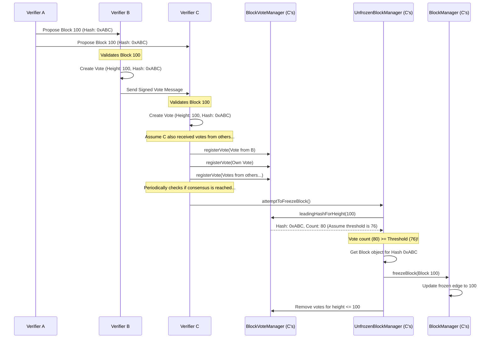

# Chapter 7: Consensus (Voting)

In [Chapter 6: BalanceList](06_balancelist_.md), we saw how each [Block](05_block_.md) contains a hash representing the state of all account balances. This ensures everyone agrees on who owns what *if* they agree on the block itself. But what happens if two honest [Verifier](01_verifier_.md)s create different, but equally valid, blocks at almost the same time for the same block height? Which block becomes the official next page in our ledger?

Imagine our diligent accountants again. Suppose two accountants, Alice and Bob, both finish preparing their version of page 100 for the ledger. Both pages contain valid, signed [Transaction](04_transaction_.md)s, and both correctly link back to page 99. Which page should be added? The network needs a way to **agree** on a single version of history. This process of agreement is called **Consensus**. In Nyzo, consensus is primarily achieved through **Voting**.

## The Problem: Agreeing on the Next Block

The core challenge in any decentralized system like Nyzo is ensuring that all participants (Verifiers) agree on the same history, even though they might receive information in slightly different orders or see different block proposals initially. If Verifiers can't agree on the next block, the blockchain would split into multiple conflicting histories (a "fork"), causing chaos.

Nyzo solves this by having the active Verifiers vote on which block they believe is the correct one for the next block height.

## Voting: Casting a Ballot for a Block

Think of it exactly like an election. When a Verifier (let's say, Charlie) receives a candidate block for height 100 from Alice, Charlie checks if it's valid:
*   Does it correctly point to Block 99?
*   Are the transactions inside valid?
*   Is the [BalanceList](06_balancelist_.md) hash correct?
*   Was it created by the Verifier whose turn it was according to the [CycleInformation / CycleDigest](03_cycleinformation___cycledigest_.md)?

If the block looks good, Charlie creates a **Vote**. This vote isn't just saying "I like Alice's block". It specifically contains:
1.  **Block Height:** The height the vote is for (e.g., 100).
2.  **Block Hash:** The unique hash (fingerprint) of the specific block Charlie is voting for (e.g., the hash of Alice's block).
3.  **Charlie's Signature:** Charlie signs this vote with his private key, proving the vote came from him.

Charlie then broadcasts this signed vote message to other Verifiers he knows via their [Node](02_node_.md)s.

## Supermajority Wins: Ensuring Strong Agreement

Now, every Verifier starts receiving votes from other Verifiers. They collect these votes for each block height.

But how many votes are needed to declare a winner? A simple majority (more than 50%) isn't always safe enough in distributed systems. Nyzo requires a **supermajority** – typically more than 75% (or similar high thresholds) of the active Verifiers in the current cycle – to vote for the *same block hash* for a specific height.

Why >75%? This makes it extremely difficult for a small group of malicious actors to force their own block onto the chain. It ensures very strong agreement among the honest participants before a block is considered final.

When a block receives this supermajority of votes, it becomes **frozen**. This means it's officially confirmed and accepted as the permanent, undisputed next block in the chain.

## Managing the Votes: The Vote Managers

Keeping track of all these votes requires dedicated components. `nyzoVerifier` uses several "Manager" classes for this:

1.  **`BlockVoteManager`:** This is the main manager for handling votes related to block consensus. It receives incoming vote messages, stores them, counts them per block hash, and determines which hash is currently "leading" for a given height.
2.  **`NewVerifierVoteManager`:** This manager handles a separate voting process where existing Verifiers vote on which *new* Verifier should be admitted into the active cycle next.
3.  **`VerifierRemovalManager`:** This manages votes to potentially remove Verifiers from the cycle if they are performing poorly (e.g., not participating in voting or block creation).

While `NewVerifierVoteManager` and `VerifierRemovalManager` are important for the health of the cycle, **`BlockVoteManager` is the core component for deciding the next block**.

Let's look at how `BlockVoteManager` handles an incoming vote.

```java
// Simplified snippet from: src/main/java/co/nyzo/verifier/BlockVoteManager.java

public class BlockVoteManager {

    // Stores votes: Map<BlockHeight, Map<VerifierIdentifier, BlockVote>>
    private static final Map<Long, Map<ByteBuffer, BlockVote>> voteMap = new ConcurrentHashMap<>();

    // Called when a vote message is received
    public static synchronized void registerVote(Message message) {

        if (message != null && message.getContent() instanceof BlockVote) {
            BlockVote vote = (BlockVote) message.getContent();
            long height = vote.getHeight();
            byte[] voterIdentifier = message.getSourceNodeIdentifier();
            ByteBuffer voterIdBuffer = ByteBuffer.wrap(voterIdentifier);

            // 1. Basic Checks: Is the vote for a relevant height?
            long frozenEdgeHeight = BlockManager.getFrozenEdgeHeight();
            if (height >= frozenEdgeHeight && height <= BlockManager.openEdgeHeight(true)) {

                // 2. Check Voter Status: Is the voter in the current cycle?
                // (In Genesis cycle, all votes might be counted)
                if (BlockManager.verifierInCurrentCycle(voterIdBuffer) || BlockManager.inGenesisCycle()) {

                    // 3. Get votes for this specific height
                    Map<ByteBuffer, BlockVote> votesForHeight = voteMap.get(height);
                    if (votesForHeight == null) {
                        votesForHeight = new ConcurrentHashMap<>();
                        voteMap.put(height, votesForHeight);
                    }

                    // 4. Store the vote (handle potential vote changes/flips - simplified here)
                    // Ensures only one vote per verifier per height is counted.
                    // May have logic to allow changing votes under specific conditions.
                    BlockVote existingVote = votesForHeight.get(voterIdBuffer);
                    if (existingVote == null /* || conditionsMetToChangeVote(existingVote, vote) */) {
                        votesForHeight.put(voterIdBuffer, vote);
                        // LogUtil.println("Registered vote from " + voterIdBuffer + " for height " + height);
                    }
                }
            }
        }
    }
    // ... other methods to count votes, find leading hash, etc. ...
}
```

This `registerVote` method does the essential bookkeeping:
*   It checks if the vote is for a height the Verifier cares about (near the current end of the chain).
*   It verifies if the vote comes from a Verifier who is currently part of the active voting group (the cycle).
*   It stores the vote, making sure each Verifier only gets one active vote per block height. (Nyzo has rules about how and when a Verifier can change their vote, involving a "flip vote" mechanism to prevent rapid back-and-forth voting, which is simplified away here).

## Counting Votes and Freezing the Block

How does the system use these stored votes to freeze a block? Another manager, `UnfrozenBlockManager`, often orchestrates this check.

```java
// Simplified concept from: src/main/java/co/nyzo/verifier/UnfrozenBlockManager.java

public class UnfrozenBlockManager {

    // Tries to freeze the block at height = frozenEdge + 1
    public static boolean attemptToFreezeBlock() {

        long frozenEdgeHeight = BlockManager.getFrozenEdgeHeight();
        long heightToFreeze = frozenEdgeHeight + 1;

        // 1. Find the leading hash and its vote count for this height
        AtomicInteger leadingVoteCount = new AtomicInteger(0);
        // BlockVoteManager tells us which hash has the most votes
        byte[] leadingHash = BlockVoteManager.leadingHashForHeight(heightToFreeze, leadingVoteCount);
        int voteCount = leadingVoteCount.get();

        // 2. Determine the required threshold (e.g., >75% of cycle size)
        int cycleSize = BlockManager.currentCycleLength(); // Get number of active verifiers
        int requiredVotes = (cycleSize * 3 / 4) + 1; // Simplified threshold calculation

        // 3. Compare count to threshold
        boolean frozeBlock = false;
        if (leadingHash != null && voteCount >= requiredVotes) {

            // 4. Get the actual block object corresponding to the winning hash
            Block blockToFreeze = /* ... Get Block object with hash 'leadingHash' ... */;

            if (blockToFreeze != null) {
                // 5. Freeze it! Tell BlockManager this block is now confirmed.
                System.out.println("Freezing block " + heightToFreeze + " with hash " + leadingHash);
                BlockManager.freezeBlock(blockToFreeze);
                frozeBlock = true;

                // Clean up old votes and unfrozen blocks below this height
                performMaintenance();
            }
        }

        return frozeBlock;
    }

    // ... other methods like registerBlock, updateVote, performMaintenance ...
}
```

This `attemptToFreezeBlock` function (called periodically in the main Verifier loop):
1.  Asks `BlockVoteManager` which block hash has the most votes for the next height (`heightToFreeze`).
2.  Calculates the supermajority threshold based on the current cycle size.
3.  Checks if the leading hash's vote count meets or exceeds the threshold.
4.  If yes, it retrieves the actual [Block](05_block_.md) object that matches the winning hash.
5.  It tells the [BlockManager](09_blockmanager_.md) to "freeze" this block, making it the official, permanent next block in the chain.
6.  Finally, it cleans up old data related to now-obsolete blocks and votes for lower heights.

## Visualizing the Voting Process

Let's imagine Verifier A creates Block 100. Verifiers B and C receive it.



1.  Verifier A creates Block 100 and sends it to B and C.
2.  B validates it, creates a vote for hash `0xABC` at height 100, signs it, and sends it to C (and others).
3.  C also validates Block 100 and creates its own vote.
4.  C receives votes from B and others, passing them to its `BlockVoteManager` for registration.
5.  Later, C's `UnfrozenBlockManager` checks if consensus has been reached for height 100.
6.  It asks `BlockVoteManager` for the leading hash and count. Let's say `0xABC` has 80 votes, and the threshold is 76.
7.  Since 80 >= 76, `UnfrozenBlockManager` gets the actual Block 100 object.
8.  It calls `BlockManager.freezeBlock(Block 100)`, officially confirming it.
9.  Cleanup occurs, removing old votes and candidate blocks.

## Conclusion

Consensus is the process by which distributed participants agree on a single truth. In Nyzo, this is achieved through **Voting**. Active Verifiers vote for the hash of the block they deem valid for the next height. These votes are collected and tallied, primarily by the `BlockVoteManager`.

When a specific block hash receives a **supermajority** (>75% or similar) of votes from the cycle Verifiers, the `UnfrozenBlockManager` triggers the freezing of that block via the [BlockManager](09_blockmanager_.md). This ensures that the blockchain grows with a single, agreed-upon history, providing security and reliability.

Now that we understand how Verifiers reach agreement, how do they actually exchange these votes, blocks, and other pieces of information over the network? This communication happens through structured messages.

Let's move on to [Chapter 8: Message](08_message_.md) to explore the format and types of messages used for communication between Nyzo Nodes.

---

Generated by [AI Codebase Knowledge Builder](https://github.com/The-Pocket/Tutorial-Codebase-Knowledge)