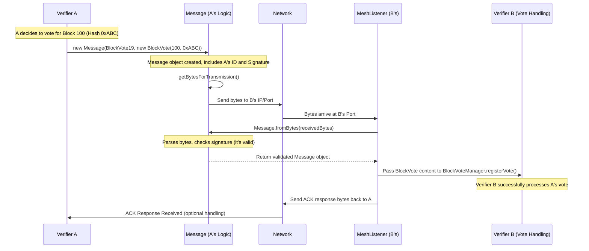

# Chapter 8: Message

In [Chapter 7: Consensus (Voting)](07_consensus__voting__.md), we learned how [Verifier](01_verifier_.md)s vote to agree on the next [Block](05_block_.md) in the chain. But how do these votes, or the proposed blocks themselves, actually travel from one Verifier to another across the internet? If Verifier Alice wants to send her vote to Verifier Bob, what format does she use so Bob can understand it?

This is where **Messages** come in. They are the standard way Verifiers package information to send to each other.

## What is a Message? The Network's Envelope

Think of the Nyzo network as a global office of accountants ([Verifier](01_verifier_.md)s) who need to constantly send official documents (like votes, new ledger pages, requests for information) to each other. They can't just scribble notes on scrap paper; they need a standardized format.

A **Message** in Nyzo is like a pre-printed, official envelope or form used for this communication. It ensures that every piece of information sent between Verifiers has a consistent structure, making it easy for the recipient to understand and process.

Every Message contains these key parts:

1.  **Type:** What kind of information is this? Is it a vote, a new block, a request for data, or something else? This is like checking a box on the form (e.g., "Vote", "New Block Proposal").
2.  **Content:** The actual data being sent. This is the main substance of the form (e.g., the details of the vote, the actual block data).
3.  **Timestamp:** When was this message created? Helps prevent old messages from being replayed.
4.  **Sender Identifier:** Who sent this message? This is the public key of the sending [Verifier](01_verifier_.md).
5.  **Sender Signature:** A digital signature created by the sender using their private key. This proves the message genuinely came from the sender and hasn't been tampered with, like an official, unforgeable wax seal on the envelope.

The [MeshListener](02_node_.md) component we encountered earlier is responsible for receiving these structured Messages when they arrive at a Verifier's [Node](02_node_.md) address.

## The `Message` Class: Defining the Envelope

In the `nyzoVerifier` code, the `Message.java` file defines this standard format. A `Message` object wraps the content being sent with all the necessary header information (type, sender, signature, etc.).

```java
// Simplified structure from: src/main/java/co/nyzo/verifier/Message.java

public class Message {

    private long timestamp;             // When the message was created (milliseconds)
    private MessageType type;           // What kind of message is this? (e.g., BlockVote19)
    private MessageObject content;      // The actual data (e.g., a BlockVote object)
    private byte[] sourceNodeIdentifier;// Sender's public key (32 bytes)
    private byte[] sourceNodeSignature; // Sender's signature (64 bytes)

    // --- Not serialized, but important context ---
    private boolean valid;              // Was the signature verified successfully?
    private byte[] sourceIpAddress;     // IP address the message came from

    // --- Constructor for creating a NEW message to send ---
    public Message(MessageType type, MessageObject content) {
        this.timestamp = System.currentTimeMillis();
        this.type = type;
        this.content = content; // The data payload (e.g., a Block, a Vote)
        this.sourceNodeIdentifier = Verifier.getIdentifier(); // Our public key

        // Sign the message content + headers with our private key
        this.sourceNodeSignature = Verifier.sign(getBytesForSigning());
        this.valid = true; // It's valid because we just created it
    }

    // --- Constructor used when receiving and parsing bytes ---
    public Message(long timestamp, MessageType type, MessageObject content,
                   byte[] sourceNodeIdentifier, byte[] sourceNodeSignature,
                   byte[] sourceIpAddress) {
        // ... assigns all the fields ...
        this.sourceIpAddress = sourceIpAddress;

        // Check if the received signature is valid for the received data & sender ID
        this.valid = SignatureUtil.signatureIsValid(sourceNodeSignature,
                                             getBytesForSigning(), sourceNodeIdentifier);
    }

    // --- Methods to access parts of the message ---
    public MessageType getType() { return type; }
    public MessageObject getContent() { return content; }
    public byte[] getSourceNodeIdentifier() { return sourceNodeIdentifier; }
    public boolean isValid() { return valid; }

    // --- Methods for sending/receiving (simplified concept) ---
    // public byte[] getBytesForTransmission() { ... } // Converts object to bytes for sending
    // public byte[] getBytesForSigning() { ... }    // Converts object to bytes for signing
    // public static Message fromBytes(...) { ... }  // Parses bytes into a Message object
    // public static void fetch(...) { ... }         // Sends a message to a specific node
    // public static void broadcast(...) { ... }     // Sends a message to many nodes
}
```

Key takeaways:
*   When a Verifier *creates* a message, it fills in the `type`, `content`, its own `sourceNodeIdentifier`, and calculates the `sourceNodeSignature` using its private key.
*   When a Verifier *receives* bytes over the network, it uses `Message.fromBytes()` to parse them. This constructor checks if the `sourceNodeSignature` is valid using the sender's `sourceNodeIdentifier` (public key). The `isValid()` method reflects this check.

The actual data (`content`) inside the message must implement the `MessageObject` interface, which essentially means it knows how to convert itself into bytes (`getBytes()`) and report its size (`getByteSize()`). Examples include `Block`, `Transaction`, `BlockVote`, `MeshResponse`, etc.

## Message Types: Different Forms for Different Purposes

Just like an office has different forms for different tasks (vacation requests, expense reports), Nyzo uses different `MessageType`s. The `MessageType.java` file defines these as an `enum` (a list of named constants).

Here are a few examples:

*   `NewBlock9`: Used to announce a newly created [Block](05_block_.md). The `content` would be a `NewBlockMessage` object containing the block itself.
*   `BlockVote19`: Used to send a vote for a specific block hash during [Consensus (Voting)](07_consensus__voting__.md). The `content` would be a `BlockVote` object.
*   `Transaction5`: Used to submit a new [Transaction](04_transaction_.md) to the network. The `content` is the `Transaction` object.
*   `MeshRequest15`: A request sent to another [Node](02_node_.md) asking for a list of other nodes it knows. The `content` is null.
*   `MeshResponse16`: The reply to a `MeshRequest15`, containing a list of `Node` objects. The `content` is a `MeshResponse` object.
*   `StatusRequest17`: Asks a node for its current status information.
*   `StatusResponse18`: The reply containing status details (version, block height, etc.). The `content` is a `StatusResponse` object.

When a Verifier receives a message, the *first* thing it usually does is check the `MessageType` to know how to interpret the `content` and what action to take.

## Sending and Receiving Messages

**Sending:**

To send a message, a Verifier typically uses methods from the `Message` class:

*   `Message.fetch(Node targetNode, Message messageToSend, MessageCallback callback)`: Sends a specific `messageToSend` to a single `targetNode`. It might wait for a response and notify the `callback` when it arrives (or fails).
*   `Message.broadcast(Message messageToSend)`: Sends the message to many active nodes in the network (usually those in or near the current cycle). This is common for things like new blocks or votes that need wide distribution.

```java
// Example: Sending a vote message
BlockVote voteContent = new BlockVote(blockHeight, blockHash); // Create the vote data
Message voteMessage = new Message(MessageType.BlockVote19, voteContent); // Wrap it in a Message

// Send it to everyone important
Message.broadcast(voteMessage);
```

Under the hood, `fetch` and `broadcast` figure out the target [Node](02_node_.md)'s IP address and port. They convert the `Message` object into bytes using `getBytesForTransmission()` and send it over the network (using TCP for reliable delivery or UDP for faster, less reliable delivery for certain message types like votes).

**Receiving:**

As discussed in [Chapter 2: Node](02_node_.md), the `MeshListener` runs constantly, listening for incoming network connections (TCP) and packets (UDP).

```java
// Simplified concept from MeshListener.java

// When a TCP connection arrives...
private static void processSocket(Socket clientSocket /*...*/) {
    // 1. Read the bytes from the socket
    byte[] receivedBytes = /* ... read bytes from clientSocket input stream ... */;

    // 2. Parse the bytes into a Message object
    Message receivedMessage = Message.fromBytes(receivedBytes,
                                      clientSocket.getInetAddress().getAddress(), false); // false=Not UDP

    // 3. Check validity and process based on type
    if (receivedMessage != null && receivedMessage.isValid()) {
        // 'response()' determines action based on receivedMessage.getType()
        Message reply = response(receivedMessage); // Process & generate reply if needed

        // 4. Send reply back if necessary
        if (reply != null) {
            clientSocket.getOutputStream().write(reply.getBytesForTransmission());
        }
    }
    // 5. Close the socket
    ConnectionManager.closeSocket(clientSocket);
}

// The response() method acts like a big switch statement:
private static Message response(Message message) {
    Message reply = null;
    if (message.isValid()) {
        switch (message.getType()) {
            case BlockVote19:
                BlockVoteManager.registerVote(message); // Pass to Vote Manager
                reply = new Message(MessageType.BlockVoteResponse20, null); // Send simple ack
                break;
            case NewBlock9:
                UnfrozenBlockManager.registerBlock(
                    ((NewBlockMessage)message.getContent()).getBlock()
                ); // Pass to Block Manager
                reply = new Message(MessageType.NewBlockResponse10, null); // Send simple ack
                break;
            // ... cases for all other message types ...
            default:
                reply = new Message(MessageType.Error65534, new ErrorMessage("Unknown type"));
        }
    } else {
        reply = new Message(MessageType.Error65534, new ErrorMessage("Invalid signature"));
    }
    return reply;
}
```

1.  The `MeshListener` receives raw bytes.
2.  It uses `Message.fromBytes()` to parse these bytes back into a `Message` object. This automatically verifies the signature.
3.  If the message is valid, it looks at the `message.getType()` and passes the message (or its `content`) to the appropriate manager (like `BlockVoteManager` or `UnfrozenBlockManager`) for processing.
4.  It often sends back a simple acknowledgment response message.

## Under the Hood: From Object to Bytes and Back

How does a complex object like a `Block` or `Message` get turned into a sequence of bytes to send over the network, and then get perfectly reconstructed on the other side? This is called **Serialization** (object to bytes) and **Deserialization** (bytes to object).

**Serialization (`getBytesForTransmission()`):**

When `getBytesForTransmission()` is called on a `Message` object:
1.  It calculates the total size needed for all parts.
2.  It creates a byte array of that size.
3.  It writes each field into the array in a specific, predefined order:
    *   Total message length (4 bytes)
    *   Timestamp (8 bytes)
    *   Message Type (2 bytes)
    *   Content (variable size, uses `content.getBytes()`)
    *   Sender Identifier (32 bytes)
    *   Sender Signature (64 bytes)
4.  The resulting byte array is ready to be sent.

**Signing (`getBytesForSigning()`):**

This is similar, but it produces the specific sequence of bytes that needs to be signed. It includes the timestamp, type, content, and sender identifier, but *excludes* the signature itself and the initial length field. The output of this method is fed into the signing algorithm (`Verifier.sign()`).

**Deserialization (`Message.fromBytes()`):**

When `Message.fromBytes()` receives a byte array:
1.  It reads the fields back in the *exact same order* they were written.
2.  It reads the timestamp, type value (and converts it to `MessageType`), etc.
3.  It reads the sender identifier and signature from the end.
4.  It calculates what the signed portion of the bytes *should* be.
5.  It calls `SignatureUtil.signatureIsValid()` to check if the received signature matches the calculated signed portion and the sender's public key (identifier).
6.  Based on the `MessageType`, it calls the appropriate `fromByteBuffer()` method for the content (e.g., `BlockVote.fromByteBuffer()`, `Block.fromByteBuffer()`) to parse the content bytes.
7.  It creates and returns the fully reconstructed `Message` object, marking it as valid or invalid based on the signature check.

**Sequence Diagram: Sending a Vote**



This shows how the `Message` object acts as the container, gets serialized to bytes for the network, and is deserialized and validated by the receiver before the actual content is processed.

## Conclusion

Messages are the lifeblood of communication in the Nyzo network. They provide a standardized, authenticated format for Verifiers to exchange all kinds of information, from blocks and transactions to votes and network status requests. The `Message` class encapsulates this format, handling serialization, signing, deserialization, and validation. The `MeshListener` receives these messages, and based on their `MessageType`, routes them to the correct internal components for processing.

Understanding Messages helps clarify how different parts of the `nyzoVerifier`, like the voting system and the block propagation mechanism, actually interact over the network.

With messages delivering blocks and votes, how does a verifier keep track of the blockchain itself – storing blocks, finding the latest one, and managing the chain's history? This is the role of the `BlockManager`.

Let's move on to [Chapter 9: BlockManager](09_blockmanager_.md).

---

Generated by [AI Codebase Knowledge Builder](https://github.com/The-Pocket/Tutorial-Codebase-Knowledge)