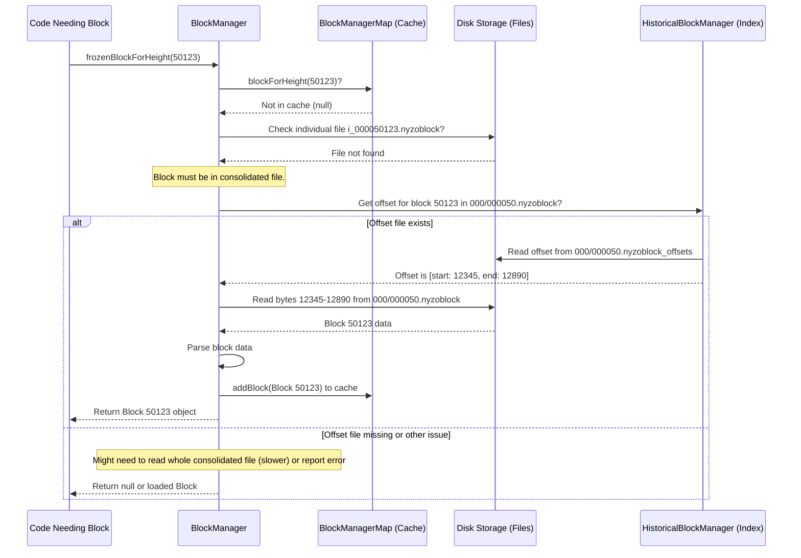

# Chapter 9: BlockManager

In [Chapter 8: Message](08_message_.md), we saw how [Verifier](01_verifier_.md)s use **Messages** to send information like votes and new [Block](05_block_.md)s across the network. Once a Verifier receives a new block (or needs to look up an old one), how does it actually store these blocks and retrieve them later? If you need to find out what happened in Block #50,000, which part of the software knows where to look?

This is the job of the **BlockManager**. Think of it as the master librarian for the entire blockchain ledger. It manages the "books" (blocks), knows where each one is stored, and keeps track of the very latest confirmed page (the "frozen edge").

## What Does the BlockManager Do?

The `BlockManager` is responsible for:

1.  **Storing Blocks:** Saving new blocks received from the network or created by the Verifier itself onto the computer's disk.
2.  **Retrieving Blocks:** Finding and loading specific blocks from the disk when needed (e.g., to check history, calculate cycle information, or serve requests from other nodes).
3.  **Tracking the "Frozen Edge":** Knowing the height (number) and the actual [Block](05_block_.md) object of the most recently confirmed block in the blockchain. This is the official, agreed-upon end of the ledger so far.
4.  **Managing Blockchain State:** Providing information derived from the blockchain history, like the current active [Verifier](01_verifier_.md) cycle list ([CycleInformation / CycleDigest](03_cycleinformation___cycledigest_.md)) or the start time of the very first block (Genesis block).

Essentially, the `BlockManager` ensures that the Verifier has a reliable and accessible copy of the blockchain history stored locally.

## The Frozen Edge: The End of the Known Ledger

A key concept managed by `BlockManager` is the **Frozen Edge**. This refers to the highest block number (height) that has been definitively confirmed by the network through the [Consensus (Voting)](07_consensus__voting__.md) process.

Imagine the blockchain as a growing stack of confirmed ledger pages. The "frozen edge" is simply the very top page of that stack. Any blocks proposed *after* this height are still being voted on ("unfrozen") and aren't yet part of the official history.

The `BlockManager` provides easy access to this information:

```java
// Simplified snippet from: src/main/java/co/nyzo/verifier/BlockManager.java

public class BlockManager {

    private static long frozenEdgeHeight = -1L; // Stores the height number
    private static Block frozenEdge = null;     // Stores the actual Block object

    // Get the height number of the latest confirmed block
    public static long getFrozenEdgeHeight() {
        return frozenEdgeHeight;
    }

    // Get the actual Block object for the latest confirmed block
    public static Block getFrozenEdge() {
        return frozenEdge;
    }

    // ... other fields and methods ...
}
```

*   `getFrozenEdgeHeight()`: Returns the page number (block height) of the latest confirmed block.
*   `getFrozenEdge()`: Returns the actual `Block` object for that latest confirmed page.

This frozen edge is crucial for many operations, like validating new transactions (which need the latest [BalanceList](06_balancelist_.md) derived from this edge) or knowing which block the next one should link back to.

## The Librarian's Shelves: Storing Blocks on Disk

Where does the librarian keep all the ledger books (blocks)? The `BlockManager` saves them to the computer's hard drive in a structured way inside the `nyzo/verifier/blocks` directory.

1.  **Individual Files:** When a new block is confirmed (frozen), it's initially saved in its own separate file in the `blocks/individual/` subdirectory. The filename includes the block height, like `i_000050000.nyzoblock` for Block #50,000. This makes saving new blocks very fast.

    ```java
    // Simplified snippet from: src/main/java/co/nyzo/verifier/BlockManager.java

    // Returns the File object for an individual block file
    public static File individualFileForBlockHeight(long blockHeight) {
        return new File(individualBlockDirectory,
                        String.format("i_%09d.%s", blockHeight, "nyzoblock"));
        // Example: blockHeight 50000 -> .../blocks/individual/i_000050000.nyzoblock
    }

    // When a block is frozen, it's written to its individual file
    // Simplified conceptual call inside freezeBlock():
    // writeBlocksToFile(Collections.singletonList(block), ..., individualFileForBlockHeight(block.getHeight()));
    ```

2.  **Consolidated Files:** Having thousands or millions of tiny individual files can be inefficient. To manage this, a helper component called `BlockFileConsolidator` runs in the background. It periodically takes older individual block files (those far behind the `frozenEdge`) and bundles them together into larger "consolidated" files. These files typically contain 1000 blocks each and are stored in numbered directories.

    ```java
    // Simplified snippet from: src/main/java/co/nyzo/verifier/BlockManager.java

    public static final long blocksPerFile = 1000L; // How many blocks per consolidated file
    public static final long filesPerDirectory = 1000L; // How many consolidated files per sub-directory

    // Returns the File object for a consolidated block file
    public static File consolidatedFileForBlockHeight(long blockHeight) {
        long fileIndex = blockHeight / blocksPerFile; // Which 1000-block chunk
        long directoryIndex = fileIndex / filesPerDirectory; // Which directory chunk
        File directory = new File(blockRootDirectory, String.format("%03d", directoryIndex));
        return new File(directory, String.format("%06d.%s", fileIndex, "nyzoblock"));
        // Example: blockHeight 50123 -> fileIndex 50, directoryIndex 0
        //          -> .../blocks/000/000050.nyzoblock
    }
    ```
    Think of consolidation like taking 1000 loose pages from the "new arrivals" shelf (individual files) and binding them into a single volume (consolidated file) to put on the main shelves. The `BlockFileConsolidator` is like the library assistant doing this binding and organizing.

## Finding a Book: Retrieving Blocks

When the Verifier needs a specific block (e.g., Block #50,123), how does the `BlockManager` find it? It uses a prioritized approach:

1.  **Memory Cache (`BlockManagerMap`):** First, it checks if the block is already loaded in memory. The `BlockManagerMap` acts as a small, fast cache holding recently accessed or important blocks (like those near the frozen edge).

2.  **Individual File:** If not in the cache, it checks if the block's individual file (`i_000050123.nyzoblock`) exists. If so, it loads the block from there.

3.  **Consolidated File:** If neither the cache nor the individual file has the block, it means the block must be in a consolidated file (`000/000050.nyzoblock`). Loading the entire 1000-block file just to get one block can be slow. To speed this up, another helper, the `HistoricalBlockManager`, can build "offset" files (like `000/000050.nyzoblock_offsets`). These act like an index, telling the `BlockManager` exactly where Block #50,123 starts and ends within the large consolidated file, allowing it to read just that specific block quickly.

```java
// Simplified snippet from: src/main/java/co/nyzo/verifier/BlockManager.java

// Main method to get a frozen block
public static Block frozenBlockForHeight(long blockHeight) {
    Block block = null;
    if (blockHeight <= frozenEdgeHeight) { // Only look for confirmed blocks

        // 1. Check memory cache first
        block = BlockManagerMap.blockForHeight(blockHeight);

        // 2. If not in cache, try loading from individual file
        if (block == null) {
            block = loadBlockFromIndividualFile(blockHeight); // Tries individual file first
            // loadBlockFromIndividualFile might internally fall back to consolidated
            // files if the individual one doesn't exist (simplified here).
        }

        // 3. If loaded, maybe add to cache for next time
        if (block != null /* && !BlockManagerMap.contains(blockHeight) */ ) {
            BlockManagerMap.addBlock(block);
        }
    }
    return block;
}

// Tries loading from the individual file (simplified)
private static Block loadBlockFromIndividualFile(long blockHeight) {
    File file = individualFileForBlockHeight(blockHeight);
    if (file.exists()) {
        // ... read block from file ...
        return /* loaded block */;
    } else {
        // If individual doesn't exist, maybe it's consolidated
        // (More complex logic involving HistoricalBlockManager or extracting
        // consolidated files might happen here, simplified)
        return /* block loaded via consolidated mechanism, or null */;
    }
}
```

This function `frozenBlockForHeight` is the main way other parts of the Verifier ask the "librarian" (`BlockManager`) to fetch a specific historical block.

## Waking Up the Librarian: Initialization

When the `nyzoVerifier` software starts up, the `BlockManager` needs to figure out the state of the blockchain from the files stored on disk. This happens in the `initialize()` method.

```java
// Simplified flow from: src/main/java/co/nyzo/verifier/BlockManager.java initialize()

public static void initialize() {
    // Ensure block directories exist
    individualBlockDirectory.mkdirs();

    // 1. Try to load Block 0 (Genesis Block)
    Block genesisBlock = loadBlockFromFile(0L);
    if (genesisBlock != null) {
        System.out.println("Loaded Genesis block.");
        setFrozenEdge(genesisBlock, null); // Tentatively set frozen edge to 0

        // 2. Find the highest block number stored on disk (check individual files)
        long highestStoredHeight = findHighestIndividualFileHeight();

        // 3. Load that highest block to get the actual current frozen edge
        if (highestStoredHeight > getFrozenEdgeHeight()) {
            Block highestBlock = loadBlockFromFile(highestStoredHeight);
            if (highestBlock != null) {
                setFrozenEdge(highestBlock, null); // Update frozen edge
                System.out.println("Loaded highest block: " + highestStoredHeight);
            }
        }

        // 4. Load the BalanceList for the confirmed frozen edge
        BalanceList frozenEdgeBalanceList = loadBalanceListFromFileForHeight(getFrozenEdgeHeight());
        if (frozenEdgeBalanceList != null) {
            BalanceListManager.updateFrozenEdge(frozenEdgeBalanceList);
            System.out.println("Loaded balance list for frozen edge.");
        } else {
            System.err.println("Could not load balance list for frozen edge!");
            // This is a problem, verifier might not function correctly.
        }

        // ... mark initialization complete ...
        completedInitialization.set(true);
    } else {
        System.err.println("Could not load Genesis block!");
        // Cannot proceed without Genesis block.
    }
}
```

The initialization process is vital:
1.  It loads the very first block (Genesis).
2.  It quickly finds the highest block number it has stored locally.
3.  It loads that block to establish the `frozenEdge`.
4.  It loads the corresponding [BalanceList](06_balancelist_.md) so the verifier knows the current state of all accounts.

Without this initialization, the Verifier wouldn't know where the blockchain currently stands.

## The Supporting Cast

The `BlockManager` relies on a few helpers:

*   **`BlockManagerMap`:** An in-memory cache (`Map<Long, Block>`) storing recently used blocks. This avoids constantly reading from the disk for frequently needed blocks near the frozen edge. It automatically removes very old blocks to save memory.
*   **`BlockFileConsolidator`:** A background thread that runs periodically. It finds old individual block files, reads them, combines them with any existing blocks in the corresponding consolidated file, and writes a new, merged consolidated file. It then deletes the old individual files.
*   **`HistoricalBlockManager`:** Another background thread (if enabled) that builds index files (`_offsets`) for consolidated block files. This index allows `BlockManager` to read a specific block from a large consolidated file very quickly without reading the whole file.

**Conceptual Flow for Retrieving a Block:**



## Conclusion

The **BlockManager** is the core component responsible for managing the storage and retrieval of the blockchain's history on a Verifier's disk. It acts like a diligent librarian, knowing where each block (ledger page) is stored, whether in fast individual files or space-saving consolidated files. It keeps track of the crucial `frozenEdge` – the latest confirmed block – and ensures the Verifier can access any historical block when needed. Supported by helpers like `BlockManagerMap`, `BlockFileConsolidator`, and `HistoricalBlockManager`, it provides the foundation for maintaining a local copy of the Nyzo blockchain.

Throughout these chapters, we've seen identifiers for Verifiers, Senders, and Receivers mentioned frequently, often represented as long sequences of bytes. How can we represent these complex identifiers in a way that's easier for humans to read, share, and use without making mistakes?

Let's move on to the final chapter, [Chapter 10: NyzoString](10_nyzostring_.md), to explore how Nyzo tackles this usability challenge.

---

Generated by [AI Codebase Knowledge Builder](https://github.com/The-Pocket/Tutorial-Codebase-Knowledge)