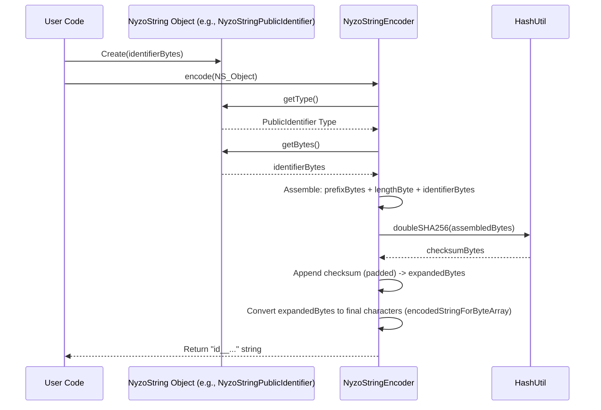
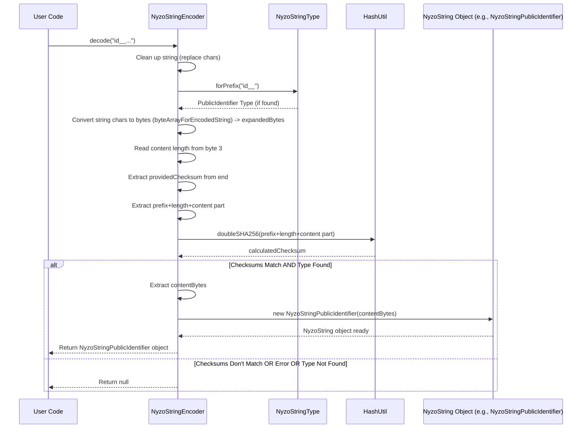

# Chapter 10: NyzoString

Welcome to the final chapter of our core concepts tour! In [Chapter 9: BlockManager](09_blockmanager_.md), we learned how the blockchain's history is stored and managed. Throughout our journey, we've encountered various identifiers – for [Verifier](01_verifier_.md)s, user accounts ([Transaction](04_transaction_.md) senders/receivers), and even secret keys. These are usually long sequences of raw bytes, like `0x8a2b...ef45`.

Imagine trying to tell a friend your Nyzo account ID over the phone, or copy-pasting your secret private key. A single mistake could mean sending funds to the wrong person or losing access to your account forever! Raw data is powerful but prone to human error. How can we make handling this important data safer and easier?

This is where the **NyzoString** comes in.

## What is a NyzoString? A User-Friendly Format for Nyzo Data

Think of a **NyzoString** as a standardized, smart way to write down important Nyzo information like private keys (seeds), public identifiers (account IDs), or even entire [Transaction](04_transaction_.md)s. It's designed to be:

1.  **Human-Readable:** It uses a specific set of characters that are easier to read, type, and share compared to raw hexadecimal or byte arrays.
2.  **Self-Identifying:** Every NyzoString starts with a specific prefix (like `key_` or `id__`) that tells you exactly what *kind* of data it represents.
3.  **Error-Checking:** It has a built-in "checksum" – a hidden mathematical code – that helps detect typos. If you accidentally change a character when typing or copying, software can usually tell that the string is invalid.

It's like having an International Bank Account Number (IBAN). An IBAN is long, but it includes country codes and check digits to reduce errors when transferring money internationally. NyzoStrings provide similar safety for Nyzo data.

## Key Features of a NyzoString

Let's break down the parts of a typical NyzoString:

*   **Prefix:** The first few characters tell you the type of data. This is defined in `NyzoStringType.java`.
    *   `key_`: Represents a private seed (your secret key - keep this safe!).
    *   `id__`: Represents a public identifier (your public account ID - safe to share).
    *   `tx__`: Represents a complete transaction.
    *   `sig_`: Represents a digital signature.
    *   `pre_`: Represents "prefilled data" often used for payment requests.
    *   `pay_`: Represents "micropay" data, a variation for specific payment flows.

    Knowing the prefix instantly tells you what you're dealing with.

*   **Content:** After the prefix (and some internal encoding details), the main data is encoded using a special character set. This set avoids characters that look similar (like 'O' and '0', 'l' and 'I') and uses characters generally safe for URLs (`-`, `.`, `~`, `_`).

*   **Checksum:** Hidden within the encoded string is a checksum calculated from the prefix and the content. When you try to use a NyzoString, the software recalculates this checksum. If the calculated checksum doesn't match the one embedded in the string, it means the string is corrupted or mistyped, and the software will reject it.

## How to Use NyzoStrings: Encoding and Decoding

The magic of converting raw data to a NyzoString (encoding) and back (decoding) is handled by the `NyzoStringEncoder.java` class.

**Encoding: From Raw Data to NyzoString**

Let's say you have a raw 32-byte public identifier (your account ID) and you want the safe, shareable NyzoString version.

```java
// Assume 'myRawIdentifier' is your 32-byte public key
byte[] myRawIdentifier = /* ... your 32-byte identifier ... */;

// 1. Wrap the raw data in the appropriate NyzoString object type
NyzoStringPublicIdentifier idStringObject = new NyzoStringPublicIdentifier(myRawIdentifier);

// 2. Use the encoder to get the string
String encodedId = NyzoStringEncoder.encode(idStringObject);

// Output: 'encodedId' will look something like "id__8a2b..."
System.out.println("My Nyzo ID: " + encodedId);
```

1.  First, you wrap your raw `byte[]` data in an object representing its type (here, `NyzoStringPublicIdentifier`). Other types include `NyzoStringPrivateSeed`, `NyzoStringTransaction`, etc. These wrapper classes implement the `NyzoString` interface.
2.  Then, you pass this object to `NyzoStringEncoder.encode()`. It handles adding the prefix (`id__`), calculating the checksum, and converting everything into the special character format.

The result is a human-friendly string you can confidently share.

**Decoding: From NyzoString Back to Raw Data**

Now, imagine someone gives you their NyzoString ID (`id__...`), and you need the raw 32-byte identifier to use it in a transaction.

```java
String receivedNyzoStringId = "id__8a2bCDefGHiJkLmNoPqRsTuVwXyZ0123456789aBcDeFgHiJkLmNoPqRsTuV"; // Example

// 1. Use the decoder to parse the string
NyzoString decodedObject = NyzoStringEncoder.decode(receivedNyzoStringId);

// 2. Check if decoding was successful and get the raw bytes
byte[] rawIdentifier = null;
if (decodedObject instanceof NyzoStringPublicIdentifier) {
    rawIdentifier = ((NyzoStringPublicIdentifier) decodedObject).getIdentifier();
    // Now you can use 'rawIdentifier' (the 32-byte array)
    System.out.println("Successfully decoded ID!");
} else {
    // Decoding failed (checksum error, invalid prefix, etc.) or wrong type
    System.out.println("Invalid or unrecognized NyzoString ID.");
}
```

1.  You pass the received string to `NyzoStringEncoder.decode()`. This method automatically checks the prefix, validates the checksum, and converts the characters back to the underlying bytes.
2.  If the string is valid and the checksum matches, `decode()` returns the corresponding `NyzoString` object (like `NyzoStringPublicIdentifier`). If the string is invalid (e.g., mistyped), it returns `null`.
3.  You should always check if the result is not `null` and if it's the type you expected (e.g., `instanceof NyzoStringPublicIdentifier`) before trying to get the raw bytes using methods like `getIdentifier()` or `getSeed()`.

This automatic checking makes NyzoStrings much safer to handle than raw data.

## Under the Hood: The Encoding Process

How does `NyzoStringEncoder.encode()` turn raw bytes into that special string?

**Step-by-step:**

1.  **Get Prefix Bytes:** It looks up the prefix for the type (e.g., `id__` becomes specific bytes).
2.  **Get Content Bytes:** It gets the raw data from the input object (e.g., the 32-byte identifier).
3.  **Assemble Header+Content:** It creates a temporary byte sequence: `[Prefix Bytes (3)] [Content Length (1 byte)] [Content Bytes (...)]`.
4.  **Calculate Checksum:** It calculates a secure hash (double SHA-256) of the `Header+Content` sequence created in step 3.
5.  **Append Checksum:** It takes the first 4-6 bytes of the hash (enough to make the total length divisible by 3) and appends them to the `Header+Content` sequence. This forms the complete "expanded byte array".
6.  **Character Encoding:** It converts this entire expanded byte array into the final NyzoString characters using a base-64-like encoding scheme (`encodedStringForByteArray`) designed for readability and URL safety.

**Sequence Diagram:**



The core logic is in `NyzoStringEncoder.java`, using `NyzoStringType.java` for prefixes and `HashUtil.java` for the checksum calculation.

```java
// Simplified snippet from NyzoStringEncoder.encode()

public static String encode(NyzoString stringObject) {
    // 1. Get prefix and content bytes
    byte[] prefixBytes = stringObject.getType().getPrefixBytes(); // e.g., bytes for "id__"
    byte[] contentBytes = stringObject.getBytes(); // e.g., the 32-byte ID

    // 2. Determine lengths
    int checksumLength = 4 + (3 - (contentBytes.length + 2) % 3) % 3; // 4-6 bytes
    int expandedLength = headerLength + contentBytes.length + checksumLength; // Total bytes needed

    // 3. Assemble header and content
    byte[] expandedArray = new byte[expandedLength];
    ByteBuffer expandedBuffer = ByteBuffer.wrap(expandedArray);
    expandedBuffer.put(prefixBytes); // First 3 bytes
    expandedBuffer.put((byte) contentBytes.length); // 4th byte = content length
    expandedBuffer.put(contentBytes); // Put the actual data

    // 4. Calculate checksum of the header+content part
    byte[] checksum = HashUtil.doubleSHA256(Arrays.copyOf(expandedArray, 4 + contentBytes.length));

    // 5. Append checksum
    expandedBuffer.put(checksum, 0, checksumLength);

    // 6. Convert the full expandedArray to the final character string
    return encodedStringForByteArray(expandedArray);
}
```

## Under the Hood: The Decoding Process

How does `NyzoStringEncoder.decode()` turn a string back into verified, raw data?

**Step-by-step:**

1.  **Cleanup:** Replace potentially mistyped or old characters (`l`->`I`, `O`->`0`, `*`->`-`, etc.).
2.  **Identify Type:** Read the first 4 characters (the prefix) and look up the `NyzoStringType` (e.g., `id__` -> `PublicIdentifier`). If the prefix is unknown, fail.
3.  **Character Decoding:** Convert the input string's characters back into the "expanded byte array" using `byteArrayForEncodedString`.
4.  **Read Length & Checksum:** Read the content length from byte 3 of the expanded array. Extract the checksum bytes from the end of the array.
5.  **Verify Checksum:**
    *   Take the `Header+Content` part (everything *before* the checksum) from the expanded array.
    *   Calculate the hash (double SHA-256) of this part.
    *   Compare the first 4-6 bytes of the calculated hash with the checksum extracted in step 4. If they don't match, fail (the string is invalid/corrupted).
6.  **Extract Content:** If the checksums matched, extract the `Content Bytes` from the middle of the expanded array.
7.  **Create Object:** Create the appropriate `NyzoString` object (e.g., `new NyzoStringPublicIdentifier(contentBytes)`).
8.  **Return:** Return the created object (or `null` if any step failed).

**Sequence Diagram:**



The `decode` method carefully reverses the encoding process, with the critical checksum validation step ensuring data integrity.

```java
// Simplified snippet from NyzoStringEncoder.decode()

public static NyzoString decode(String encodedString) {
    NyzoString result = null;
    try {
        // 1. Cleanup string
        encodedString = encodedString.replace('l', 'I').replace('O', '0'); // And others

        // 2. Identify type from prefix
        NyzoStringType type = NyzoStringType.forPrefix(encodedString.substring(0, 4));
        if (type != null) {
            // 3. Convert characters back to bytes
            byte[] expandedArray = byteArrayForEncodedString(encodedString);

            // 4. Read length and checksum details
            int contentLength = expandedArray[3] & 0xff;
            int checksumLength = expandedArray.length - contentLength - 4; // Expect 4-6

            if (checksumLength >= 4 && checksumLength <= 6) {
                // 5. Verify checksum
                byte[] calculatedChecksum = Arrays.copyOf(HashUtil.doubleSHA256(
                        Arrays.copyOf(expandedArray, headerLength + contentLength)), checksumLength);
                byte[] providedChecksum = Arrays.copyOfRange(expandedArray,
                        expandedArray.length - checksumLength, expandedArray.length);

                if (ByteUtil.arraysAreEqual(calculatedChecksum, providedChecksum)) {
                    // Checksums match!
                    // 6. Extract content
                    byte[] contentBytes = Arrays.copyOfRange(expandedArray, headerLength,
                                                expandedArray.length - checksumLength);

                    // 7. Create the specific NyzoString object based on 'type'
                    switch (type) {
                        case PublicIdentifier:
                            result = new NyzoStringPublicIdentifier(contentBytes);
                            break;
                        case PrivateSeed:
                            result = new NyzoStringPrivateSeed(contentBytes);
                            break;
                        // ... other cases ...
                    }
                }
            }
        }
    } catch (Exception ignored) { /* Return null on any error */ }

    // 8. Return the object or null
    return result;
}
```

## Conclusion

NyzoStrings are a vital part of making Nyzo user-friendly and secure. By providing a standardized format with clear type prefixes (`key_`, `id__`, etc.) and built-in checksums for error detection, they make it much safer for humans to handle sensitive information like private keys and public identifiers. The `NyzoStringEncoder` class provides the tools to easily convert between raw byte data and these robust, human-readable strings.

This concludes our exploration of the fundamental concepts within the `nyzoVerifier` project. We hope this journey through Verifiers, Nodes, Cycles, Transactions, Blocks, BalanceLists, Consensus, Messages, the BlockManager, and NyzoStrings has given you a solid understanding of how the Nyzo blockchain operates at its core.

---

Generated by [AI Codebase Knowledge Builder](https://github.com/The-Pocket/Tutorial-Codebase-Knowledge)