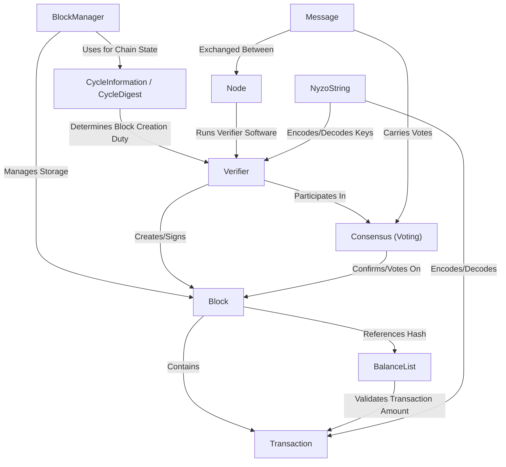

# Tutorial: nyzoVerifier

The `nyzoVerifier` project is software that helps maintain the *Nyzo blockchain*. It acts like a digital accountant, working with others on the network.
Its main job is to check (**validate**) new *transactions* (like sending Nyzo coins), group them into **blocks** (like pages in a ledger), and agree with other accountants (**consensus**) on the correct order of these blocks to build the secure, shared history of the blockchain.

**Source Repository:** [None](None)

## Chapters

1. [Verifier
](01_verifier_.md)
2. [Node
](02_node_.md)
3. [CycleInformation / CycleDigest
](03_cycleinformation___cycledigest_.md)
4. [Transaction
](04_transaction_.md)
5. [Block
](05_block_.md)
6. [BalanceList
](06_balancelist_.md)
7. [Consensus (Voting)
](07_consensus__voting__.md)
8. [Message
](08_message_.md)
9. [BlockManager
](09_blockmanager_.md)
10. [NyzoString
](10_nyzostring_.md)

---

Generated by [AI Codebase Knowledge Builder](https://github.com/The-Pocket/Tutorial-Codebase-Knowledge)