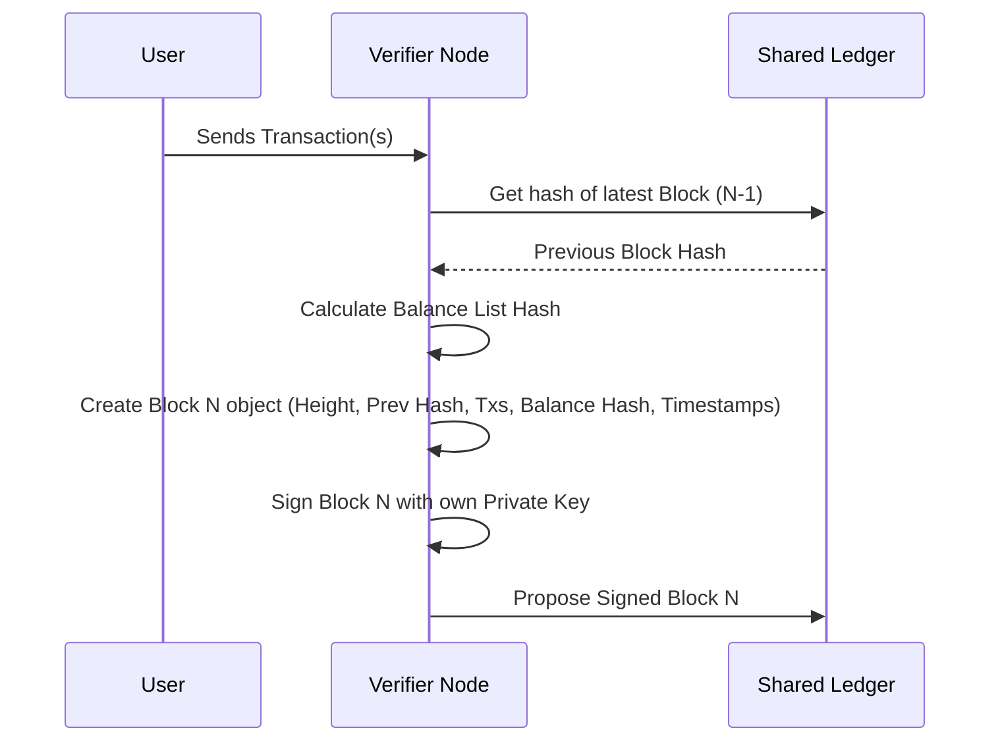

# Chapter 1: Block

Welcome to the Nyzo Verifier tutorial! We're going to explore the core building blocks (pun intended!) of the Nyzo blockchain system. Let's start with the most fundamental concept: the `Block`.

Imagine the entire history of Nyzo transactions like a giant, shared, public ledger book that everyone in the network agrees on. This ledger book is called the **blockchain**.

So, what's a `Block`?

Think of a `Block` as a single page in that ledger book.

## Why Do We Need Blocks?

The main goal of a blockchain is to keep a trustworthy and ordered record of everything that happens, especially transactions (like sending Nyzo coins). If we just had a random pile of transactions, it would be chaotic!

Blocks solve this by:

1.  **Grouping:** They bundle transactions together in batches.
2.  **Ordering:** Each block points back to the *previous* block, creating a specific sequence, like pages in a book.
3.  **Securing:** Each block is "signed" or verified by a trusted party ([Verifier](13_verifier_.md)), making it hard to tamper with past records.

Our use case is simple: How does the Nyzo network record a batch of transactions in a way that everyone can agree on and trust, ensuring they are added in the correct order? The answer is: by putting them into a `Block`!

## What's Inside a Block (Page)?

Just like a page in our ledger book analogy, a Nyzo `Block` contains specific pieces of information:

1.  **Transactions:** The main content! This is a list of the actual transaction records (like "Alice sent 10 Nyzo to Bob"). We'll learn more about these in the [Transaction](02_transaction_.md) chapter.
2.  **Previous Block Hash (`previousBlockHash`):** This is like writing "This page follows page X" at the top. It's a unique digital fingerprint (a "hash") of the *previous* block in the chain. This is what links the pages together sequentially. The very first block (the "Genesis block") has a special previous block hash because nothing came before it.
3.  **Verifier Info (`verifierIdentifier`, `verifierSignature`):** Remember the auditor who signs off on each page? That's the [Verifier](13_verifier_.md). The block stores the Verifier's unique ID (`verifierIdentifier`) and their digital signature (`verifierSignature`). This signature proves the verifier approved this block and its contents.
4.  **Height:** This is simply the page number. The first block is height 0, the next is height 1, and so on.
5.  **Timestamps (`startTimestamp`, `verificationTimestamp`):** These record roughly when the block's time period started and precisely when the verifier signed it.
6.  **Balance List Hash (`balanceListHash`):** This is a bit more advanced. Think of it as a quick summary (another digital fingerprint or "hash") of *everyone's account balances* *after* all the transactions in this block have been processed. It's a clever way to ensure everyone agrees on the account balances without listing every single one in the block itself. We'll touch on this more in the [BalanceList](03_balancelist_.md) chapter.

```mermaid
graph TD
    subgraph BlockN [Page N]
        direction LR
        HeightN[Height: N]
        PrevHashN[Prev Hash: fingerprint(Block N-1)]
        TimestampN[Timestamp]
        VerifierN[Verifier Signature]
        BalanceHashN[Balance List Hash]
        TxListN[Transactions List: Tx1, Tx2, ...]
    end

    subgraph BlockN1 [Page N-1]
        direction LR
        HeightN1[Height: N-1]
        PrevHashN1[Prev Hash: fingerprint(Block N-2)]
        TimestampN1[Timestamp]
        VerifierN1[Verifier Signature]
        BalanceHashN1[Balance List Hash]
        TxListN1[Transactions List: ...]
    end

    BlockN -- PrevHashN points to --> BlockN1
```

## How Blocks are Created (Simplified)

1.  A [Verifier](13_verifier_.md) node gathers new [Transaction](02_transaction_.md)s that users have sent.
2.  It gets the hash (fingerprint) of the most recent block already added to the chain. This will be the `previousBlockHash` for the new block.
3.  It calculates the `balanceListHash` based on what everyone's account balance will be after these new transactions.
4.  It bundles the transactions, previous hash, balance hash, current timestamp, and its own ID into a new `Block`.
5.  It digitally signs the whole package using its private key, creating the `verifierSignature`.
6.  This newly signed `Block` is then proposed to the rest of the network.

## Using a Block in Code (Conceptual)

Let's look at how a `Block` object might be represented. The actual code involves details we don't need right now, but conceptually, creating a block involves providing its core components.

```java
// --- File: src/main/java/co/nyzo/verifier/Block.java ---

// Simplified view of creating a Block instance
// (Real constructors have more parameters and logic)

public class Block implements MessageObject {

    private long height;
    private byte[] previousBlockHash;
    private List<Transaction> transactions;
    private byte[] balanceListHash;
    private byte[] verifierIdentifier;
    private byte[] verifierSignature;
    // ... other fields like timestamps, version ...

    // A simplified constructor idea
    public Block(long height, byte[] previousHash, List<Transaction> txs,
                 byte[] balanceHash, byte[] verifierId, byte[] signature) {

        this.height = height;
        this.previousBlockHash = previousHash;
        this.transactions = txs; // Usually a copy is made
        this.balanceListHash = balanceHash;
        this.verifierIdentifier = verifierId;
        this.verifierSignature = signature;
        // ... set timestamps etc. ...
    }

    // Method to get the block's height (page number)
    public long getBlockHeight() {
        return height;
    }

    // Method to get the transactions included in this block
    public List<Transaction> getTransactions() {
        return transactions; // Returns the list
    }

    // Method to get the block's unique fingerprint (hash of its signature)
    public byte[] getHash() {
        // Calculates a SHA-256 hash of the verifierSignature
        return HashUtil.doubleSHA256(verifierSignature);
    }

    // ... other methods ...
}
```

**Explanation:**

*   We create a `Block` object by passing in essential information like the height, the previous block's hash, the list of transactions, the balance list hash, and the verifier's details.
*   Once we have a `Block` object, we can easily ask for its `height`, the `transactions` it contains, or its own unique hash (`getHash()`).

## Under the Hood: Block Creation and Validation

Let's visualize the flow when a new block is made:



Now, let's peek at some relevant code snippets from `src/main/java/co/nyzo/verifier/Block.java`.

**1. Creating and Signing a Block:**

When a verifier creates a block, it uses a constructor and then signs it (or the signing happens within the constructor).

```java
// --- File: src/main/java/co/nyzo/verifier/Block.java ---

// Simplified constructor showing key assignments and signing
public Block(int blockchainVersion, long height, byte[] previousBlockHash,
             long startTimestamp, List<Transaction> transactions,
             byte[] balanceListHash) {

    this.blockchainVersion = blockchainVersion; // Nyzo blockchain version
    this.height = height;                       // The block number
    this.previousBlockHash = previousBlockHash; // Link to previous block
    this.startTimestamp = startTimestamp;       // Time period start
    this.transactions = new ArrayList<>(transactions); // Store the transactions
    this.balanceListHash = balanceListHash;     // Summary of balances

    // Get the verifier's ID and sign the block's data
    try {
        this.verifierIdentifier = Verifier.getIdentifier(); // Who is signing?
        // Sign all the data *except* the signature itself
        this.verifierSignature = Verifier.sign(getBytes(false));
    } catch (Exception e) {
        // Handle cases where signing fails (e.g., key missing)
        this.verifierIdentifier = new byte[32]; // Placeholder ID
        this.verifierSignature = new byte[64];  // Placeholder signature
    }

    this.verificationTimestamp = System.currentTimeMillis(); // When was it signed?
}
```

**Explanation:**

*   The constructor takes the necessary pieces of information.
*   It stores the height, previous hash, transactions, and balance hash.
*   Crucially, it calls `Verifier.sign()` on the block's data (excluding the signature field itself). This creates the digital signature using the verifier's private key and stores it in `verifierSignature`.

**2. Getting the Block's Own Hash:**

Each block needs a unique identifier. In Nyzo, this is the hash of the *verifier's signature* for that block.

```java
// --- File: src/main/java/co/nyzo/verifier/Block.java ---

// Method to calculate the block's unique hash
public byte[] getHash() {
    // It's a double SHA-256 hash of the signature field
    return HashUtil.doubleSHA256(verifierSignature);
}
```

**Explanation:**

*   This method takes the `verifierSignature` (which was created by signing the rest of the block's data) and calculates its hash.
*   This resulting hash serves as the unique identifier for *this specific block*. It's also what the *next* block will use as its `previousBlockHash`.

**3. Checking the Signature:**

How does someone else know the block is legitimate and hasn't been tampered with? They check the signature.

```java
// --- File: src/main/java/co/nyzo/verifier/Block.java ---

// Method to check if the signature is valid
public boolean signatureIsValid() {

    // Check if we already determined the validity
    if (signatureState == SignatureState.Undetermined) {
        // Use a utility function to verify the signature
        // It checks if the 'verifierSignature' matches the block data
        // using the 'verifierIdentifier' (which implies the public key)
        signatureState = SignatureUtil.signatureIsValid(verifierSignature,
                                                        getBytes(false), // Block data without signature
                                                        verifierIdentifier)
                         ? SignatureState.Valid : SignatureState.Invalid;
    }

    // Return true if it was valid
    return signatureState == SignatureState.Valid;
}
```

**Explanation:**

*   This method uses a cryptographic function (`SignatureUtil.signatureIsValid`).
*   It takes the block's data (everything *except* the signature), the signature itself (`verifierSignature`), and the verifier's ID (`verifierIdentifier`).
*   Using the verifier's public key (derived from the ID), it checks if the signature correctly corresponds to the block data.
*   If it matches, the signature is valid, meaning the identified verifier signed this specific data, and it hasn't been changed since.

These components – grouping transactions, linking via `previousBlockHash`, and securing with a `verifierSignature` – are what make the blockchain a reliable and tamper-resistant ledger. The [BlockManager](06_blockmanager_.md) is responsible for handling blocks once they are created and verified.

## Conclusion

We've learned that a `Block` is like a signed, numbered page in the Nyzo blockchain ledger. It bundles [Transaction](02_transaction_.md)s, links to the previous page using `previousBlockHash`, and is verified by a [Verifier](13_verifier_.md)'s signature. This structure creates a secure, ordered history of events on the network.

Now that we understand the container (the `Block`), let's look inside at the most important content: the actual entries on the page.

Next up: [Chapter 2: Transaction](02_transaction_.md)

---

Generated by [AI Codebase Knowledge Builder](https://github.com/The-Pocket/Tutorial-Codebase-Knowledge)
