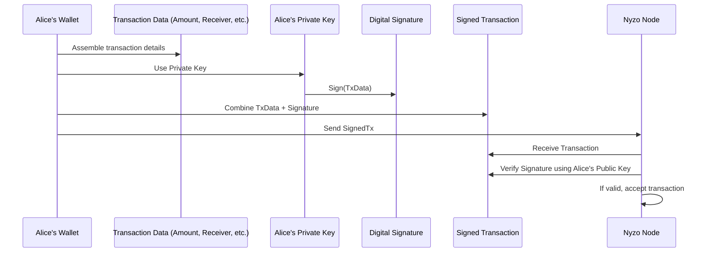

# Chapter 2: Transaction

In [Chapter 1: Block](01_block_.md), we learned that a `Block` is like a page in Nyzo's big public ledger book. Now, let's zoom in on the most important entries written on those pages: `Transaction`s.

Imagine you want to send some Nyzo coins to your friend. How does the Nyzo network keep a record of that specific action? That's where `Transaction` comes in.

## What is a Transaction?

Think of a `Transaction` as a single line item in the ledger book (a `Block`). It's the fundamental record of value moving from one Nyzo account to another.

Our simple use case: Alice wants to send 10 Nyzo coins to Bob. How does the Nyzo network officially record this so everyone can agree it happened and Bob's balance increases while Alice's decreases? The answer: by creating a `Transaction`!

## What's Inside a Transaction?

Just like a check you might write, a Nyzo `Transaction` needs specific details to be valid:

1.  **Sender (`senderIdentifier`):** The account address sending the coins (Alice's address).
2.  **Receiver (`receiverIdentifier`):** The account address receiving the coins (Bob's address).
3.  **Amount:** How many Nyzo coins (or fractions, called *micronyzos*) are being sent (10 Nyzo).
4.  **Timestamp:** When the transaction was created. This helps order transactions within a block.
5.  **Sender Signature (`signature`):** This is crucial! It's a digital signature created using the sender's private key. Only the owner of the sending account can create this signature, proving they authorized the transaction. It's like Alice signing her check.
6.  **Previous Block Hash (`previousBlockHash`, `previousHashHeight`):** To prevent certain attacks, transactions also refer back to a recent block hash that the sender knows about.
7.  **Sender Data (`senderData`):** An optional small field (up to 32 bytes) where the sender can include a short message or note, like a memo on a check.
8.  **Type:** Nyzo has different transaction types for different purposes. The most common is `typeStandard` (like our Alice-to-Bob example). Others include:
    *   `typeCoinGeneration`: Used only in the very first block (Genesis block) to create the initial coins.
    *   `typeSeed`: Used for distributing initial coins early in Nyzo's history.
    *   `typeCycle` / `typeCycleSignature`: More advanced types related to how the network's core functions (like the verifier cycle) operate. We'll focus on `typeStandard` for now.

```mermaid
graph TD
    subgraph Transaction (Alice sends 10 Nyzo to Bob)
        direction LR
        Type[Type: Standard]
        Timestamp[Timestamp: e.g., Now]
        Amount[Amount: 10 Nyzo]
        Receiver[Receiver: Bob's Address]
        Sender[Sender: Alice's Address]
        PrevHash[Prev Block Hash Ref]
        SenderData[Sender Data: (Optional) "For lunch"]
        Signature[Signature: Alice's Digital Signature]
    end
```

## How Transactions are Created (Simplified)

1.  **Intent:** Alice decides to send 10 Nyzo to Bob using her wallet software.
2.  **Gather Info:** The software collects the necessary details: Alice's address, Bob's address, the amount (10 Nyzo), the current time, a recent block hash, and any optional sender data.
3.  **Signing:** This is the magic step. Alice's wallet software takes all the transaction details (except the signature field itself) and uses Alice's *private key* to generate a unique digital `signature`.
4.  **Assemble:** The software bundles all the information, including the newly generated `signature`, into a `Transaction` object.
5.  **Broadcast:** The wallet sends this signed `Transaction` out to the Nyzo network.

## Using a Transaction in Code (Conceptual)

Let's imagine how Alice's wallet might create this transaction.

```java
// --- Simplified view of creating a standard Transaction ---

// Inputs needed:
byte[] alicesPrivateKey; // Alice's secret key
byte[] bobsAddress;      // Bob's public address
long amountToSend = 10 * Transaction.micronyzoMultiplierRatio; // Amount in micronyzos
long timestamp = System.currentTimeMillis(); // Current time
byte[] optionalData = "For lunch".getBytes(); // Optional memo

// Wallet needs to find a recent block hash
long prevHashHeight = BlockManager.getFrozenEdgeHeight();
byte[] prevBlockHash = BlockManager.frozenBlockForHeight(prevHashHeight).getHash();

// Create the transaction object (this also signs it internally)
Transaction aliceToBob = Transaction.standardTransaction(
    timestamp,
    amountToSend,
    bobsAddress,
    prevHashHeight,     // Reference to a recent block height
    prevBlockHash,      // The hash of that recent block
    optionalData,       // The memo
    alicesPrivateKey    // Alice's private key is used to sign
);

// Now 'aliceToBob' holds the complete, signed transaction
// ready to be sent to the network.
System.out.println("Created Transaction: " + aliceToBob);
```

**Explanation:**

*   We provide the core details: when, how much, who to, and any memo.
*   Crucially, we provide Alice's `privateKey`. The `standardTransaction` method uses this key to generate the `signature` internally.
*   We also need a reference (`prevHashHeight`, `prevBlockHash`) to a recent known block.
*   The result is a `Transaction` object containing all these details plus the vital digital signature.

## Under the Hood: Signing and Verification

How does the signature prove Alice sent it, and how do others check it?



**1. Signing (Creating the Transaction):**

The `standardTransaction` factory method handles this.

```java
// --- File: src/main/java/co/nyzo/verifier/Transaction.java ---

// Simplified standardTransaction factory method
public static Transaction standardTransaction(long timestamp, long amount, byte[] receiverIdentifier,
                                              long previousHashHeight, byte[] previousBlockHash,
                                              byte[] senderData, byte[] signerSeed) { // signerSeed is derived from private key

    Transaction transaction = new Transaction();
    transaction.type = typeStandard;
    transaction.timestamp = timestamp;
    transaction.amount = amount;
    transaction.receiverIdentifier = receiverIdentifier;
    transaction.previousHashHeight = previousHashHeight;
    transaction.previousBlockHash = previousBlockHash;
    transaction.senderIdentifier = KeyUtil.identifierForSeed(signerSeed); // Get sender's public ID
    transaction.senderData = senderData; // Store the memo/data

    // Sign the transaction data (everything EXCEPT the signature itself)
    // using the private key (signerSeed)
    transaction.signature = SignatureUtil.signBytes(
        transaction.getBytes(true), // Get bytes of data to be signed
        signerSeed                  // The private key material
    );

    return transaction;
}
```

**Explanation:**

*   It sets up all the fields of the `Transaction`.
*   It calls `transaction.getBytes(true)` which gathers all the important transaction data *except* the signature field itself into a sequence of bytes. The `true` means "for signing".
*   It then calls `SignatureUtil.signBytes` which performs the cryptographic signing operation using the sender's private key (`signerSeed`) on that data.
*   The resulting digital `signature` is stored in the transaction object.

**2. Getting Bytes for Signing:**

What exactly gets signed?

```java
// --- File: src/main/java/co/nyzo/verifier/Transaction.java ---

// Simplified version of getBytes(forSigning=true)
public byte[] getBytes(boolean forSigning) {
    // Calculate size needed...
    byte[] array = new byte[getByteSize(forSigning)];
    ByteBuffer buffer = ByteBuffer.wrap(array);

    buffer.put(type);
    buffer.putLong(timestamp);
    buffer.putLong(amount);
    buffer.put(receiverIdentifier);

    if (forSigning) {
        // For signing, we use the actual previous block hash
        buffer.put(getPreviousBlockHash());
    } else {
        // For storage/sending, we use the height
        // buffer.putLong(getPreviousHashHeight());
    }
    buffer.put(senderIdentifier);

    if (forSigning) {
        // For signing, we use a HASH of the sender data
        buffer.put(HashUtil.doubleSHA256(senderData));
    } else {
        // For storage/sending, we include the actual data
        // buffer.put((byte) senderData.length);
        // buffer.put(senderData);
    }

    // ** Crucially, the signature field itself is NOT included when forSigning=true **

    return array;
}
```

**Explanation:**

*   When `forSigning` is `true`, this method carefully arranges the transaction's core data into a specific byte sequence.
*   Notice that the `signature` field itself is *not* part of this sequence. You sign the *message*, not the signature of the message!
*   Also, for signing, a hash of the `senderData` is used, not the raw data.

**3. Verifying the Signature:**

How does someone else (like a [Verifier](13_verifier_.md)) check if Alice's transaction is legitimate?

```java
// --- File: src/main/java/co/nyzo/verifier/Transaction.java ---

// Method to check if the transaction's signature is valid
public boolean signatureIsValid() {
    // Avoid re-calculating if already checked
    if (signatureState == SignatureState.Undetermined) {
        // Check standard/seed/cycle/cycle-signature transactions
        if (type == typeSeed || type == typeStandard || type == typeCycle || type == typeCycleSignature) {
            // Use a utility to verify:
            // Does the 'signature' match the 'transaction data' (getBytes(true))
            // when checked against the 'senderIdentifier' (Alice's public key)?
            signatureState = SignatureUtil.signatureIsValid(
                                signature,           // The signature stored in the transaction
                                getBytes(true),      // The data that was supposedly signed
                                senderIdentifier     // The public key of the sender
                             ) ? SignatureState.Valid : SignatureState.Invalid;
        } else {
             // Coin generation transactions don't have signatures in the same way
             signatureState = SignatureState.Valid; // Or handle appropriately
        }
    }
    return signatureState == SignatureState.Valid;
}
```

**Explanation:**

*   This method uses `SignatureUtil.signatureIsValid`.
*   It takes the `signature` from the transaction, the transaction data that *should* have been signed (`getBytes(true)`), and the sender's public key (`senderIdentifier`).
*   Cryptography allows it to check if the signature could *only* have been produced by someone holding the private key corresponding to the `senderIdentifier`, for that *exact* transaction data.
*   If it matches, the signature is valid! The network knows Alice (or someone with her private key) authorized this exact transaction, and it hasn't been tampered with since she signed it.

These signed transactions are the core records. They are collected by [Verifier](13_verifier_.md) nodes and eventually bundled into a [Block](01_block_.md) to be permanently added to the blockchain ledger. The network uses components like the `TransactionPool` (not a separate chapter, but related code exists) to temporarily hold transactions submitted by users before they get included in a block by a verifier. How balances are actually updated based on these transactions is handled by the [BalanceList](03_balancelist_.md) and [BalanceManager](04_balancemanager_.md).

## Conclusion

We've learned that a `Transaction` is a digitally signed record detailing the transfer of Nyzo coins. It contains the sender, receiver, amount, timestamp, and the crucial sender's signature which proves authenticity. Different types exist, but the standard transaction is the most common for user-to-user payments. These transactions are the fundamental "entries" that fill the "pages" ([Block](01_block_.md)s) of the Nyzo ledger.

Now that we know how individual transfers are recorded, how does the network keep track of everyone's overall account balance after many transactions?

Next up: [Chapter 3: BalanceList](03_balancelist_.md)

---

Generated by [AI Codebase Knowledge Builder](https://github.com/The-Pocket/Tutorial-Codebase-Knowledge)