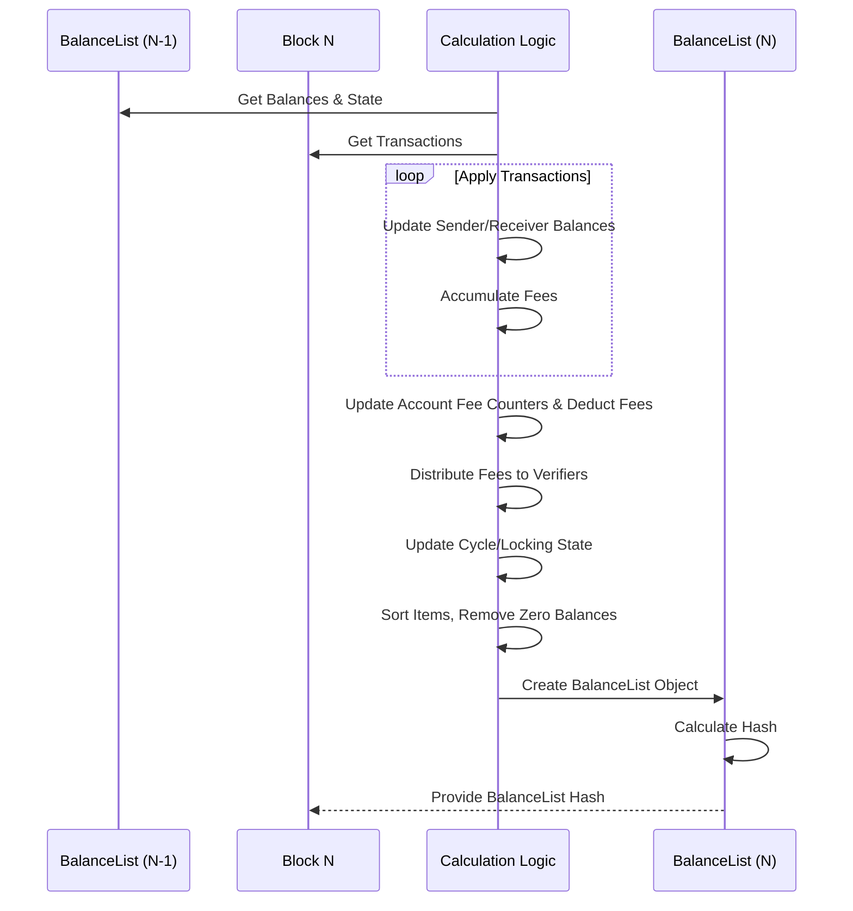

# Chapter 3: BalanceList

In [Chapter 1: Block](01_block_.md), we saw that each `Block` (like a page in our ledger book) contains a `balanceListHash` – a fingerprint representing the state of all accounts *after* that block. In [Chapter 2: Transaction](02_transaction_.md), we learned how individual transfers are recorded.

Now, let's figure out what that `balanceListHash` actually points to. How does the Nyzo network maintain a complete, consistent picture of *everyone's* account balance and other important details at the end of each block?

Imagine you've just processed all the transactions on page 100 of the ledger. You need a definitive summary sheet that shows:
*   Alice's final balance
*   Bob's final balance
*   ... everyone else's final balance
*   Any updates to special network rules (like locked accounts or cycle transactions)

This summary sheet needs to be exactly the same for everyone looking at page 100. How do we create and agree on this sheet? The answer is the `BalanceList`!

## What is a BalanceList?

Think of a `BalanceList` as that official **summary sheet** attached to each [Block](01_block_.md). It provides a complete snapshot of the entire blockchain's state *after* all the [Transaction](02_transaction_.md)s in that specific block have been applied.

It doesn't just list account balances; it also includes other critical information needed to keep the network running smoothly. Most importantly, everyone who processes the block should arrive at the *exact same* `BalanceList`.

## Why Do We Need BalanceLists?

1.  **Consensus:** The main goal is agreement. By calculating the `BalanceList` for a block, every node in the network can verify they have reached the *same state*. The `balanceListHash` in the [Block](01_block_.md) acts as a checksum – if your calculated `BalanceList` produces the same hash, you know you're in sync with the verifier who created the block.
2.  **Efficiency:** Instead of replaying all transactions from the beginning every time you want to know a balance, the `BalanceList` gives you the state at a specific block height. To find the state at the *next* block, you only need the *previous* block's `BalanceList` and the *new* block's [Transaction](02_transaction_.md)s.
3.  **State Tracking:** It tracks not just coin balances but also other evolving network parameters vital for validation and governance.

## What's Inside a BalanceList?

A `BalanceList` object contains several key pieces of information that define the blockchain's state at a particular moment:

1.  **Block Height (`blockHeight`):** The page number this summary sheet corresponds to. Tells you exactly which [Block](01_block_.md) this state snapshot follows.
2.  **Items (`items`):** This is the core list! It contains a `BalanceListItem` for every account that has a *positive* balance. Each `BalanceListItem` includes:
    *   `identifier`: The account's public address.
    *   `balance`: The account's balance in micronyzos.
    *   `blocksUntilFee`: A counter tracking when the next small account maintenance fee is due (we'll touch on fees later).
    *   **Important:** This list (`items`) is always kept **sorted** by account identifier. This ensures the list is always in the same order for everyone, which is crucial for calculating a consistent hash. Accounts with zero balance are removed to keep the list tidy.
3.  **Rollover Fees (`rolloverFees`):** Sometimes, transaction fees don't divide perfectly among verifiers. This tiny leftover amount (usually 0 to a few micronyzos) is carried over to be distributed in the next block.
4.  **Previous Verifiers (`previousVerifiers`):** A list of the identifiers of the [Verifier](13_verifier_.md)s who signed the last few blocks (up to 9). This is used to distribute transaction fees fairly.
5.  **Unlock Info (`unlockThreshold`, `unlockTransferSum`):** (More advanced) These fields relate to rules for accounts that have restrictions on how much Nyzo can be transferred out of them per block. This prevents large holders from destabilizing the market.
6.  **Cycle Transaction Info (`pendingCycleTransactions`, `recentlyApprovedCycleTransactions`):** (More advanced) These track the status of special transactions related to the network's internal operations and governance, managed by the verifier cycle. We'll explore the cycle later in [Chapter 5: CycleDigest / CycleInformation](05_cycledigest___cycleinformation_.md).
7.  **Blockchain Version (`blockchainVersion`):** Indicates the set of rules that were active when this `BalanceList` was created. Nyzo can upgrade its rules over time.

```mermaid
graph TD
    subgraph BalanceList for Block N
        direction LR
        HeightN[Height: N]
        Version[Version: X]
        Rollover[Rollover Fees: Z μN]
        PrevV[Prev Verifiers: [V_N-1, V_N-2, ...]]
        Unlock[Unlock Info: Threshold, Sum]
        CycleTx[Cycle Tx Info: Pending, Approved]
        ItemList[Items (Sorted List):<br>- Account A: Balance, Fee Counter<br>- Account B: Balance, Fee Counter<br>- ...]
    end
```

## How BalanceLists are Created (Conceptual)

You don't just pull a `BalanceList` out of thin air. It's *calculated*.

The `BalanceList` for **Block N** is derived from:

1.  The `BalanceList` of the **previous block (N-1)**.
2.  The list of **[Transaction](02_transaction_.md)s** included in **Block N**.

The process looks roughly like this:

1.  Start with the balances and state from the `BalanceList` of Block N-1.
2.  For each valid [Transaction](02_transaction_.md) in Block N:
    *   Decrease the sender's balance.
    *   Increase the receiver's balance (minus any transaction fee).
    *   Keep track of total fees collected.
3.  Update the `blocksUntilFee` counter for all accounts, and deduct fees if due.
4.  Distribute the collected transaction fees (plus any `rolloverFees` from Block N-1) among the recent [Verifier](13_verifier_.md)s. Note the new `rolloverFees` for Block N.
5.  Update the Unlock Info based on transactions from locked accounts.
6.  Update the Cycle Transaction Info based on any cycle-related transactions in Block N.
7.  Clean up the list: Remove accounts with zero balance and ensure the list is sorted by identifier.
8.  Package all this updated information into the new `BalanceList` object for Block N.
9.  Calculate the SHA-256 hash of this new `BalanceList` object. This hash is what gets included in Block N as the `balanceListHash`.

## Using a BalanceList in Code (Conceptual)

Once a block is processed, you might want to check the resulting state. The [BalanceManager](04_balancemanager_.md) helps manage these lists.

```java
// --- Conceptual Example ---

// Assume 'blockN' is the Block object for height N we just received or processed.
Block blockN = BlockManager.frozenBlockForHeight(N); // Get block N

if (blockN != null) {
    // Get the BalanceList associated with this block
    // The BalanceListManager might calculate it if needed, or retrieve it from cache.
    BalanceList balanceListN = BalanceListManager.balanceListForBlock(blockN);

    if (balanceListN != null) {
        // Now we can query the state defined by this BalanceList
        byte[] bobsAddress = getBobsAddress(); // Function to get Bob's identifier

        // Ask the BalanceList for Bob's balance *after* block N
        long bobsBalance = balanceListN.balanceForIdentifier(bobsAddress);

        System.out.println("After block " + N + ", Bob's balance is: " +
                           PrintUtil.printAmount(bobsBalance)); // Use Nyzo's amount printing helper

        // We could also check other state info from balanceListN...
        // like balanceListN.getUnlockThreshold() or balanceListN.getPendingCycleTransactions()
    } else {
        System.out.println("Could not determine the BalanceList for block " + N);
    }
}
```

**Explanation:**

*   We first get the [Block](01_block_.md) object itself.
*   We use `BalanceListManager.balanceListForBlock()` to get the corresponding `BalanceList`. This manager class is smart enough to either calculate it (if necessary, by looking at the previous block's list and the current block's transactions) or fetch it if it's already known.
*   Once we have the `BalanceList` object, we can use methods like `balanceForIdentifier()` to query the balance of any specific account at that point in time.

## Under the Hood: Calculation and Hashing

Let's visualize the calculation flow:



Now let's look at some key code snippets.

**1. Calculating the Next BalanceList (`Block.java`):**

The static method `Block.balanceListForNextBlock` is the heart of the calculation. It takes the previous block/list and the new transactions to produce the next list.

```java
// --- File: src/main/java/co/nyzo/verifier/Block.java ---

public static BalanceList balanceListForNextBlock(Block previousBlock, BalanceList previousBalanceList,
                                                  List<Transaction> transactions, byte[] verifierIdentifier,
                                                  int blockchainVersion) {
    // ... (Initial setup: get previous state from previousBalanceList) ...
    List<BalanceListItem> previousBalanceItems;
    // ... (get previous rollover fees, verifiers, unlock info, cycle info) ...
    if (previousBlock == null) { // Genesis block case
        // ... (start with empty state) ...
    } else { // Normal block case
        previousBalanceItems = previousBalanceList.getItems();
        // ... (copy state from previousBalanceList) ...
    }

    // Make a temporary map for easy balance updates
    Map<ByteBuffer, BalanceListItem> identifierToItemMap = new HashMap<>();
    for (BalanceListItem item : previousBalanceItems) {
        identifierToItemMap.put(ByteBuffer.wrap(item.getIdentifier()), item);
    }

    // Process transactions (simplified view)
    long feesThisBlock = 0L;
    for (Transaction transaction : transactions) {
        // Skip certain types if needed based on blockchainVersion
        // (Real code has more checks for validity via BalanceManager.approvedTransactionsForBlock)

        feesThisBlock += transaction.getFee();
        byte[] senderId = transaction.getSenderIdentifier(); // Simplified: doesn't handle cycle source
        if (transaction.getType() != Transaction.typeCoinGeneration) {
            // Decrease sender's balance
            adjustBalance(senderId, -transaction.getAmount(), identifierToItemMap);
        }

        long amountAfterFee = transaction.getAmount() - transaction.getFee();
        if (amountAfterFee > 0) {
            // Increase receiver's balance
            adjustBalance(transaction.getReceiverIdentifier(), amountAfterFee, identifierToItemMap);
        }
        // ... (track organic fees, locked amounts) ...
    }

    // ... (Process V2 Cycle Transactions if blockchainVersion >= 2) ...
    // ... (Subtract periodic account fees, update counters) ...
    // ... (Distribute total fees among verifiers, calculate new rollover) ...

    // Create the final list of items (removing zero balances)
    List<BalanceListItem> balanceItems = new ArrayList<>();
    for (BalanceListItem item : identifierToItemMap.values()) {
        if (item.getBalance() > 0L) {
            balanceItems.add(item.decrementBlocksUntilFee()); // Also decrement fee counter
        }
    }

    // ... (Calculate new unlock/cycle state) ...

    // Create the new BalanceList object (constructor sorts items)
    byte newRolloverFees = /* calculation */;
    BalanceList result = new BalanceList(blockchainVersion, blockHeight, newRolloverFees, previousVerifiers,
            balanceItems, newUnlockThreshold, newUnlockTransferSum, newPendingCycleTx, newApprovedCycleTx);

    // ... (Check micronyzosInSystem == total supply for safety) ...

    return result;
}

// Helper method to update balance in the map
private static void adjustBalance(byte[] identifier, long amount,
                                  Map<ByteBuffer, BalanceListItem> identifierToItemMap) {
    ByteBuffer idBuffer = ByteBuffer.wrap(identifier);
    BalanceListItem item = identifierToItemMap.get(idBuffer);
    if (item == null) { // New account
        item = new BalanceListItem(identifier, 0L);
    }
    item = item.adjustByAmount(amount); // Create updated item
    identifierToItemMap.put(idBuffer, item);
}
```

**Explanation:**

*   The method takes the previous state (`previousBalanceList`) and the new `transactions`.
*   It uses a temporary `Map` (`identifierToItemMap`) for efficient balance lookups and updates during transaction processing.
*   The `adjustBalance` helper finds the account in the map (or creates it if new) and updates its balance.
*   After processing transactions and fees, it creates the final list `balanceItems` including only accounts with positive balances.
*   Finally, it constructs the new `BalanceList` object with all the calculated state. The `BalanceList` constructor itself handles sorting the `items`.

**2. Looking Up a Balance (`BalanceList.java`):**

Because the `items` list is sorted by identifier, finding a specific account's balance is very efficient using a binary search.

```java
// --- File: src/main/java/co/nyzo/verifier/BalanceList.java ---

public long balanceForIdentifier(byte[] identifier) {
    // This method performs a binary search on the identifier to efficiently find the balance.
    long balance = 0L;
    int lowIndex = 0;
    int highIndex = items.size() - 1;
    // Create a temporary item for comparison
    BalanceListItem identifierItem = new BalanceListItem(identifier, 0L);

    // Standard binary search loop
    while (lowIndex <= highIndex && balance == 0L) { // Check bounds properly
        // Check ends first for quick find
        if (ByteUtil.arraysAreEqual(identifier, items.get(lowIndex).getIdentifier())) {
            balance = items.get(lowIndex).getBalance();
            break; // Found it
        }
        if (ByteUtil.arraysAreEqual(identifier, items.get(highIndex).getIdentifier())) {
             balance = items.get(highIndex).getBalance();
             break; // Found it
        }

        // Calculate middle index
        int midIndex = lowIndex + (highIndex - lowIndex) / 2; // Avoid potential overflow

        // Compare target identifier with the middle item's identifier
        int midComparison = balanceListItemComparator.compare(identifierItem, items.get(midIndex));

        if (midComparison > 0) { // Target identifier is larger, search right half
            lowIndex = midIndex + 1;
        } else if (midComparison < 0) { // Target identifier is smaller, search left half
            highIndex = midIndex - 1;
        } else { // Found it!
            balance = items.get(midIndex).getBalance();
            break;
        }
    }

    // If the loop finishes without finding, balance remains 0L (or initial value)
    return balance;
}

// Comparator used for sorting and searching (simplified concept)
private static final Comparator<BalanceListItem> balanceListItemComparator = /* ... compares identifiers byte-by-byte ... */;
```

**Explanation:**

*   The `balanceForIdentifier` method takes the account address (`identifier`) you're looking for.
*   It performs a binary search on the sorted `items` list. This is much faster than checking every single item, especially when there are many accounts.
*   It uses the `balanceListItemComparator` to compare identifiers byte-by-byte to navigate the search.
*   If the identifier is found, it returns the corresponding balance; otherwise, it returns 0 (implying the account either doesn't exist or has no balance in this list).

**3. Calculating the Hash (`BalanceList.java`):**

Once the `BalanceList` object is fully constructed, its hash can be calculated. This hash is the fingerprint stored in the corresponding [Block](01_block_.md).

```java
// --- File: src/main/java/co/nyzo/verifier/BalanceList.java ---

// Calculates the unique hash for this entire BalanceList object
public byte[] getHash() {
    // 1. Get all the data of the BalanceList serialized into bytes
    // 2. Calculate the double SHA-256 hash of those bytes
    return HashUtil.doubleSHA256(getBytes());
}

// Helper method to serialize the BalanceList object into a byte array
@Override
public byte[] getBytes() {
    byte[] result = new byte[getByteSize()]; // Calculate exact size needed
    ByteBuffer buffer = ByteBuffer.wrap(result);

    // Write all fields in a specific, defined order into the buffer
    buffer.putLong(ShortLong.combinedValue(blockchainVersion, blockHeight));
    buffer.put(rolloverFees);
    for (byte[] previousVerifier : previousVerifiers) {
        buffer.put(previousVerifier);
    }
    buffer.putInt(items.size()); // Number of items
    for (BalanceListItem item : items) { // Items MUST be in sorted order here
        buffer.put(item.getIdentifier());
        buffer.putLong(item.getBalance());
        buffer.putShort(item.getBlocksUntilFee());
    }
    // ... (write unlock info if blockchainVersion > 0) ...
    // ... (write cycle transaction info if blockchainVersion > 1) ...

    return result;
}
```

**Explanation:**

*   The `getHash()` method relies on `getBytes()`.
*   `getBytes()` carefully writes *all* the fields of the `BalanceList` (height, fees, verifiers, sorted items, unlock info, cycle info, etc.) into a byte array in a strictly defined order.
*   `getHash()` then takes this complete byte array and computes its double SHA-256 hash. Any tiny change in the `BalanceList` data (like one micronyzo difference in a balance, or a different sorting order) will result in a completely different hash. This makes it a reliable fingerprint for the entire state.

**4. Managing BalanceLists (`BalanceListManager.java`):**

This class helps keep track of recent `BalanceList`s, especially the one at the "frozen edge" (the most recent block considered permanently confirmed).

```java
// --- File: src/main/java/co/nyzo/verifier/BalanceListManager.java ---

public class BalanceListManager {

    // Cache for recently used BalanceLists (especially near the frozen edge)
    private static BalanceList[] recentLists = new BalanceList[numberOfRecentLists];
    // Cache map from balance list hash to the BalanceList object
    private static final Map<ByteBuffer, BalanceList> balanceListMap = new ConcurrentHashMap<>();

    // Tries to find the BalanceList for a given block
    public static BalanceList balanceListForBlock(Block block) {
        BalanceList balanceList = null;
        if (block != null) {
            // 1. Check if it's a known recent list
            balanceList = recentBalanceListForHeight(block.getBlockHeight());

            // 2. If not recent, check the hash map cache
            if (balanceList == null) {
                balanceList = balanceListMap.get(ByteBuffer.wrap(block.getBalanceListHash()));
            }

            // 3. If still not found, try to calculate it from a previous known list
            if (balanceList == null) {
                // ... (Logic to find an older cached list and calculate forward using Block.balanceListForNextBlock) ...
                // If calculated, add it to the cache: registerBalanceList(balanceList);
            }
        }
        return balanceList;
    }

    // Adds a newly calculated/verified BalanceList to the cache map
    public static void registerBalanceList(BalanceList balanceList) {
        if (balanceList != null && balanceListMap.size() < maximumMapSize) {
            balanceListMap.put(ByteBuffer.wrap(balanceList.getHash()), balanceList);
        }
    }

    // Updates the cache when the frozen edge advances
    public static void updateFrozenEdge(BalanceList frozenEdgeList) {
        // ... (Shifts recentLists, updates frozenEdgeList reference) ...
        // Clear the hash map cache (except for the new frozen edge list)
        balanceListMap.clear();
        if (frozenEdgeList != null) {
            balanceListMap.put(ByteBuffer.wrap(frozenEdgeList.getHash()), frozenEdgeList);
        }
        // ... (Also updates a map of balances just for the frozen edge for quick checks) ...
    }

    // ... other methods ...
}
```

**Explanation:**

*   `BalanceListManager` acts as a helper to avoid redundant calculations.
*   `balanceListForBlock` tries to find the requested `BalanceList` first in a small array of recent lists, then in a hash-based cache. Only if it's not found does it trigger the potentially expensive calculation (which involves walking back to find a known list and applying subsequent blocks' transactions).
*   `registerBalanceList` stores a newly computed or received valid `BalanceList` in the cache.
*   `updateFrozenEdge` is called when a new block becomes final, updating the caches to reflect the new state of the chain.

## Conclusion

The `BalanceList` is a critical concept in Nyzo. It's the **agreed-upon snapshot** of all account balances and important network parameters after a specific [Block](01_block_.md) is processed. It's calculated based on the previous block's state and the current block's [Transaction](02_transaction_.md)s. Its hash, stored in the `Block`, serves as a vital checksum ensuring everyone agrees on the state of the ledger at that point.

Understanding the `BalanceList` is key because it forms the basis for validating future transactions. How does the network use this state information to decide if a *new* transaction is valid (e.g., does the sender have enough funds according to the latest `BalanceList`)? That's where the next component comes in.

Next up: [Chapter 4: BalanceManager](04_balancemanager_.md)

---

Generated by [AI Codebase Knowledge Builder](https://github.com/The-Pocket/Tutorial-Codebase-Knowledge)