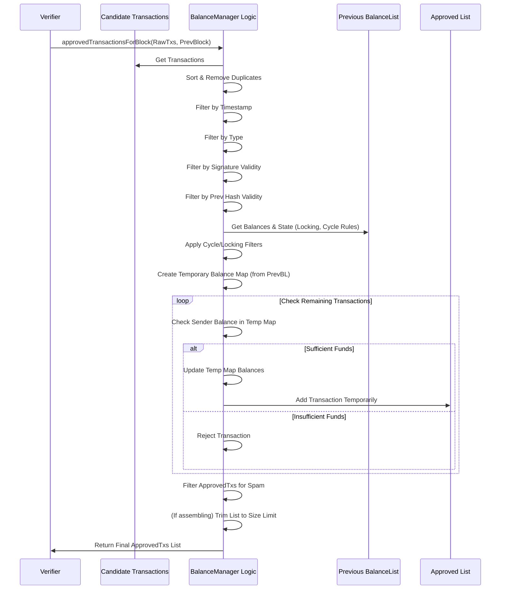

# Chapter 4: BalanceManager

In [Chapter 3: BalanceList](03_balancelist_.md), we saw how the `BalanceList` provides a complete snapshot of everyone's account balances after a specific [Block](01_block_.md). This snapshot is the ground truth for the state of the network at that moment.

Now, imagine you're a [Verifier](13_verifier_.md) node. Users are constantly sending new [Transaction](02_transaction_.md)s to the network ("Alice sends 10 Nyzo to Bob", "Charlie sends 5 Nyzo to Dave", etc.). Your job is to gather these proposed transactions and decide which ones are valid and should be included in the *next* page (Block) of the ledger.

How do you make that decision? You can't just include every transaction you receive. Some might be invalid:
*   Maybe Alice doesn't actually have 10 Nyzo to send.
*   Maybe someone is trying to send the same transaction twice.
*   Maybe the transaction is formatted incorrectly or uses an outdated rule.

You need a strict set of rules and a process to check each proposed transaction against the current state (the latest `BalanceList`). This is where the `BalanceManager` comes in!

## What is a BalanceManager?

Think of the `BalanceManager` as the meticulous **accountant** or **gatekeeper** for transactions wanting to get into the next [Block](01_block_.md). It's not a single object you pass around, but rather a collection of important rules and logic (mostly static methods within the `BalanceManager` class) that are used to validate transactions.

Its main responsibility is to take a list of *potential* transactions and, based on the current state defined by the latest [BalanceList](03_balancelist_.md), determine which of those transactions are **valid** and **approved** for inclusion in the upcoming block.

**Use Case:** A [Verifier](13_verifier_.md) is preparing to create Block #101. It has received 50 potential [Transaction](02_transaction_.md)s from users. It needs to consult the state defined by the `BalanceList` for Block #100 to figure out which of these 50 transactions follow all the rules and can be safely included in Block #101. The `BalanceManager` provides the logic for this check.

## What Rules Does the BalanceManager Enforce?

The `BalanceManager` acts like a checklist, ensuring each transaction meets several criteria before it gets the green light:

1.  **Sorting and Deduplication:** First, it puts the candidate transactions in a standard order (by timestamp, then signature) and removes any exact duplicates. You can't spend the same money twice in the same block!
2.  **Timestamp Range:** It checks if the transaction's timestamp falls within the allowed time window for the *next* block. Transactions too old or too far in the future are rejected.
3.  **Valid Type:** Is the transaction type appropriate for the current block height? For example, `typeCoinGeneration` is only allowed in the Genesis block (Block 0). Cycle-related types (`typeCycle`, `typeCycleSignature`) might only be valid if the blockchain has reached a certain version.
4.  **Valid Signature:** Does the transaction have a valid digital signature from the sender? We learned how to check this in [Chapter 2: Transaction](02_transaction_.md); the `BalanceManager` uses that check.
5.  **Valid Previous Block Hash:** Does the transaction correctly reference a recent, known block hash? This helps prevent certain types of attacks.
6.  **Sufficient Funds:** This is a big one! Using the balances from the *previous* block's [BalanceList](03_balancelist_.md), the `BalanceManager` checks if the sender actually *has* enough Nyzo to cover the transaction amount (and fee). It processes the approved transactions sequentially, updating balances temporarily to ensure no overdrafts occur within the block.
7.  **Balance List Spam Prevention:** Nyzo discourages creating lots of tiny accounts or leaving tiny "dust" amounts after a transaction, as this can make the `BalanceList` unnecessarily large. The `BalanceManager` enforces rules to reject transactions that would create or leave accounts with balances below a certain threshold (e.g., less than ∩10).
8.  **Cycle Transaction Rules:** (Advanced) Special rules apply to `typeCycle` and `typeCycleSignature` transactions, such as ensuring they originate from verifiers currently in the active cycle. We'll learn more about cycles in [Chapter 5: CycleDigest / CycleInformation](05_cycledigest___cycleinformation_.md).
9.  **Locking Rules:** (Advanced) Nyzo has rules to limit how much Nyzo can be moved from certain large, "locked" accounts in a single block. The `BalanceManager` checks these limits.
10. **Size Limit (for Block Assembly):** If *too many* valid transactions are available, the `BalanceManager` can trim the list to fit within the block's capacity, usually prioritizing larger transactions or essential cycle signatures.

Only transactions that pass *all* these checks are considered "approved" for the next block.

## How the BalanceManager Approves Transactions (Conceptual Flow)

Let's trace the steps when a [Verifier](13_verifier_.md) uses the `BalanceManager` logic to filter transactions for the next block (Block N):

1.  **Input:**
    *   A list of candidate [Transaction](02_transaction_.md)s received from the network.
    *   The previous [Block](01_block_.md) (Block N-1).
    *   Access to the [BalanceList](03_balancelist_.md) for Block N-1.

2.  **Process (Inside `BalanceManager.approvedTransactionsForBlock`):**
    *   **Sort & Dedup:** Order the candidate transactions and remove identical copies.
    *   **Filter Timestamps:** Remove transactions outside the time range for Block N.
    *   **Filter Types:** Remove transactions with types invalid for Block N's height and blockchain version.
    *   **Filter Signatures:** Remove transactions with invalid signatures.
    *   **Filter Prev. Hash:** Remove transactions referencing invalid previous block hashes.
    *   **(Protect Seed Account):** Apply special rules if transactions involve the initial seed funding account.
    *   **(Enforce Cycle/Locking Rules):** Filter based on cycle and account locking rules.
    *   **Check Funds & Simulate:**
        *   Create a temporary copy of account balances based on the `BalanceList` from Block N-1.
        *   Go through the remaining *sorted* transactions one by one.
        *   For each transaction:
            *   Check if the sender's balance in the *temporary map* is sufficient (>= amount).
            *   If yes: Approve the transaction (add to final list), and *update the balances* in the temporary map (decrease sender, increase receiver).
            *   If no: Reject the transaction.
    *   **Filter Spam:** Remove approved transactions that violate the balance list spam rules (checking against the *original* balance map from Block N-1 and the effects of *all* potentially approved transactions).
    *   **(Trim List):** If preparing the block (not just validating), and the approved list is too long, remove the lowest-priority transactions (e.g., smallest amounts).

3.  **Output:** A final, clean list of approved [Transaction](02_transaction_.md)s ready to be included in Block N.

## Using BalanceManager Logic in Code (Conceptual)

A verifier node, when preparing a new block, would use the static method `BalanceManager.approvedTransactionsForBlock`.

```java
// --- Conceptual Example in a Verifier Node ---

// Assume 'candidateTransactions' is a List<Transaction> received from the network.
List<Transaction> candidateTransactions = getTransactionsFromPool();

// Get the latest finalized block (the "previous" block).
Block previousBlock = BlockManager.frozenBlockForHeight(BlockManager.getFrozenEdgeHeight());

if (previousBlock != null) {
    // Use the BalanceManager logic to get the approved list for the *next* block.
    // 'true' indicates we are assembling a block, so size limits apply.
    List<Transaction> approvedTxs = BalanceManager.approvedTransactionsForBlock(
        candidateTransactions, // The raw list of potential transactions
        previousBlock,         // The last confirmed block
        true                   // Yes, we are assembling a block (enforce size limits)
    );

    // Now 'approvedTxs' contains only the valid transactions that passed all checks.
    // The verifier can use this list to build the new block.
    System.out.println("Found " + approvedTxs.size() + " approved transactions for the next block.");

    // Next steps would involve:
    // 1. Calculating the BalanceList hash based on these approvedTxs.
    // 2. Creating the new Block object.
    // 3. Signing the new Block.
    // 4. Broadcasting the new Block.
}
```

**Explanation:**

*   We start with a list of potential transactions (`candidateTransactions`).
*   We get the most recent confirmed block (`previousBlock`). This is essential because it links us to the last known valid state ([BalanceList](03_balancelist_.md)).
*   We call `BalanceManager.approvedTransactionsForBlock`, passing in the candidates and the previous block. The `true` flag tells it to apply block size limits if necessary.
*   The method returns a new list (`approvedTxs`) containing only the transactions that passed all the validation rules according to the state after `previousBlock`.

## Under the Hood: The Validation Pipeline

Let's visualize the filtering process within `approvedTransactionsForBlock`:



Now, let's peek at simplified snippets from `src/main/java/co/nyzo/verifier/BalanceManager.java`.

**1. The Main Method: `approvedTransactionsForBlock`**

This orchestrates the entire validation process.

```java
// --- File: src/main/java/co/nyzo/verifier/BalanceManager.java ---

public static List<Transaction> approvedTransactionsForBlock(List<Transaction> transactions, Block previousBlock,
                                                             boolean forBlockAssembly) {

    // 1. Sort by timestamp, then signature
    sortTransactions(transactions);
    // 2. Remove exact duplicates
    List<Transaction> dedupedTransactions = transactionsWithoutDuplicates(transactions);

    // 3. Filter by timestamp range for the *next* block
    long blockHeight = previousBlock.getBlockHeight() + 1L;
    long startTimestamp = BlockManager.startTimestampForHeight(blockHeight);
    long endTimestamp = BlockManager.endTimestampForHeight(blockHeight);
    // ... remove transactions outside [startTimestamp, endTimestamp) ...

    // 4. Filter by allowed transaction types based on block height and version
    Set<Byte> validTypes = getValidTransactionTypes(blockHeight, previousBlock.getBlockchainVersion());
    // ... remove transactions with type not in validTypes ...

    // 5. Filter transactions with invalid previous block hash reference
    // ... remove transactions where !transaction.previousHashIsValid() ...

    // 6. Filter transactions with invalid signatures
    // ... remove transactions where !transaction.signatureIsValid() ...

    // 7. Apply special rules (Cycle, Locking, Seed Account Protection)
    // ... enforceCycleTransactionRules(...) ...
    // ... enforceLockingRules(...) ...
    // ... protectSeedFundingAccount(...) ...

    // 8. Check for sufficient funds (most complex part)
    List<Transaction> approvedTransactions = new ArrayList<>();
    BalanceList previousBalanceList = BalanceListManager.balanceListForBlock(previousBlock);
    Map<ByteBuffer, Long> tempBalanceMap = makeBalanceMap(previousBalanceList); // Get starting balances

    for (Transaction transaction : dedupedTransactions) { // Iterate through sorted, filtered list
        ByteBuffer senderId = // Get sender ID (handle cycle type)
        Long senderBalance = tempBalanceMap.getOrDefault(senderId, 0L);

        // Check if sender has enough balance IN THE TEMP MAP
        if (transaction.getAmount() <= senderBalance) {
            // Yes: Add to approved list and update temp map
            approvedTransactions.add(transaction);
            tempBalanceMap.put(senderId, senderBalance - transaction.getAmount()); // Decrease sender

            long amountAfterFee = transaction.getAmount() - transaction.getFee();
            if (amountAfterFee > 0) {
                ByteBuffer receiverId = ByteBuffer.wrap(transaction.getReceiverIdentifier());
                Long receiverBalance = tempBalanceMap.getOrDefault(receiverId, 0L);
                tempBalanceMap.put(receiverId, receiverBalance + amountAfterFee); // Increase receiver
            }
        } else {
            // No: Reject transaction (do nothing, it's not added to approvedTransactions)
            LogUtil.println("Rejected due to insufficient funds.");
        }
    }

    // 9. Filter out balance list spam from the provisionally approved list
    // Note: This uses the *original* balance map and considers *all* potentially approved txs
    Map<ByteBuffer, Long> originalBalanceMap = makeBalanceMap(previousBalanceList);
    approvedTransactions = transactionsWithoutBalanceListSpam(originalBalanceMap, approvedTransactions);

    // 10. Trim list size if needed (when forBlockAssembly is true)
    int maximumListSize = BlockchainMetricsManager.maximumTransactionsForBlockAssembly();
    if (approvedTransactions.size() > maximumListSize && forBlockAssembly) {
        // ... sort by priority (e.g., amount descending) and remove trailing items ...
        // ... sort back to timestamp order ...
    }

    return approvedTransactions;
}
```

**Explanation:**

*   The method follows the pipeline described earlier: sort, dedup, filter by time, type, signature, prevHash, apply special rules.
*   The crucial part is the loop checking funds:
    *   It gets the starting balances from the `previousBalanceList`.
    *   It iterates through the *already filtered and sorted* transactions.
    *   For each transaction, it checks the sender's balance against the *current state of the `tempBalanceMap`*.
    *   If funds are sufficient, the transaction is added to the `approvedTransactions` list, and the `tempBalanceMap` is immediately updated to reflect the transfer. This ensures transactions within the same block are processed sequentially regarding balance checks.
*   After the balance check loop, spam filtering is applied to the provisionally approved list.
*   Finally, if assembling a block, the list might be trimmed to meet size constraints.

**2. Creating the Temporary Balance Map**

This helper just converts the `BalanceList` items into a `Map` for quick lookups.

```java
// --- File: src/main/java/co/nyzo/verifier/BalanceManager.java ---

public static Map<ByteBuffer, Long> makeBalanceMap(BalanceList balanceList) {
    Map<ByteBuffer, Long> balanceMap = new ConcurrentHashMap<>(); // Use thread-safe map
    if (balanceList != null) {
        for (BalanceListItem item : balanceList.getItems()) {
            // Key: account identifier (wrapped in ByteBuffer for map key usage)
            // Value: account balance
            balanceMap.put(ByteBuffer.wrap(item.getIdentifier()), item.getBalance());
        }
    }
    return balanceMap;
}
```

**Explanation:**

*   Takes a [BalanceList](03_balancelist_.md) as input.
*   Creates a `Map` where keys are account identifiers and values are their balances.
*   This map provides fast `O(1)` average-time lookups for account balances, which is essential during the fund-checking loop.

**3. Checking for Balance List Spam**

This logic prevents the creation of tiny "dust" accounts.

```java
// --- File: src/main/java/co/nyzo/verifier/BalanceManager.java ---

// Checks if a single transaction might be spammy
public static boolean transactionSpamsBalanceList(Map<ByteBuffer, Long> balanceMap, Transaction transaction,
                                                  List<Transaction> allTransactionsInBlock) {
    boolean isSpam = false;

    // Only concerned with standard transfers
    if (transaction.getType() == Transaction.typeStandard) {

        // Rule 1: Creating a new account with less than the minimum preferred balance?
        ByteBuffer receiverId = ByteBuffer.wrap(transaction.getReceiverIdentifier());
        if (!balanceMap.containsKey(receiverId) && // Is receiver a new account?
                transaction.getAmount() > 1L && // Sending more than 1 micronyzo?
                transaction.getAmount() < minimumPreferredBalance) { // But less than threshold?
            isSpam = true;
        } else {
            // Rule 2: Leaving the sender account with a tiny balance (but not zero)?
            ByteBuffer senderId = ByteBuffer.wrap(transaction.getSenderIdentifier());
            long senderOriginalBalance = balanceMap.getOrDefault(senderId, 0L);
            long totalSentBySenderInBlock = 0L;
            // Calculate total amount sent by this sender in *this block*
            for (Transaction blockTx : allTransactionsInBlock) {
                if (ByteUtil.arraysAreEqual(senderId.array(), blockTx.getSenderIdentifier())) {
                    totalSentBySenderInBlock += blockTx.getAmount();
                }
            }

            long remainingBalance = senderOriginalBalance - totalSentBySenderInBlock;
            // Is the remaining balance > 0 but < threshold?
            if (remainingBalance > 0L && remainingBalance < minimumPreferredBalance) {
                isSpam = true;
            }
        }
    }
    return isSpam;
}

// Helper method used in approvedTransactionsForBlock to filter the list
public static List<Transaction> transactionsWithoutBalanceListSpam(Map<ByteBuffer, Long> balanceMap,
                                                                   List<Transaction> transactions) {
    List<Transaction> transactionsFiltered = new ArrayList<>();
    for (Transaction transaction : transactions) {
        // Call the check for each transaction, passing the *original* balance map
        // and the *full list* of potentially approved transactions from this block.
        if (!transactionSpamsBalanceList(balanceMap, transaction, transactions)) {
            transactionsFiltered.add(transaction); // Keep it if it's not spam
        }
    }
    return transactionsFiltered;
}
```

**Explanation:**

*   `transactionSpamsBalanceList` checks two conditions for a standard transaction:
    1.  Is it sending less than `minimumPreferredBalance` (e.g., ∩10) to an account that *doesn't exist* in the starting `balanceMap`?
    2.  After considering *all* transactions sent by this sender *in this block*, would the sender's account be left with a balance that is greater than zero but less than `minimumPreferredBalance`?
*   If either rule is met, the transaction is flagged as potential spam.
*   `transactionsWithoutBalanceListSpam` iterates through a list of transactions and uses the spam check to build a new list containing only the non-spammy ones.

## Conclusion

The `BalanceManager` embodies the critical validation logic that ensures the integrity of the Nyzo ledger. It acts as a gatekeeper, applying a strict set of rules – checking signatures, timestamps, types, previous hashes, sufficient funds, and preventing spam – to determine which proposed [Transaction](02_transaction_.md)s are allowed into the next [Block](01_block_.md). By carefully vetting transactions against the last confirmed state ([BalanceList](03_balancelist_.md)), the `BalanceManager` ensures that only valid and safe changes are added to the blockchain.

We've seen how standard transactions are handled. But what about those special `typeCycle` transactions mentioned earlier? They relate to the core group of verifiers running the network. How does the network manage information about this group?

Next up: [Chapter 5: CycleDigest / CycleInformation](05_cycledigest___cycleinformation_.md)

---

Generated by [AI Codebase Knowledge Builder](https://github.com/The-Pocket/Tutorial-Codebase-Knowledge)