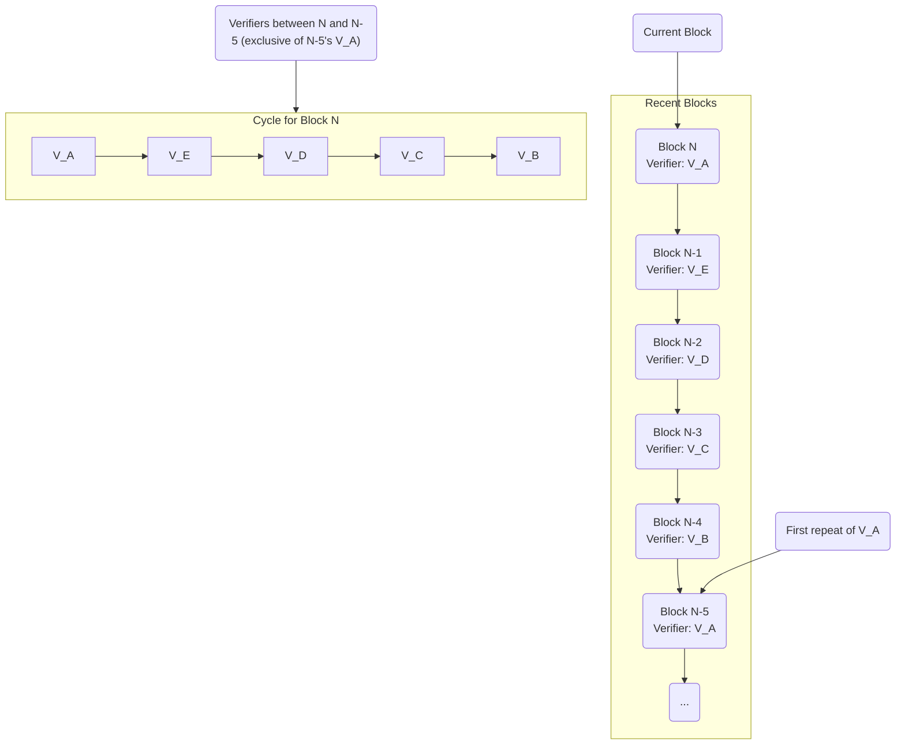
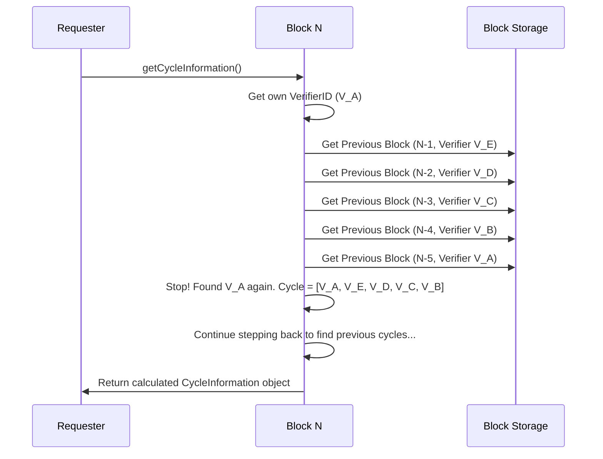
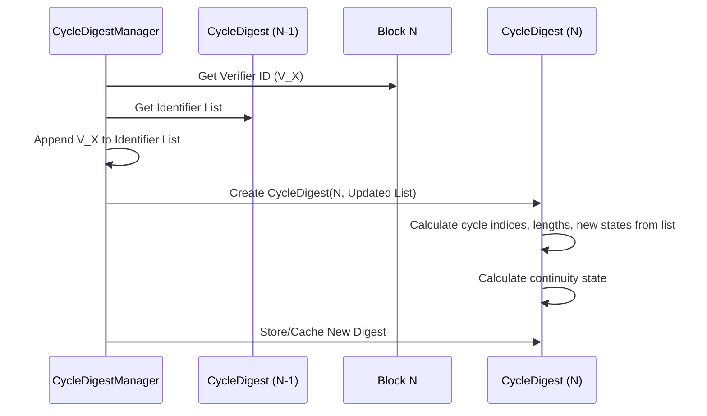

# Chapter 5: CycleDigest / CycleInformation

In [Chapter 4: BalanceManager](04_balancemanager_.md), we learned how the network validates individual transactions based on the current state defined by the [BalanceList](03_balancelist_.md). This included checks for sufficient funds and preventing spam.

But the Nyzo network has deeper consensus rules that go beyond individual transactions. A core part of Nyzo's security comes from its "Proof of Diversity" mechanism, which relies on knowing *who* is currently responsible for verifying blocks.

Imagine the group of nodes verifying blocks as a rotating "verification committee." How does the network know who is currently on this committee? How does it know how many members there are? How does it detect when a new member joins? Answering these questions is crucial for ensuring the network remains decentralized and secure.

This is where `CycleDigest` and its older counterpart, `CycleInformation`, come in.

## What is the Verifier Cycle?

Think of the sequence of blocks in the blockchain. Each block is signed by a [Verifier](13_verifier_.md). If you look back from the most recent block, you'll see a sequence of verifier IDs. The **verifier cycle** is the list of *unique* verifier IDs you encounter until you see the ID of the *current* block's verifier again.



In this example, the cycle for Block N consists of Verifiers A, E, D, C, and B. The **cycle length** is 5.

## Why Track the Cycle? (`CycleInformation` vs. `CycleDigest`)

Knowing the cycle is vital for Nyzo's "Proof of Diversity" rules:

1.  **New Verifier Detection:** We need to know if the verifier of the current block is joining the cycle for the first time (a "new verifier"). Proof of Diversity has rules limiting how often new verifiers can join to maintain stability.
2.  **Cycle Length Checks:** The rules also check if the current cycle length is reasonable compared to recent cycle lengths. This prevents the cycle from shrinking too quickly or becoming unstable.
3.  **Chain Scoring:** When nodes need to decide which version of the blockchain history is the "best" (in case of temporary disagreements), the cycle information heavily influences the score. Chains that follow the Proof of Diversity rules get better scores.

**`CycleInformation` (The Old Way):**
Originally, this information was calculated on-the-fly whenever needed. A node would look at a block and then walk backward through the [Block](01_block_.md) history (`getPreviousBlock()`), keeping track of verifier IDs until it found the full cycle.

*   **Problem:** This could be slow! Imagine needing to load dozens or hundreds of previous blocks from disk just to figure out the cycle for the current block.

**`CycleDigest` (The New, Efficient Way):**
`CycleDigest` is a smarter approach. It's a compact object that stores the recent history of verifier identifiers. The key innovation is that you can calculate the `CycleDigest` for the *next* block using only:

1.  The `CycleDigest` of the *previous* block.
2.  The identifier of the *next* block's verifier.

You no longer need to walk back through the actual block history every time! It's like keeping a running summary instead of re-reading all the old meeting minutes.

**Use Case:** When the network needs to validate Block #101 and apply Proof of Diversity rules, how does it efficiently determine the cycle length, whether Verifier V_X (who signed Block #101) is new to the cycle, and compare the cycle length to previous ones? The answer is by using the `CycleDigest` calculated from Block #100's `CycleDigest` and V_X's identifier.

## What's Inside?

Both `CycleInformation` and `CycleDigest` provide similar conceptual information, but `CycleDigest` stores it more directly:

*   **`CycleInformation` (Calculated on Demand):**
    *   `blockHeight`: The block this information pertains to.
    *   `cycleLengths`: An array holding the lengths of the last few cycles (current, previous, etc.).
    *   `maximumCycleLength`: The longest length among the recent cycles.
    *   `newVerifier`: A boolean indicating if the block's verifier is new to the cycle.
    *   `inGenesisCycle`: A boolean indicating if the block is part of the initial cycle starting from the very first block.

*   **`CycleDigest` (Stored and Updated):**
    *   `blockHeight`: The block this digest represents.
    *   `identifiers`: A list of recent verifier identifiers. This is the core data!
    *   `newVerifierStates`: An array indicating, for each identifier in the list, whether it was a new verifier *at that point*.
    *   `cycleStartIndices`: Internal markers pointing to the start of recent cycles within the `identifiers` list.
    *   `cycleLengths`: The lengths of recent cycles, derived from `cycleStartIndices`.
    *   `continuityState`: Indicates if the block follows Proof of Diversity rules (`Continuous`, `Discontinuous`, or `Undetermined`).
    *   `complete`: Indicates if the digest contains enough historical identifiers to make definitive calculations (at least 4 cycles worth or back to Genesis).

The `CycleDigest` essentially pre-calculates and stores the information needed, deriving things like `cycleLengths` and `newVerifier` status from the `identifiers` list it maintains.

## Using Cycle Information (Conceptual)

Other parts of the system, primarily the [BlockManager](06_blockmanager_.md), use this information.

```java
// --- Conceptual Example within BlockManager ---

// Assume 'blockN' is a newly received or created Block object
Block blockN = getBlockFromNetworkOrDisk(N);

if (blockN != null) {
    // Get the CycleDigest associated with this block's height
    // CycleDigestManager helps manage these efficiently
    CycleDigest digestN = CycleDigestManager.getDigestForBlock(blockN);

    if (digestN != null && digestN.isComplete()) {
        // Check Proof of Diversity rules
        if (digestN.getContinuityState() == ContinuityState.Continuous) {
            System.out.println("Block " + N + " follows Proof of Diversity rules.");

            // Is the verifier who signed blockN new?
            boolean isNew = digestN.isNewVerifier();
            System.out.println("Verifier for Block " + N + " is new: " + isNew);

            // What's the current cycle length?
            int length = digestN.getCycleLength();
            System.out.println("Cycle length at Block " + N + " is: " + length);

            // This information is used in scoring the block/chain...
            long score = calculateChainScore(blockN, digestN);

        } else {
            System.out.println("Block " + N + " VIOLATES Proof of Diversity rules!");
            // This block would likely be rejected or heavily penalized.
        }
    } else {
        System.out.println("Could not determine cycle information for Block " + N);
    }
}
```

**Explanation:**

*   We get a [Block](01_block_.md) object.
*   We retrieve its corresponding `CycleDigest` (using a helper manager class).
*   We check if the digest is `complete` (has enough history).
*   We then use methods like `getContinuityState()`, `isNewVerifier()`, and `getCycleLength()` to access the vital information needed for consensus checks and scoring.

## Under the Hood: Calculation

Let's see how these were/are calculated.

**1. `CycleInformation` Calculation (Old Way - Simplified Flow)**



**Code Snippet (`Block.java` - `calculateCycleInformation`)**

```java
// --- File: src/main/java/co/nyzo/verifier/Block.java ---

// Simplified conceptual logic for calculating the older CycleInformation
private void calculateCycleInformation(boolean eager) { // 'eager' relates to loading blocks from disk

    Block blockToCheck = this; // Start with the current block
    boolean reachedGenesisBlock = false;
    Set<ByteBuffer> identifiersInCycle = new HashSet<>();
    List<ByteBuffer> orderedIdentifiers = new ArrayList<>();
    long currentCycleEndHeight = getBlockHeight();
    int cyclesFound = 0;
    int[] cycleLengths = new int[4]; // Store lengths of last 4 cycles
    boolean newVerifier = false;
    boolean inGenesisCycle = false;

    // Loop until we find 4 full cycles or hit the Genesis block
    while (cyclesFound < 4 && blockToCheck != null) {

        ByteBuffer currentVerifierId = ByteBuffer.wrap(blockToCheck.getVerifierIdentifier());

        // Have we seen this verifier before in the *current* cycle calculation?
        while (identifiersInCycle.contains(currentVerifierId) && cyclesFound < 4) {
            // Yes! A cycle is complete. Record its length.
            int cycleLength = orderedIdentifiers.size();
            cycleLengths[cyclesFound] = cycleLength;

            // If this is the *first* cycle found (cyclesFound == 0),
            // check if the verifier closing it is the same as the original block's verifier.
            // If not, the original block's verifier must be new.
            if (cyclesFound == 0) {
                newVerifier = !currentVerifierId.equals(ByteBuffer.wrap(getVerifierIdentifier()));
            }

            cyclesFound++; // Found another cycle

            // Remove the last identifier to continue searching for the *previous* cycle
            ByteBuffer removedId = orderedIdentifiers.remove(orderedIdentifiers.size() - 1);
            identifiersInCycle.remove(removedId);
        }

        // Add the current block's verifier to the front of our list
        orderedIdentifiers.add(0, currentVerifierId);
        identifiersInCycle.add(currentVerifierId);

        // Check if we hit the very first block (Genesis)
        if (blockToCheck.getBlockHeight() == 0 && cyclesFound < 4) {
            reachedGenesisBlock = true;
            cycleLengths[cyclesFound] = orderedIdentifiers.size(); // Genesis cycle length
            if (cyclesFound == 0) {
                inGenesisCycle = true;
                newVerifier = true; // Verifier of block 0 is considered "new"
            }
        }

        // Get the previous block (might involve disk load if 'eager')
        Block previousBlock = null;
        if (!reachedGenesisBlock) {
             try {
                 previousBlock = blockToCheck.getPreviousBlock(); // Simplified: real code handles loading
             } catch (Exception e) { /* Handle error */ }
        }
        blockToCheck = previousBlock;
    }

    // If we found enough cycles or hit Genesis, create the CycleInformation object
    if (cyclesFound == 4 || reachedGenesisBlock) {
        int maxLen = Math.max(cycleLengths[0], Math.max(cycleLengths[1], cycleLengths[2]));
        cycleInformation = new CycleInformation(height, maxLen, cycleLengths, newVerifier, inGenesisCycle);
    } else {
        // Not enough history found
        cycleInformation = null;
    }
}
```

**Explanation:**

*   This method walks backward from the current block (`this`).
*   It adds verifier IDs to `orderedIdentifiers` and `identifiersInCycle`.
*   When it encounters an ID already in `identifiersInCycle`, it means a full cycle has been found. It records the length (`orderedIdentifiers.size()`) and resets the search for the *next* older cycle.
*   It continues until 4 cycle lengths are found or it reaches Block 0.
*   It determines `newVerifier` status based on whether the verifier completing the *first* cycle matches the verifier of the original block.
*   Finally, it packages this into a `CycleInformation` object. This can be computationally intensive.

**2. `CycleDigest` Update (New Way - Simplified Flow)**



**Code Snippet (`CycleDigest.java` - Factory Method)**

```java
// --- File: src/main/java/co/nyzo/verifier/CycleDigest.java ---

// Static factory method to create the *next* digest efficiently
public static CycleDigest digestForNextBlock(CycleDigest previousDigest, byte[] nextVerifierIdentifier,
                                             long suggestedBlockHeight) {

    long blockHeight;
    List<ByteBuffer> identifiers;

    // If there's no previous digest (like for Block 0), start fresh
    if (previousDigest == null) {
        blockHeight = suggestedBlockHeight; // Should be 0 for Genesis
        identifiers = new ArrayList<>();
    } else {
        // Otherwise, start with the identifier list from the previous digest
        blockHeight = previousDigest.getBlockHeight() + 1L;
        identifiers = new ArrayList<>(previousDigest.getIdentifiers());
    }

    // *** The Core Idea ***
    // Just add the identifier of the *new* block's verifier to the list
    ByteBuffer nextIdentifierBuffer = ByteBuffer.wrap(nextVerifierIdentifier);
    identifiers.add(nextIdentifierBuffer);

    // Create a new CycleDigest object. Its constructor will handle
    // recalculating all the internal state (cycle lengths, new status, etc.)
    // based *only* on this updated identifier list.
    return new CycleDigest(blockHeight, identifiers);
}
```

**Explanation:**

*   This static method takes the *previous* `CycleDigest` and the identifier of the *next* block's verifier.
*   It copies the identifier list from the `previousDigest`.
*   It simply **appends** the `nextVerifierIdentifier` to this list.
*   It then calls the `CycleDigest` constructor, passing the new `blockHeight` and the updated `identifiers` list. The constructor does the work of analyzing this list to determine cycle starts, lengths, new verifier status, and continuity. No block traversal needed!

**Code Snippet (`CycleDigest.java` - Constructor Logic)**

```java
// --- File: src/main/java/co/nyzo/verifier/CycleDigest.java ---

// Simplified view of the constructor's logic
public CycleDigest(long blockHeight, List<ByteBuffer> identifiers) {
    this.blockHeight = blockHeight;
    this.identifiers = identifiers; // Store the provided list

    // 1. Calculate Cycle Start Indices & Determine if 'complete'
    //    (Walks backward *through the identifiers list*, not blocks)
    calculateCycleStartIndicesAndCompleteness(); // Sets this.cycleStartIndices, this.complete

    // 2. Calculate Cycle Lengths from the start indices
    calculateCycleLengths(); // Sets this.cycleLengths

    // 3. Trim excess identifiers if needed (keep roughly 4 cycles worth)
    //    (Ensures the list doesn't grow indefinitely)
    // ... trimming logic ...

    // 4. Determine New/Existing status for each identifier in the list
    //    (Walks forward *through the identifiers list*)
    this.newVerifierStates = new NewVerifierState[identifiers.size()];
    List<ByteBuffer> runningCycle = new ArrayList<>();
    boolean determinedNewVerifier = identifiers.size() == blockHeight + 1; // True if back to Genesis
    for (int i = 0; i < identifiers.size(); i++) {
        ByteBuffer id = identifiers.get(i);
        if (runningCycle.contains(id)) {
            // Found this ID before in the current running cycle check -> Existing
            determinedNewVerifier = true; // We know status from here on
            newVerifierStates[i] = NewVerifierState.ExistingVerifier;
            // Reset runningCycle check
            while (!runningCycle.get(0).equals(id)) { runningCycle.remove(0); }
            runningCycle.remove(0);
        } else {
            // Haven't seen this ID yet in the current running cycle check
            runningCycle.add(id);
            // Mark as New if we are sure, otherwise Undetermined
            newVerifierStates[i] = determinedNewVerifier ? NewVerifierState.NewVerifier :
                                                            NewVerifierState.Undetermined;
        }
    }

    // 5. Store count of unique IDs in the current list
    this.numberOfUniqueIdentifiers = new HashSet<>(identifiers).size();

    // 6. Calculate Continuity State based on rules and derived info
    this.continuityState = complete ? calculateContinuityState() : ContinuityState.Undetermined;
}
```

**Explanation:**

*   The constructor takes the `identifiers` list (which was just updated by `digestForNextBlock`).
*   It performs all calculations based **only on this list**:
    *   Finds where cycles start within the list (`calculateCycleStartIndicesAndCompleteness`).
    *   Calculates lengths from those start points (`calculateCycleLengths`).
    *   Determines if each entry in the list corresponds to a new or existing verifier *at that point in the list history* (`newVerifierStates`).
    *   Calculates the final `continuityState` based on the Proof of Diversity rules applied to the information derived from the list.

This internal calculation is much faster than traversing the blockchain.

## Conclusion

`CycleDigest` and its predecessor `CycleInformation` are fundamental to Nyzo's consensus. They provide critical information about the "verification committee" – the active group of verifiers. This includes the cycle length, identification of new verifiers joining, and checks against the Proof of Diversity rules.

While `CycleInformation` required potentially slow blockchain traversal, the newer `CycleDigest` provides a much more efficient way to track this state by maintaining and updating a list of recent verifier identifiers, allowing the next state to be calculated quickly from the previous one.

This cycle information is heavily used by the component responsible for managing the overall blockchain state, ensuring blocks are valid, and choosing the best chain according to Nyzo's rules.

Next up: [Chapter 6: BlockManager](06_blockmanager_.md)

---

Generated by [AI Codebase Knowledge Builder](https://github.com/The-Pocket/Tutorial-Codebase-Knowledge)
