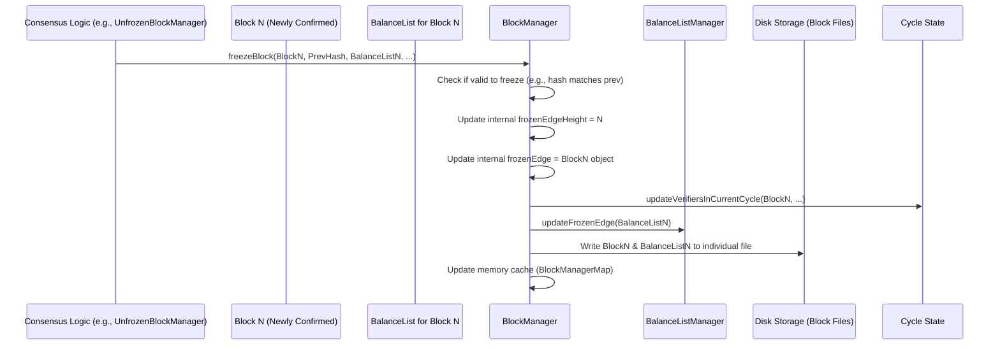

# Chapter 6: BlockManager

Welcome back! In [Chapter 5: CycleDigest / CycleInformation](05_cycledigest___cycleinformation_.md), we explored how the Nyzo network tracks the group of currently active verifiers using the efficient `CycleDigest`. This cycle information is crucial for maintaining the network's health and security rules (Proof of Diversity).

Now, let's step back and look at the big picture of the blockchain itself. We know blocks are linked together, forming a history. But how does the network keep track of the *official*, confirmed, and finalized part of this history? Which block is the absolute latest one that everyone agrees is set in stone?

Imagine a library with many librarians adding pages to a giant ledger book. There's a point where a page is considered final, checked, and officially added – it won't be changed later. How does the library manage this "finalized" section of the book?

This is the job of the `BlockManager`.

## What is the BlockManager?

Think of the `BlockManager` as the **head librarian** for the Nyzo blockchain ledger. It doesn't write the new pages itself, but it's responsible for managing the **"frozen edge"** – the most recent, confirmed, and immutable (unchangeable) part of the blockchain history that everyone in the network agrees on.

Its main job is to:

1.  **Know the Frozen Edge:** Keep track of exactly which [Block](01_block_.md) is the latest one considered final.
2.  **Store Final Blocks:** Manage the storage of these finalized blocks, typically on the computer's disk.
3.  **Retrieve Final Blocks:** Provide a way for other parts of the system to easily access any block within this frozen history.
4.  **Manage State:** Use the frozen edge to maintain crucial network state information, like the current verifier cycle ([CycleDigest / CycleInformation](05_cycledigest___cycleinformation_.md)) and the active blockchain rules version.

**Use Case:** When a Nyzo node starts up or needs to check the current state, how does it know the height of the latest finalized block? How can it retrieve Block #500,000 from the confirmed history? How does it know the list of verifiers in the *current* cycle based on this finalized history? The `BlockManager` provides the answers.

## Key Responsibilities

The `BlockManager` is primarily a collection of static methods and state variables that manage the finalized part of the chain. It doesn't handle the process of *deciding* which block becomes final (that involves voting, which we'll see later). Once a block *is* decided upon, the `BlockManager` takes over.

Here's what it does:

*   **Tracking the Edge:** It maintains the `frozenEdgeHeight` (the height of the latest final block) and a reference to the `frozenEdge` [Block](01_block_.md) object itself.
*   **Persistence:** It handles saving new frozen blocks to disk. Nyzo stores blocks in files – initially individual files per block (`individualBlockDirectory`), which are later grouped into larger consolidated files for efficiency (`consolidatedFileForBlockHeight`).
*   **Retrieval:** It provides methods like `frozenBlockForHeight(long blockHeight)` to load any block from the frozen history, checking memory caches (`BlockManagerMap`) first, then looking in the individual file, and potentially extracting from consolidated files if needed.
*   **State Management:** When a new block is frozen (the `frozenEdge` advances), the `BlockManager` updates important derived information:
    *   It recalculates the current verifier cycle (`updateVerifiersInCurrentCycle`).
    *   It informs the [BalanceManager](04_balancemanager_.md) (via `BalanceListManager.updateFrozenEdge`) about the new state so future transaction validation uses the correct balances.
    *   It keeps track of utility information like the start timestamp of the Genesis block (`genesisBlockStartTimestamp`), which is needed to calculate time windows for future blocks.

## Using the BlockManager (Code Concept)

Other parts of the Nyzo verifier constantly need information about the finalized chain. They use static methods provided by `BlockManager`.

```java
// --- Conceptual Example: Getting Chain Info ---

// What is the height of the latest finalized block?
long latestHeight = BlockManager.getFrozenEdgeHeight();
System.out.println("Latest frozen block height: " + latestHeight);

// Get the actual Block object for the frozen edge
Block latestBlock = BlockManager.getFrozenEdge();
if (latestBlock != null) {
    System.out.println("Frozen edge block hash: " +
                       PrintUtil.compactPrintByteArray(latestBlock.getHash()));
}

// Retrieve an older block from the frozen history (e.g., block 1000)
long specificHeight = 1000;
Block oldBlock = BlockManager.frozenBlockForHeight(specificHeight);
if (oldBlock != null) {
    System.out.println("Retrieved block " + specificHeight + " with hash: " +
                       PrintUtil.compactPrintByteArray(oldBlock.getHash()));
} else {
    System.out.println("Could not retrieve block " + specificHeight);
}

// Get the list of verifiers currently in the cycle
List<ByteBuffer> cycle = BlockManager.verifiersInCurrentCycleList();
System.out.println("Current cycle length: " + cycle.size());
System.out.println("Verifiers in cycle: ");
for (ByteBuffer id : cycle) {
    System.out.println("- " + PrintUtil.compactPrintByteArray(id.array()));
}

// When is the time window for block N+1 expected to start?
long nextBlockStartTime = BlockManager.startTimestampForHeight(latestHeight + 1);
System.out.println("Expected start time for block " + (latestHeight + 1) + ": " + nextBlockStartTime);

```

**Explanation:**

*   We can directly ask `BlockManager` for the `frozenEdgeHeight` or the `frozenEdge` block itself.
*   `frozenBlockForHeight()` allows us to fetch any block within the finalized history by its height.
*   We can get the current list of active verifiers (`verifiersInCurrentCycleList()`).
*   Utility methods like `startTimestampForHeight()` help predict block timing based on the Genesis block's start time.

## Under the Hood: Freezing a Block

How does the frozen edge advance? This usually happens after the network reaches consensus on the next block (a process involving components like [BlockVoteManager](07_blockvotemanager_.md) and [UnfrozenBlockManager](08_unfrozenblockmanager_.md)). Once consensus is reached for Block N, the `BlockManager.freezeBlock` method is called.

**Conceptual Flow:**



**Code Snippets:**

Let's look at the simplified logic involved when `freezeBlock` is called.

**1. `BlockManager.freezeBlock()` (Orchestration):**

This method is the entry point to making a block permanent.

```java
// --- File: src/main/java/co/nyzo/verifier/BlockManager.java ---

public static synchronized void freezeBlock(Block block, byte[] previousBlockHash, BalanceList balanceList,
                                            List<ByteBuffer> cycleVerifiers) {

    // Only freeze if the block correctly chains to the previous block
    // and we have its calculated BalanceList.
    if (ByteUtil.arraysAreEqual(previousBlockHash, block.getPreviousBlockHash()) && balanceList != null) {

        try {
            // 1. Update the frozen edge pointer and cycle info
            setFrozenEdge(block, cycleVerifiers); // Updates height, edge object, and cycle state

            // 2. Tell the BalanceListManager about the new frozen state
            BalanceListManager.updateFrozenEdge(balanceList);

            // 3. Save the block and its balance list to a new individual file
            //    (The constructor sorts items)
            writeBlocksToFile(Collections.singletonList(block), Collections.singletonList(balanceList),
                    individualFileForBlockHeight(block.getBlockHeight()));

            // 4. If this was the Genesis block, record its start time
            if (block.getBlockHeight() == 0L) {
                genesisBlockStartTimestamp = block.getStartTimestamp();
                // Mark initialization as complete only after Genesis is frozen
                completedInitialization.set(true);
            }

            // 5. (Implicitly done in setFrozenEdge) Update internal caches

        } catch (Exception reportOnly) {
            // Log errors if writing fails
            System.err.println("exception writing block to file: " + reportOnly.getMessage());
        }
    } else {
        System.err.println("Cannot freeze block " + block.getBlockHeight() + ": Mismatched prev hash or null balance list.");
    }
}
```

**Explanation:**

*   This method is `synchronized` to prevent multiple threads from trying to freeze blocks at the same time.
*   It first checks if the block is valid to freeze (correct previous hash, non-null balance list).
*   It calls `setFrozenEdge` to update the core state (height, block object, cycle info).
*   It notifies `BalanceListManager` so it can update its caches and balance map for the new edge.
*   It calls `writeBlocksToFile` to persist the block and its balance list to disk (in the `individual` directory initially).
*   It handles the special case of freezing the Genesis block.

**2. `BlockManager.setFrozenEdge()` (Core Update):**

This helper method updates the actual frozen edge variables and triggers the cycle recalculation.

```java
// --- File: src/main/java/co/nyzo/verifier/BlockManager.java ---

private static synchronized void setFrozenEdge(Block block, List<ByteBuffer> cycleVerifiers) {

    // Don't allow setting the edge backwards
    if (block.getBlockHeight() < frozenEdgeHeight) {
        System.err.println("Attempting to set frozen edge backwards!");
        return;
    }

    // Update the main pointers
    frozenEdge = block;
    frozenEdgeHeight = block.getBlockHeight();

    // Recalculate derived state based on the new edge
    boolean isNewVerifier = block.getCycleInformation() != null && block.getCycleInformation().isNewVerifier();
    updateVerifiersInCurrentCycle(block, cycleVerifiers, isNewVerifier); // Update cycle list/set

    // Update other managers/metrics if needed...
    BlockchainMetricsManager.registerBlock(block);
    MetadataManager.registerBlock(block);

    // Add the block to the memory cache
    BlockManagerMap.addBlock(block);
}
```

**Explanation:**

*   Updates the `frozenEdge` and `frozenEdgeHeight` variables.
*   Calls `updateVerifiersInCurrentCycle` to recalculate the current verifier cycle based on the history leading up to this *new* frozen edge.
*   Notifies other managers/trackers about the new block.
*   Adds the newly frozen block to the `BlockManagerMap` memory cache for faster access.

**3. `BlockManager.updateVerifiersInCurrentCycle()` (Cycle State):**

This method determines the current cycle based on the history ending at the provided `block`.

```java
// --- File: src/main/java/co/nyzo/verifier/BlockManager.java ---

// Simplified logic
private static synchronized void updateVerifiersInCurrentCycle(Block block,
                                                               List<ByteBuffer> bootstrapCycleVerifiers,
                                                               boolean isNewVerifier) {

    ByteBuffer edgeIdentifierBuffer = ByteBuffer.wrap(block.getVerifierIdentifier());
    long edgeHeight = block.getBlockHeight();

    // --- Attempt 1: Calculate by walking back through blocks ---
    boolean foundCycle = false;
    List<ByteBuffer> calculatedCycleList = new ArrayList<>();
    boolean calculatedInGenesisCycle = false;
    Block currentBlock = block; // Start from the new frozen edge
    while (currentBlock != null && !foundCycle) {
        ByteBuffer identifierBuffer = ByteBuffer.wrap(currentBlock.getVerifierIdentifier());
        if (calculatedCycleList.contains(identifierBuffer)) {
            foundCycle = true; // Found the start of the cycle
        } else {
            calculatedCycleList.add(0, identifierBuffer); // Add verifier to the front
        }
        calculatedInGenesisCycle = currentBlock.getBlockHeight() == 0 && !foundCycle;
        currentBlock = currentBlock.getPreviousBlock(); // Go to the previous block
    }
    if (calculatedInGenesisCycle) foundCycle = true;

    // --- Attempt 2: Use alternative calculation if walk-back failed ---
    // (Handles cases where blocks might be missing locally during initialization/catch-up)
    if (!foundCycle) {
        // ... (Logic to use bootstrapCycleVerifiers or extend previous cycle) ...
        // If successful, update calculatedCycleList and set foundCycle = true
    }

    // --- If a cycle was determined ---
    if (foundCycle) {
        // Update the manager's state variables
        BlockManager.currentCycleEndHeight = edgeHeight;
        BlockManager.currentCycleList = calculatedCycleList;
        BlockManager.inGenesisCycle = calculatedInGenesisCycle;
        BlockManager.currentCycleSet = ConcurrentHashMap.newKeySet(); // Rebuild set from list
        BlockManager.currentCycleSet.addAll(calculatedCycleList);
        // ... (Update related sets like currentAndNearCycleSet/Nodes) ...
        // ... (Update lastVerifierJoinHeight/lastVerifierRemovalHeight if needed) ...
        BlockManager.cycleComplete = true;
    } else {
        // Mark the cycle state as incomplete if calculation failed
        BlockManager.cycleComplete = false;
    }
}

```

**Explanation:**

*   This method tries to determine the list of unique verifiers in the most recent cycle ending at the given `block`.
*   It first attempts to walk backward through the `previousBlockHash` links from the `block`, collecting unique verifier IDs until it finds a repeat.
*   If walking back fails (e.g., a block is missing locally), it tries alternative methods (like using a provided bootstrap list or extending the previously known cycle if the new block just adds one step).
*   If successful, it updates the `currentCycleList`, `currentCycleSet`, `inGenesisCycle` flag, and other related state variables.

**4. `BlockManager.frozenBlockForHeight()` (Retrieval):**

How blocks are fetched from the frozen history.

```java
// --- File: src/main/java/co/nyzo/verifier/BlockManager.java ---

public static Block frozenBlockForHeight(long blockHeight) {

    Block block = null;
    // Only retrieve blocks at or below the current frozen edge
    if (blockHeight <= frozenEdgeHeight) {

        // 1. Check the memory cache first for speed
        block = BlockManagerMap.blockForHeight(blockHeight);

        // 2. If not in cache, try loading from its individual disk file
        if (block == null) {
            block = loadBlockFromIndividualFile(blockHeight);

            // 3. If not in individual file, try extracting from a consolidated file
            //    (This also saves it back as an individual file)
            if (block == null) {
                 extractConsolidatedFile(consolidatedFileForBlockHeight(blockHeight));
                 block = loadBlockFromIndividualFile(blockHeight); // Try individual file again
            }

            // 4. If successfully loaded from disk, add it to the memory cache
            if (block != null) {
                BlockManagerMap.addBlock(block);
            }
        }
    }

    return block;
}

// Helper to load from an individual file (simplified)
private static Block loadBlockFromIndividualFile(long blockHeight) {
    Block block = null;
    File file = individualFileForBlockHeight(blockHeight);
    if (file.exists()) {
        try (RandomAccessFile reader = new RandomAccessFile(file, "r")) {
            short numberOfBlocks = reader.readShort(); // Should be 1
            if (numberOfBlocks == 1) {
                block = Block.fromFile(reader); // Read the block data
                if (block.getBlockHeight() != blockHeight) block = null; // Sanity check
            }
        } catch (Exception ignored) { /* Return null on error */ }
    }
    return block;
}

// Helper to load from consolidated (simplified concept)
private static void extractConsolidatedFile(File consolidatedFile) {
    // ... complex logic to read the large consolidated file ...
    // ... finds the requested block's data ...
    // ... writes that single block back out to its individual file ...
    // (See full code for details)
}
```

**Explanation:**

*   `frozenBlockForHeight` first checks a memory cache (`BlockManagerMap`) for the requested block.
*   If not cached, it attempts to load it from the block's specific individual file (`i_HEIGHT.nyzoblock`).
*   If that file doesn't exist (it might have been consolidated), it calls logic (`extractConsolidatedFile`) to read the larger consolidated file containing that block, extract the block, and save it back to its individual file. Then it tries reading the individual file again.
*   If a block is successfully loaded from disk, it's added to the memory cache for future requests.

## Conclusion

The `BlockManager` is the authoritative source of truth for the finalized history of the Nyzo blockchain. It acts like the head librarian, keeping track of the "frozen edge" – the latest confirmed [Block](01_block_.md). It manages the storage and retrieval of these blocks and uses the frozen edge to maintain critical network state like the current verifier cycle. While it doesn't decide *which* block gets frozen, it's responsible for everything *after* that decision is made, ensuring the permanent record is consistent and accessible.

But how *does* the network decide which block to freeze next? This involves verifiers proposing blocks and voting on them.

Next up: [Chapter 7: BlockVoteManager](07_blockvotemanager_.md)

---

Generated by [AI Codebase Knowledge Builder](https://github.com/The-Pocket/Tutorial-Codebase-Knowledge)