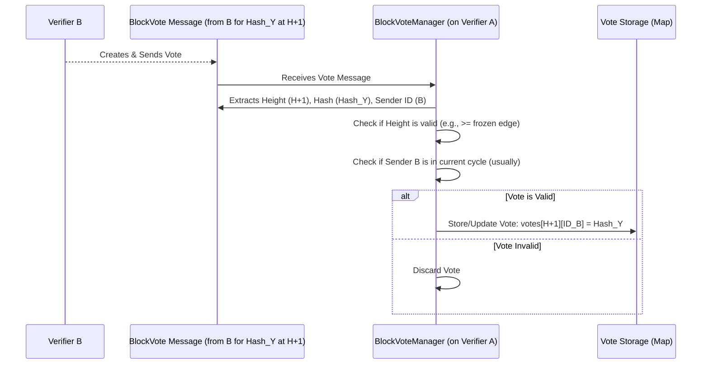

# Chapter 7: BlockVoteManager

In the previous chapter, [BlockManager](06_blockmanager_.md), we saw how the Nyzo network manages the "frozen edge" – the confirmed, final part of the blockchain history. But how does the network *decide* which block gets added next? What happens when different [Verifier](13_verifier_.md) nodes propose different potential blocks for the same height?

Imagine an election where several candidates (potential blocks) are running for the same position (the next block height). We need a fair way to count the votes and see who wins. This is where the `BlockVoteManager` comes in!

## What is the BlockVoteManager?

Think of the `BlockVoteManager` as the **election official** for the Nyzo blockchain. When a [Verifier](13_verifier_.md) decides which block it thinks should be next in the chain, it casts a "vote" for that block. The `BlockVoteManager` is responsible for:

1.  **Collecting Votes:** Receiving `BlockVote` messages from different verifiers.
2.  **Tallying Votes:** Counting how many votes each potential block (identified by its unique hash) receives for a specific block height.
3.  **Identifying the Leader:** Determining which block hash has the most votes (the "leading hash") for each height.

**Use Case:** Verifier Alpha proposes Block `X` for height 101, and Verifier Bravo proposes a different Block `Y` for the same height 101. Other verifiers in the network need to decide which block to accept. They express their preference by sending a `BlockVote`. How does the network track these votes and determine which block, `X` or `Y`, is winning the "election" for height 101? The `BlockVoteManager` handles this counting process.

## Key Concepts

*   **`BlockVote`:** This is a simple message sent by a [Verifier](13_verifier_.md). It essentially says, "For block height `H`, I vote for the block with hash `XYZ`." Each verifier typically casts one vote per height.
    ```java
    // Simplified idea of a BlockVote object
    public class BlockVote {
        long height;      // Which block height this vote is for (e.g., 101)
        byte[] hash;      // The fingerprint (hash) of the block being voted for
        long timestamp;   // When the vote was cast
        // ... other fields (like sender info) added when received ...
    }
    ```
*   **Tallying:** The `BlockVoteManager` maintains an internal record, often organized by block height. For each height, it keeps track of which verifier voted for which block hash.
    ```
    Height 101 Votes:
      - Verifier Alpha voted for Hash_X
      - Verifier Bravo voted for Hash_Y
      - Verifier Charlie voted for Hash_X
      - Verifier Delta voted for Hash_X
    ```
*   **Leading Hash:** After tallying, the `BlockVoteManager` can easily see which hash has the most votes for a given height. In the example above, `Hash_X` has 3 votes, and `Hash_Y` has 1 vote. Therefore, `Hash_X` is the **leading hash** for height 101.
*   **Consensus Role:** Getting enough votes for a leading hash (usually more than 50% or even 75% of the active verifiers) is a critical signal that the network is agreeing on the next block. While the `BlockVoteManager` just counts votes, this count is used by other parts of the system (like the [UnfrozenBlockManager](08_unfrozenblockmanager_.md)) to decide when a block can be considered confirmed and eventually frozen by the [BlockManager](06_blockmanager_.md).

## How Votes are Managed (Conceptual Flow)

1.  **Proposal:** Verifier A creates a new [Block](01_block_.md) (`Block_A`) for height `H+1`.
2.  **Self-Vote:** Verifier A creates a `BlockVote` for `Block_A`'s hash at height `H+1` and broadcasts it. `BlockVoteManager` on Verifier A records this vote.
3.  **Receive Vote:** Other Verifiers (B, C, D) receive Verifier A's `BlockVote`. Their `BlockVoteManager` components record this vote from A.
4.  **Receive Block:** Verifiers B, C, D might also receive `Block_A` itself (or maybe a competing `Block_B` from Verifier B).
5.  **Evaluate & Vote:** Verifiers B, C, and D evaluate the blocks they have received. They decide which block they prefer for height `H+1` (e.g., B prefers `Block_B`, C and D prefer `Block_A`).
6.  **Broadcast Votes:** Verifiers B, C, and D broadcast their own `BlockVote` messages.
7.  **Tally:** Every verifier's `BlockVoteManager` now has a collection of votes for height `H+1`. It tallies them up.
    *   Hash of `Block_A`: Votes from A, C, D
    *   Hash of `Block_B`: Vote from B
8.  **Determine Leader:** The `BlockVoteManager` identifies the hash of `Block_A` as the leading hash.

## Using the BlockVoteManager (Code Concepts)

The `BlockVoteManager` typically works behind the scenes, receiving vote messages. Other parts of the verifier might query it to understand the current consensus state.

```java
// --- Conceptual Example: Checking Vote Status ---

long targetHeight = BlockManager.getFrozenEdgeHeight() + 1; // Check the next height

// How many verifiers have voted for this height so far?
int totalVotes = BlockVoteManager.numberOfVotesAtHeight(targetHeight);
System.out.println("Total votes received for height " + targetHeight + ": " + totalVotes);

// What is the leading hash and how many votes does it have?
AtomicInteger leadingVoteCount = new AtomicInteger(0); // A wrapper to get the count back
byte[] leadingHash = BlockVoteManager.leadingHashForHeight(targetHeight, leadingVoteCount);

if (leadingHash != null) {
    System.out.println("Leading hash for height " + targetHeight + ": " +
                       PrintUtil.compactPrintByteArray(leadingHash));
    System.out.println("Votes for leading hash: " + leadingVoteCount.get());

    // Check if the leading count crosses a consensus threshold (e.g., > 50% of cycle)
    int cycleSize = BlockManager.currentCycleLength();
    if (leadingVoteCount.get() > cycleSize / 2) {
        System.out.println("Consensus threshold reached for this block!");
        // The UnfrozenBlockManager might use this information to try and freeze the block.
    } else {
        System.out.println("Waiting for more votes...");
    }
} else {
    System.out.println("No votes yet for height " + targetHeight);
}

// Did *our* verifier vote for a specific hash at this height?
byte[] myIdentifier = Verifier.getIdentifier();
byte[] myVoteHash = BlockVoteManager.voteForIdentifierAtHeight(myIdentifier, targetHeight);
if (myVoteHash != null) {
     System.out.println("Our vote was for hash: " + PrintUtil.compactPrintByteArray(myVoteHash));
}
```

**Explanation:**

*   We use static methods on `BlockVoteManager` to query the voting status.
*   `numberOfVotesAtHeight` tells us how many distinct verifiers have cast a vote for that height.
*   `leadingHashForHeight` returns the hash with the most votes and (via the `AtomicInteger`) the number of votes it received.
*   We can compare the `leadingVoteCount` to the network's cycle size to see if consensus is forming.
*   `voteForIdentifierAtHeight` lets us check what a specific verifier (like our own) voted for.

## Under the Hood: Storing and Counting Votes

Let's visualize how the `BlockVoteManager` handles an incoming vote.



Now, let's look at some key code snippets.

**1. Registering a Vote (`BlockVoteManager.java`):**

When a `BlockVote` message arrives, this method processes it.

```java
// --- File: src/main/java/co/nyzo/verifier/BlockVoteManager.java ---

// Map storing votes: Height -> (Verifier ID -> BlockVote Object)
private static final Map<Long, Map<ByteBuffer, BlockVote>> voteMap = new ConcurrentHashMap<>();
// Map used for handling vote changes ("flips") - more advanced
private static final Map<Long, Map<ByteBuffer, BlockVote>> flipVoteMap = new ConcurrentHashMap<>();

public static synchronized void registerVote(Message message) {

    if (message != null && message.getContent() instanceof BlockVote) {
        BlockVote vote = (BlockVote) message.getContent();
        long height = vote.getHeight();
        byte[] senderId = message.getSourceNodeIdentifier();
        ByteBuffer identifierBuffer = ByteBuffer.wrap(senderId);

        // Basic validation: Is the height relevant? Is the sender allowed to vote?
        long frozenEdgeHeight = BlockManager.getFrozenEdgeHeight();
        if (height >= frozenEdgeHeight &&
                height <= BlockManager.openEdgeHeight(true) && // Not too far ahead
                !ByteUtil.isAllZeros(vote.getHash()) &&       // Not an empty hash
                (BlockManager.verifierInCurrentCycle(identifierBuffer) || // Is sender in cycle?
                 BlockManager.inGenesisCycle())) {                 // (Or are we in Genesis?)

            // Get the map for this specific height
            Map<ByteBuffer, BlockVote> votesForHeight = voteMap.get(height);
            if (votesForHeight == null) {
                votesForHeight = new ConcurrentHashMap<>();
                voteMap.put(height, votesForHeight);
            }

            // Get the existing vote from this sender for this height, if any
            BlockVote existingVote = votesForHeight.get(identifierBuffer);

            // Simple case: No previous vote, just store the new one.
            if (existingVote == null) {
                vote.setReceiptTimestamp(System.currentTimeMillis()); // Store when we got it
                votesForHeight.put(identifierBuffer, vote);
            } else if (!ByteUtil.arraysAreEqual(existingVote.getHash(), vote.getHash())) {
                // Advanced: Handle vote "flips" (changing vote)
                // Requires multiple votes over time to prevent quick changes.
                // (Simplified - see full code for flip logic using flipVoteMap)
                System.out.println("Handling potential vote flip for " +
                                   PrintUtil.compactPrintByteArray(senderId) + " at height " + height);
                // In simple terms: if conditions met, update the vote:
                // votesForHeight.put(identifierBuffer, vote);
            }
            // If new vote has the same hash as existing vote, do nothing.
        }
    }
}
```

**Explanation:**

*   The code uses a `Map` (`voteMap`) where the key is the block `height`. The value is another `Map` where the key is the `verifierIdentifier` (who voted) and the value is the `BlockVote` object itself (containing the voted hash).
*   It performs checks: Is the height valid relative to the frozen edge? Is the sender a verifier in the current cycle?
*   If valid, it retrieves the vote map for that height (creating it if it doesn't exist).
*   It stores the vote, keyed by the sender's identifier. This automatically handles the "one vote per verifier per height" rule, as putting a new vote with the same key overwrites the old one (though Nyzo has extra logic to make changing a vote harder - the "flip vote" mechanism).

**2. Finding the Leading Hash (`BlockVoteManager.java`):**

This method tallies the votes for a specific height.

```java
// --- File: src/main/java/co/nyzo/verifier/BlockVoteManager.java ---

public static synchronized byte[] leadingHashForHeight(long height, AtomicInteger leadingHashVoteCount) {

    byte[] leadingHash = null;
    leadingHashVoteCount.set(0); // Reset count for the caller

    // Get all votes recorded for this height
    Map<ByteBuffer, BlockVote> votesForHeight = voteMap.get(height);

    if (votesForHeight != null) {
        // Temporary map to count votes per hash: (Block Hash -> Vote Count)
        Map<ByteBuffer, Integer> votesPerHash = new HashMap<>();

        // Iterate through all votes cast for this height
        for (BlockVote vote : votesForHeight.values()) {
            ByteBuffer hashBuffer = ByteBuffer.wrap(vote.getHash());
            // Increment the count for this specific hash
            int currentCount = votesPerHash.getOrDefault(hashBuffer, 0);
            votesPerHash.put(hashBuffer, currentCount + 1);
        }

        // Find the hash with the highest count
        for (Map.Entry<ByteBuffer, Integer> entry : votesPerHash.entrySet()) {
            ByteBuffer hash = entry.getKey();
            int count = entry.getValue();

            if (count > leadingHashVoteCount.get()) {
                // Found a new leader
                leadingHashVoteCount.set(count);
                leadingHash = hash.array();
            }
        }
    }

    return leadingHash; // Return the hash that had the most votes
}
```

**Explanation:**

*   It retrieves the map of all votes for the requested `height`.
*   It creates a temporary map (`votesPerHash`) to store the counts.
*   It iterates through each `BlockVote` cast for this height. For each vote, it increments the count associated with the vote's `hash` in the `votesPerHash` map.
*   After counting all votes, it iterates through the `votesPerHash` map to find the entry (hash) with the highest count.
*   It returns the hash with the highest count and sets the `leadingHashVoteCount` for the caller.

**3. Cleaning Up Old Votes (`BlockVoteManager.java`):**

To save memory, votes for heights far behind the frozen edge are removed.

```java
// --- File: src/main/java/co/nyzo/verifier/BlockVoteManager.java ---

// How many blocks behind the frozen edge to keep votes for
public static final long retentionNumberOfBlocks = 40L;

public static synchronized void removeOldVotes() {

    long frozenEdgeHeight = BlockManager.getFrozenEdgeHeight();
    long removalThreshold = frozenEdgeHeight - retentionNumberOfBlocks;

    // Get all heights currently in the vote map
    Set<Long> heightsInMap = new HashSet<>(voteMap.keySet());

    // Check each height
    for (long height : heightsInMap) {
        // If the height is too old (below the threshold)
        if (height <= removalThreshold) {
            // Remove the vote data for this height
            voteMap.remove(height);
            flipVoteMap.remove(height); // Also remove flip vote data
            LogUtil.println("BlockVoteManager: removing old votes for height " + height);
        }
    }
}
```

**Explanation:**

*   Calculates a `removalThreshold` based on the current `frozenEdgeHeight` and `retentionNumberOfBlocks`.
*   Iterates through all heights currently stored in the `voteMap`.
*   If a height is less than or equal to the threshold, it removes the entry for that height from both the main `voteMap` and the `flipVoteMap`.

## Conclusion

The `BlockVoteManager` plays a crucial role in Nyzo's consensus by acting as the vote counter. It collects `BlockVote`s from [Verifier](13_verifier_.md)s, tallies them for each block height, and identifies the **leading hash** – the block proposal with the most support. This information is essential for the network to agree on which block to add next to the chain.

Now that we understand how votes are counted, how does the system use this information, along with the proposed blocks themselves, to manage the blocks that are *candidates* for becoming the next frozen block?

Next up: [Chapter 8: UnfrozenBlockManager](08_unfrozenblockmanager_.md)

---

Generated by [AI Codebase Knowledge Builder](https://github.com/The-Pocket/Tutorial-Codebase-Knowledge)