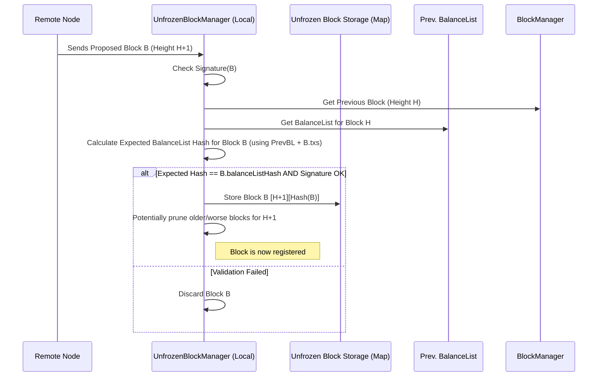
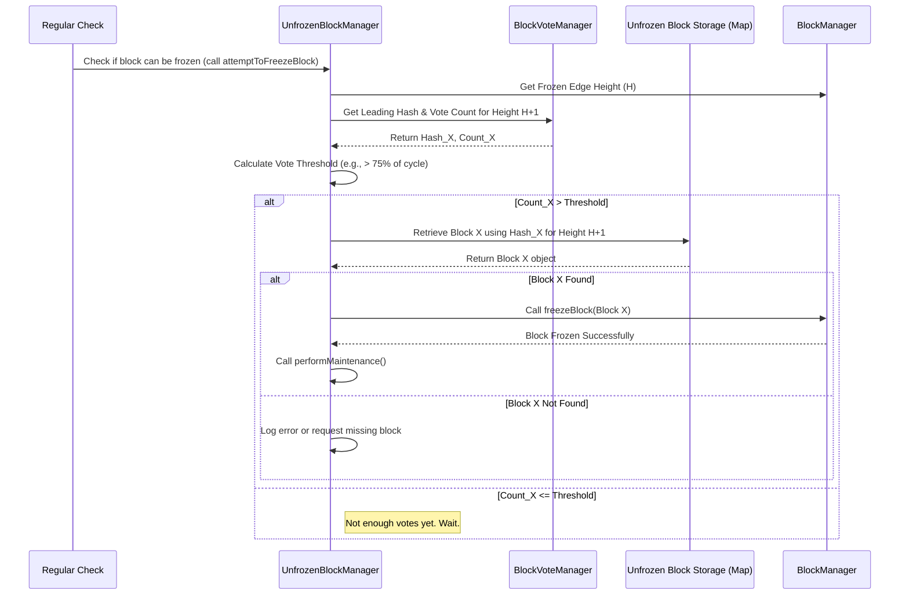

# Chapter 8: UnfrozenBlockManager

In [Chapter 7: BlockVoteManager](07_blockvotemanager_.md), we learned how the Nyzo network acts like an election official, collecting and tallying votes for potential next blocks. Verifiers cast votes (`BlockVote` messages) for the block hash they prefer at a certain height, and the `BlockVoteManager` tells us which hash is currently leading.

But where are these *actual* potential blocks stored while the voting happens? If Verifier A proposes Block X and Verifier B proposes Block Y for the same height, the network needs a place to keep track of both X and Y *before* one is declared the winner and added to the final, "frozen" chain by the [BlockManager](06_blockmanager_.md).

Imagine our [BlockManager](06_blockmanager_.md) is the head librarian managing the main, bound ledger book (the frozen chain). We need an assistant librarian who handles the *new*, proposed pages that haven't been officially added yet. This assistant keeps them organized and ready for review.

This is the role of the `UnfrozenBlockManager`.

## What is the UnfrozenBlockManager?

Think of the `UnfrozenBlockManager` as the **librarian's assistant** responsible for the "unfrozen" section of the library – the shelves holding the newest, proposed pages (Blocks) that haven't been fully agreed upon and finalized yet.

Its main jobs are:

1.  **Collecting Proposals:** Receiving potential new [Block](01_block_.md)s proposed by different [Verifier](13_verifier_.md)s.
2.  **Temporary Storage:** Keeping these candidate blocks organized, typically by their intended height and unique hash.
3.  **Providing Access:** Making these unfrozen blocks available so the system can examine them, evaluate their scores, and decide which one to vote for ([BlockVoteManager](07_blockvotemanager_.md)).
4.  **Driving Consensus:** Using the vote counts from the [BlockVoteManager](07_blockvotemanager_.md), it determines when a specific block has received enough support (consensus) to be considered the winner.
5.  **Initiating Freezing:** Once consensus is reached on a block, the `UnfrozenBlockManager` hands it over to the [BlockManager](06_blockmanager_.md) to be officially added to the permanent, frozen chain.

**Use Case:** Verifier Alpha proposes Block `X` (hash `abc`) for height 101. Verifier Bravo proposes Block `Y` (hash `def`) for height 101. How does the network keep track of both `X` and `Y` while votes are being cast? How does it decide when, say, `X` has enough votes to become the official Block 101? The `UnfrozenBlockManager` receives both `X` and `Y`, stores them, monitors the votes via `BlockVoteManager`, and eventually triggers the freezing of the winner.

## Key Responsibilities

The `UnfrozenBlockManager`, like the `BlockManager` and `BlockVoteManager`, is mostly a collection of static methods and internal data structures. It orchestrates the transition of a block from "proposed" to "frozen".

*   **Receiving & Storing Blocks (`registerBlock`):** When a new block proposal arrives from the network, the `UnfrozenBlockManager` checks its basic validity (e.g., signature, timestamp range). Crucially, it also checks if the block's stated `balanceListHash` matches the hash calculated based on the previous block's state and the transactions within this new block. This is a vital integrity check. If valid, the block is stored, typically in a map structure keyed by height and then by the block's hash.
    ```java
    // Conceptual Storage: Map<Height, Map<BlockHash, BlockObject>>
    Map<Long, Map<ByteBuffer, Block>> unfrozenBlocks;
    ```
*   **Managing Candidates:** To save memory, the manager might only keep a limited number of the "best" candidate blocks for each height (e.g., the top 10 based on their chain score).
*   **Retrieving Blocks (`unfrozenBlockAtHeight`):** Provides a way to get a specific unfrozen block if you know its height and hash. This is used, for example, to get the block corresponding to the leading hash reported by the [BlockVoteManager](07_blockvotemanager_.md).
*   **Casting Votes (`updateVote`):** The `UnfrozenBlockManager` often contains the logic for the verifier to decide *which* block hash to vote for. It examines the candidate blocks it holds for the next height, considers their scores, looks at the current vote counts from `BlockVoteManager`, and then potentially casts or updates its own vote using `BlockVoteManager.registerVote`.
*   **Checking for Consensus (`attemptToFreezeBlock`):** This is the core function where the manager checks if consensus has been reached. It queries the `BlockVoteManager` for the leading hash and its vote count for the next height. If the count exceeds a threshold (e.g., > 75% of active verifiers), it retrieves the corresponding winning block and tells the [BlockManager](06_blockmanager_.md) to freeze it.
*   **Maintenance (`performMaintenance`):** Cleans up old unfrozen blocks for heights that are now far behind the frozen edge.

## Using the UnfrozenBlockManager (Code Concepts)

The `UnfrozenBlockManager` interacts closely with incoming blocks, the `BlockVoteManager`, and the `BlockManager`.

```java
// --- Conceptual Example: Processing a New Block Proposal ---

// Assume 'receivedBlock' is a new Block object just arrived from the network
// for height = BlockManager.getFrozenEdgeHeight() + 1
boolean wasRegistered = UnfrozenBlockManager.registerBlock(receivedBlock);

if (wasRegistered) {
    System.out.println("Successfully registered new block proposal: " + receivedBlock.getHash());

    // Now that a new candidate exists, let's re-evaluate our vote
    UnfrozenBlockManager.updateVote(); // This might cast a vote via BlockVoteManager

    // Let's check if any block now has enough votes to be frozen
    boolean didFreeze = UnfrozenBlockManager.attemptToFreezeBlock();
    if (didFreeze) {
        System.out.println("Consensus reached! A new block was frozen.");
        UnfrozenBlockManager.performMaintenance(); // Clean up old unfrozen blocks
    } else {
        System.out.println("Still waiting for consensus...");
    }

} else {
    System.out.println("Block proposal was invalid or duplicate, discarding.");
}

// --- Conceptual Example: Getting a specific unfrozen block ---
long nextHeight = BlockManager.getFrozenEdgeHeight() + 1;
AtomicInteger voteCount = new AtomicInteger(0);
byte[] leadingHash = BlockVoteManager.leadingHashForHeight(nextHeight, voteCount);

if (leadingHash != null) {
    // Get the actual block object for the leading hash
    Block leadingBlock = UnfrozenBlockManager.unfrozenBlockAtHeight(nextHeight, leadingHash);
    if (leadingBlock != null) {
        System.out.println("Leading block details: " + leadingBlock);
        // We could now examine the leadingBlock's contents or score...
    } else {
         System.out.println("Have votes for hash, but don't have the block yet.");
         // Might need to request the missing block from the network...
         // UnfrozenBlockManager.fetchMissingBlock(nextHeight, leadingHash);
    }
}
```

**Explanation:**

*   When a new block proposal arrives, we try to `registerBlock` it. This performs crucial validation.
*   If registered, we might update our own vote (`updateVote`) and check if any block is ready for freezing (`attemptToFreezeBlock`).
*   If a block is frozen, we perform maintenance (`performMaintenance`).
*   Separately, we can query the `BlockVoteManager` for the leading hash and then use `unfrozenBlockAtHeight` to retrieve the corresponding block object from the `UnfrozenBlockManager`.

## Under the Hood: Managing Candidates and Freezing

Let's trace the life cycle of a block from proposal to potential freezing.

**1. Receiving a Block:**



**2. Deciding to Freeze:**



**Code Snippets:**

Let's look at simplified versions of the key methods.

**1. `UnfrozenBlockManager.registerBlock()`:**

This validates and stores a new block proposal.

```java
// --- File: src/main/java/co/nyzo/verifier/UnfrozenBlockManager.java ---

// Map storing blocks: Height -> (BlockHash -> BlockObject)
private static Map<Long, Map<ByteBuffer, Block>> unfrozenBlocks = new ConcurrentHashMap<>();

public static boolean registerBlock(Block block) {

    boolean registeredBlock = false;
    long frozenEdgeHeight = BlockManager.getFrozenEdgeHeight();

    // Basic checks: not null, signature valid, height relevant
    if (block != null && block.getBlockHeight() > frozenEdgeHeight &&
            block.signatureIsValid() &&
            block.getBlockHeight() <= BlockManager.openEdgeHeight(true)) {

        long blockHeight = block.getBlockHeight();
        Map<ByteBuffer, Block> blocksAtHeight = unfrozenBlocks.computeIfAbsent(blockHeight, k -> new ConcurrentHashMap<>());
        ByteBuffer blockHashBuffer = ByteBuffer.wrap(block.getHash());

        // Avoid processing duplicates
        if (!blocksAtHeight.containsKey(blockHashBuffer)) {

            // *** Crucial Validation Step ***
            // Check if the balance list hash matches our calculation
            BalanceList calculatedBalanceList = BalanceListManager.balanceListForBlock(block);
            if (calculatedBalanceList != null &&
                ByteUtil.arraysAreEqual(calculatedBalanceList.getHash(), block.getBalanceListHash())) {

                // Passed validation! Add to storage.
                blocksAtHeight.put(blockHashBuffer, block);
                registeredBlock = true;

                // Pruning logic (simplified): Keep only top N blocks based on score
                if (blocksAtHeight.size() > 10 && !BlockManager.inGenesisCycle()) {
                    // ... (Find the block with the worst/highest score) ...
                    // ... (Check if it's the leading hash - if so, maybe don't remove) ...
                    // ... (Remove the worst block: blocksAtHeight.remove(worstHashBuffer)) ...
                }
            } else {
                 System.err.println("Block " + block.getBlockHeight() + " failed balance list hash check!");
                 // This block is invalid because its claimed state doesn't match calculated state.
            }
        }
    }

    return registeredBlock;
}
```

**Explanation:**

*   Performs initial checks (signature, height).
*   The most important check is comparing the `block.getBalanceListHash()` with the hash of the `BalanceList` calculated locally (`BalanceListManager.balanceListForBlock(block)`). This ensures the block's transactions result in the claimed state.
*   If valid, the block is added to the `unfrozenBlocks` map.
*   Includes logic (simplified here) to prune the map and keep only the best candidate blocks for each height to manage memory.

**2. `UnfrozenBlockManager.unfrozenBlockAtHeight()`:**

Retrieves a specific block from the temporary storage.

```java
// --- File: src/main/java/co/nyzo/verifier/UnfrozenBlockManager.java ---

public static Block unfrozenBlockAtHeight(long height, byte[] hash) {

    Block block = null;
    if (hash != null) {
        // Get the inner map for the specified height
        Map<ByteBuffer, Block> blocksAtHeight = unfrozenBlocks.get(height);
        if (blocksAtHeight != null) {
            // Get the block using the hash as the key
            block = blocksAtHeight.get(ByteBuffer.wrap(hash));
        }
    }

    return block; // Returns the block object or null if not found
}
```

**Explanation:**

*   Takes the `height` and `hash` of the desired block.
*   Looks up the inner map for that `height` in the `unfrozenBlocks` map.
*   If the inner map exists, it looks up the block using the `hash`.
*   Returns the `Block` object if found, otherwise `null`.

**3. `UnfrozenBlockManager.attemptToFreezeBlock()`:**

Checks vote counts and triggers freezing if consensus is met.

```java
// --- File: src/main/java/co/nyzo/verifier/UnfrozenBlockManager.java ---

public static boolean attemptToFreezeBlock() {

    boolean frozeBlock = false;
    long frozenEdgeHeight = BlockManager.getFrozenEdgeHeight();
    long heightToFreeze = frozenEdgeHeight + 1;

    // 1. Get leading hash and vote count from BlockVoteManager
    AtomicInteger voteCountWrapper = new AtomicInteger(0);
    byte[] leadingHash = BlockVoteManager.leadingHashForHeight(heightToFreeze, voteCountWrapper);
    int voteCount = voteCountWrapper.get();

    // 2. Determine the threshold needed
    int votingPoolSize = BlockManager.currentCycleLength(); // Size of the current committee
    // Simplified threshold (e.g., > 75%, real code might adjust based on time)
    int voteCountThreshold = votingPoolSize * 3 / 4;

    // 3. Check if threshold is met
    if (leadingHash != null && voteCount > voteCountThreshold) {

        // 4. Get the winning block from our unfrozen storage
        Block blockToFreeze = unfrozenBlockAtHeight(heightToFreeze, leadingHash);

        if (blockToFreeze != null) {
            // 5. Tell BlockManager to freeze it!
            System.out.println("Consensus reached! Freezing block " + blockToFreeze);
            BlockManager.freezeBlock(blockToFreeze); // Hand off to the Head Librarian
            frozeBlock = true;
        } else {
            // We have votes for this hash, but we don't have the block locally!
            System.err.println("Want to freeze hash " + PrintUtil.compactPrintByteArray(leadingHash) +
                               " but block is missing!");
            // Request the missing block from the network
            fetchMissingBlock(heightToFreeze, leadingHash);
        }
    }

    return frozeBlock;
}
```

**Explanation:**

*   Determines the next height to freeze (`heightToFreeze`).
*   Asks the `BlockVoteManager` for the leading hash and its vote count at that height.
*   Calculates the required vote threshold (simplified here; actual calculation can be more complex).
*   If the vote count exceeds the threshold:
    *   It retrieves the actual winning `Block` object from its own storage using `unfrozenBlockAtHeight`.
    *   If the block is found locally, it calls `BlockManager.freezeBlock()` to make it part of the permanent chain.
    *   If the block is *not* found locally (maybe it was pruned or never received), it triggers a request to fetch it from the network (`fetchMissingBlock`).

**4. `UnfrozenBlockManager.updateVote()` (Simplified Concept):**

Decides which block hash the local verifier should vote for.

```java
// --- File: src/main/java/co/nyzo/verifier/UnfrozenBlockManager.java ---

public static void updateVote() {
    long frozenEdgeHeight = BlockManager.getFrozenEdgeHeight();
    long heightToVote = frozenEdgeHeight + 1;
    Map<ByteBuffer, Block> candidates = unfrozenBlocks.get(heightToVote);

    byte[] hashToVoteFor = null;
    String reason = "No candidates";

    if (candidates != null && !candidates.isEmpty()) {
        // Logic to choose the best hash to vote for:
        // 1. Check BlockVoteManager: Is there a strong leader (>50%)?
        //    - If yes, and we have that block, and its score is acceptable, vote for it.
        // 2. If no strong leader, find the block among *our* candidates with the lowest score.
        //    - If its score allows voting (check block.getMinimumVoteTimestamp()), vote for it.
        // 3. If still no decision, maybe stick with previous vote or wait.
        // (This logic is complex - see full source for details)

        // Example: Simplified - vote for the lowest score we have, if allowed
        Block bestBlock = null;
        long lowestScore = Long.MAX_VALUE;
        for (Block block : candidates.values()) {
            long score = block.chainScore(frozenEdgeHeight);
            if (score < lowestScore) {
                lowestScore = score;
                bestBlock = block;
            }
        }

        if (bestBlock != null && bestBlock.getMinimumVoteTimestamp() <= System.currentTimeMillis()) {
            hashToVoteFor = bestBlock.getHash();
            reason = "Lowest score (" + lowestScore + ")";
        } else {
             reason = "Best block score (" + lowestScore + ") not ready for voting yet";
        }
    }

    System.out.println("Vote decision: " + reason);
    if (hashToVoteFor != null) {
        // Use helper method to actually cast the vote via BlockVoteManager
        castVote(heightToVote, hashToVoteFor);
    }
}
```

**Explanation:**

*   This method encapsulates the local verifier's voting strategy.
*   It examines the candidate `Block`s it holds for the next height.
*   It likely checks the current vote situation using `BlockVoteManager`.
*   It calculates scores (`chainScore`) for candidate blocks.
*   Based on scores, vote counts, and timing rules (`getMinimumVoteTimestamp`), it determines the `hashToVoteFor`.
*   If a decision is made, it calls `castVote` (which uses `BlockVoteManager` internally) to broadcast its preference.

## Conclusion

The `UnfrozenBlockManager` is the crucial link between proposed blocks and the finalized blockchain. It acts as the librarian's assistant, carefully receiving, validating (especially the `balanceListHash`), and storing candidate blocks. By working closely with the [BlockVoteManager](07_blockvotemanager_.md) to track consensus and evaluating block scores, it determines when a block is ready to be passed to the [BlockManager](06_blockmanager_.md) for permanent freezing. It also drives the local verifier's own voting strategy based on the blocks it holds.

We've now seen how blocks are created, validated, voted on, and managed. But who are the participants doing all this work? They are the nodes in the Nyzo network.

Next up: [Chapter 9: Node](09_node_.md)

---

Generated by [AI Codebase Knowledge Builder](https://github.com/The-Pocket/Tutorial-Codebase-Knowledge)