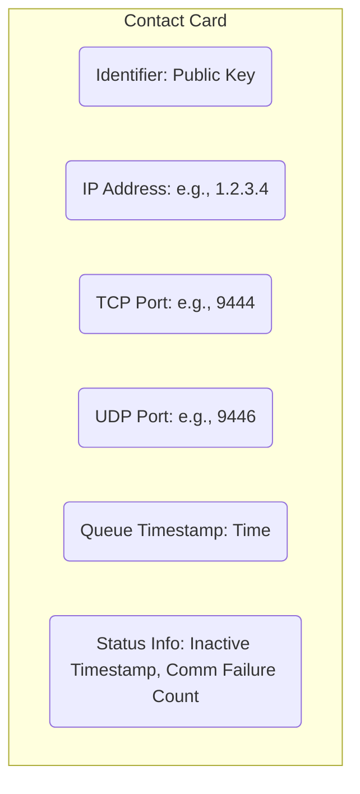
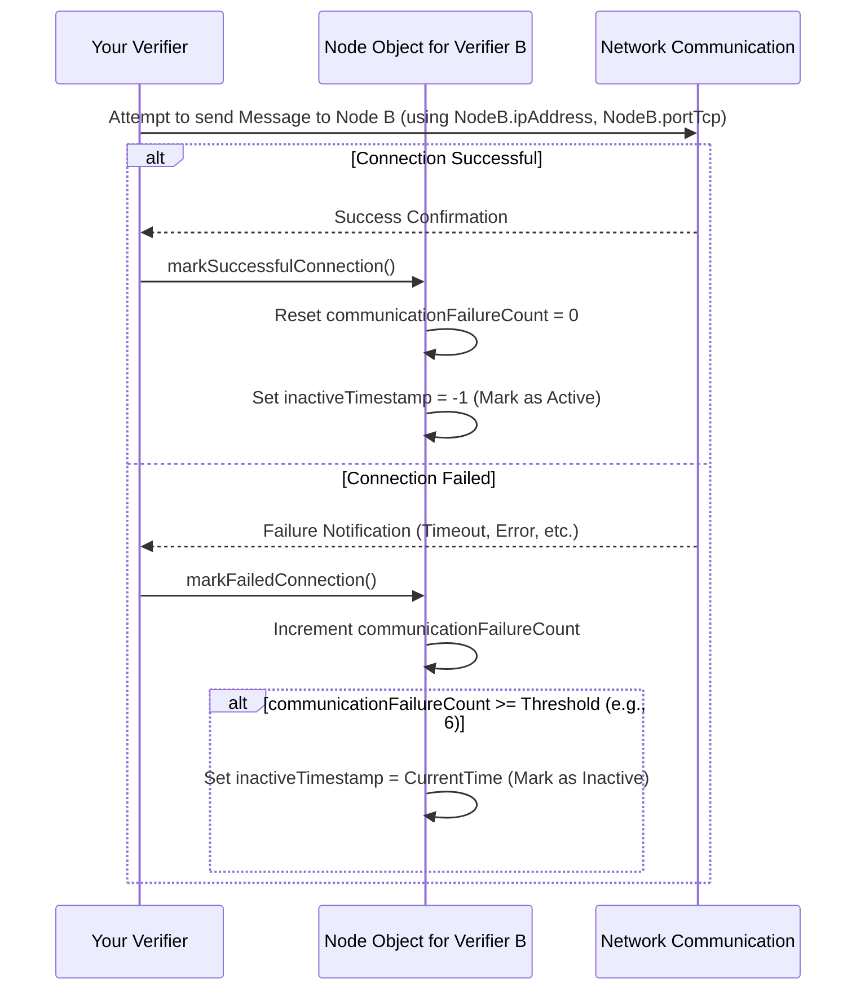

# Chapter 9: Node

In [Chapter 8: UnfrozenBlockManager](08_unfrozenblockmanager_.md), we saw how the network manages proposed blocks before they become final. We learned about verifiers proposing blocks and voting on them ([Chapter 7: BlockVoteManager](07_blockvotemanager_.md)). But who *are* these verifiers? And how does the system keep track of all the computers participating in the Nyzo network?

Imagine our library analogy again. We have librarians ([Verifier](13_verifier_.md)s) managing the ledger ([Block](01_block_.md)s). How does the head librarian know who is on duty today? How do they know each librarian's name and how to contact them if needed? They need a roster or directory of all the participants.

This is exactly what the `Node` object represents in the Nyzo network.

## What is a Node?

Think of a `Node` as a **directory entry** for a single computer participating in the Nyzo network. It's like a contact card for each librarian or auditor working on the shared ledger.

Each computer running the Nyzo verifier software is considered a "node." To communicate and coordinate, the network needs basic information about each of these nodes.

**Use Case:** Your Nyzo verifier needs to send a message (like a vote or a block proposal) to another specific verifier, let's call it "Verifier B". How does your verifier know Verifier B's unique identifier (like its name badge) and its network address (like its phone number and extension) to send the message? The answer is by looking up Verifier B's `Node` object, which contains this information.

## What's Inside a Node Object?

Just like a contact card, a `Node` object holds specific pieces of information about a participant computer:

1.  **Identifier (`identifier`):** This is the unique public key (like a name badge or cryptographic ID) of the verifier running on that computer. Every node participating actively has one.
2.  **IP Address (`ipAddress`):** This is the computer's address on the internet (like a street address or main phone number). It tells other nodes *where* to send messages. Nyzo stores this as raw bytes.
3.  **TCP Port (`portTcp`):** When sending messages over the internet, you need not just the IP address but also a specific "port" number (like a phone extension). Nyzo typically uses TCP port 9444 for reliable, connection-based communication.
4.  **UDP Port (`portUdp`):** Nyzo also uses UDP (a faster, connectionless way to send messages) for certain things like votes. This field stores the UDP port number (typically 9446) if the node supports it.
5.  **Queue Timestamp (`queueTimestamp`):** This records when the node joined the network or was last updated. It's sometimes used for ordering or determining eligibility for certain roles.
6.  **Inactive Timestamp (`inactiveTimestamp`):** If the network hasn't been able to successfully communicate with this node for a while, it might be marked as inactive. This timestamp records *when* it was marked inactive. If the node is active, this value is typically -1.
7.  **Communication Failure Count (`communicationFailureCount`):** This counter tracks how many times *in a row* attempts to communicate with this node have failed. If it reaches a certain threshold (e.g., 6 failures), the node is marked as inactive.



## How Node Objects are Used (Conceptual)

`Node` objects themselves are simple data containers. Their real power comes when they are managed collectively by the [NodeManager](10_nodemanager_.md), which maintains the list of all known nodes (the "mesh").

Here's how they fit in:

*   **Network Directory:** The [NodeManager](10_nodemanager_.md) keeps a list (or map) of `Node` objects, acting as the network's address book.
*   **Sending Messages:** When your verifier needs to send a [Message](11_message_.md) to Verifier B, it asks the [NodeManager](10_nodemanager_.md) for Verifier B's `Node` object. It then uses the `ipAddress` and `portTcp` (or `portUdp`) from that object to direct the message.
*   **Tracking Status:** The `inactiveTimestamp` and `communicationFailureCount` within the `Node` object help the [NodeManager](10_nodemanager_.md) keep track of which nodes are currently responsive and active participants in the network cycle. Nodes that consistently fail to communicate are eventually removed or ignored.

## Using a Node in Code (Conceptual)

Let's see how you might interact with a `Node` object once you have one (perhaps obtained from the [NodeManager](10_nodemanager_.md)).

```java
// Assume 'nodeB' is a Node object representing Verifier B
// Node nodeB = NodeManager.findNode(verifierB_Identifier); // Conceptual lookup

if (nodeB != null) {
    // Get its IP address (as bytes)
    byte[] ip = nodeB.getIpAddress();
    // Get its TCP port
    int port = nodeB.getPortTcp();

    // Convert IP bytes to a readable string (using a helper)
    String ipString = IpUtil.addressAsString(ip);
    System.out.println("Verifier B Address: " + ipString + ":" + port);

    // Check if the node is currently considered active
    if (nodeB.isActive()) {
        System.out.println("Verifier B is active.");
        // Okay to try sending messages...
        // sendMessageTo(ip, port, myMessage);
    } else {
        System.out.println("Verifier B is inactive (last inactive timestamp: " + nodeB.getInactiveTimestamp() + ")");
        // Probably shouldn't rely on this node right now.
    }

    // --- Simulating connection results ---
    // If a connection attempt succeeds:
    nodeB.markSuccessfulConnection();
    System.out.println("Connection successful! Failure count reset.");

    // If a connection attempt fails:
    nodeB.markFailedConnection();
    System.out.println("Connection failed. Is it active now? " + nodeB.isActive());
    // If markFailedConnection() caused it to become inactive, isActive() will now return false.

} else {
    System.out.println("Could not find Node information for Verifier B.");
}
```

**Explanation:**

*   We get a `Node` object (here, `nodeB`).
*   We can retrieve its properties like `ipAddress` and `portTcp` using getter methods. We use a helper `IpUtil.addressAsString` to make the IP address readable.
*   We can check its status using `isActive()`.
*   Crucially, after attempting to communicate with the node, other parts of the system call `markSuccessfulConnection()` or `markFailedConnection()`. These methods update the internal state of the `Node` object (failure count, inactive timestamp).

## Under the Hood: Managing Node Status

The `Node` object doesn't actively do anything on its own; it just holds data. The key mechanism is how its status fields (`communicationFailureCount`, `inactiveTimestamp`) are updated by external actions (like connection attempts).

**Flow for Updating Status:**



**Code Snippets (`Node.java`):**

Let's look at the simplified code for the constructor and the status methods.

**1. `Node` Constructor:**

```java
// --- File: src/main/java/co/nyzo/verifier/Node.java ---

public class Node implements MessageObject {

    private byte[] identifier;
    private byte[] ipAddress;
    private int portTcp;
    private int portUdp;
    private long queueTimestamp;
    private long inactiveTimestamp;
    private long communicationFailureCount;

    // How many consecutive failures trigger marking as inactive
    private static final int communicationFailureInactiveThreshold = 6;

    public Node(byte[] identifier, byte[] ipAddress, int portTcp, int portUdp) {
        // Store copies of the provided data
        this.identifier = Arrays.copyOf(identifier, FieldByteSize.identifier);
        this.ipAddress = Arrays.copyOf(ipAddress, FieldByteSize.ipAddress);
        this.portTcp = portTcp;
        this.portUdp = portUdp; // Store UDP port if provided

        // Initialize status: Timestamped now, Active, 0 failures
        this.queueTimestamp = System.currentTimeMillis();
        this.inactiveTimestamp = -1L; // -1 means active
        this.communicationFailureCount = 0;
    }

    // ... getter and setter methods ...
}
```

**Explanation:**

*   The constructor takes the basic identification and connection details.
*   It makes copies of the byte arrays (`identifier`, `ipAddress`) to ensure the `Node` object has its own data.
*   It initializes the node as active (`inactiveTimestamp = -1L`) with zero communication failures.

**2. Marking Connection Success:**

```java
// --- File: src/main/java/co/nyzo/verifier/Node.java ---

    public void markSuccessfulConnection() {
        // On success, reset the failure count
        communicationFailureCount = 0;
        // Ensure the node is marked as active
        inactiveTimestamp = -1L;
    }
```

**Explanation:**

*   If communication succeeds, any previous consecutive failures are forgotten by resetting `communicationFailureCount` to 0.
*   It also explicitly sets `inactiveTimestamp` to -1, ensuring the node is considered active.

**3. Marking Connection Failure:**

```java
// --- File: src/main/java/co/nyzo/verifier/Node.java ---

    public void markFailedConnection() {
        // Increment the failure count
        communicationFailureCount++;

        // Check if the threshold is reached AND if the node is not already inactive
        if (communicationFailureCount >= communicationFailureInactiveThreshold && inactiveTimestamp < 0) {
            // Mark as inactive by recording the current time
            inactiveTimestamp = System.currentTimeMillis();
            System.out.println("Node " + IpUtil.addressAsString(ipAddress) + " marked inactive.");
        }
    }
```

**Explanation:**

*   Increments the `communicationFailureCount`.
*   Checks if the count has reached or exceeded the `communicationFailureInactiveThreshold`.
*   It *also* checks if `inactiveTimestamp` is less than 0 (meaning it's currently considered active).
*   If both conditions are true, it marks the node as inactive by setting `inactiveTimestamp` to the current time. This prevents setting the timestamp repeatedly on subsequent failures.

**4. Checking Activity Status:**

```java
// --- File: src/main/java/co/nyzo/verifier/Node.java ---

    public boolean isActive() {
        // A node is active if its inactiveTimestamp is negative
        return inactiveTimestamp < 0;
    }
```

**Explanation:**

*   A simple check: if `inactiveTimestamp` is -1 (or any negative value), the node is considered active. Otherwise, it's inactive.

## Conclusion

We've learned that a `Node` object is like a contact card for each computer participating in the Nyzo network. It holds essential information: the verifier's unique `identifier`, its network `ipAddress` and `port` for communication, and status information like whether it's currently `active` based on recent communication success or failure. These `Node` objects are the fundamental building blocks for understanding the structure of the network mesh.

But how does the system manage the *entire collection* of these `Node` objects? How does it discover new nodes, keep the list updated, and provide ways to query the network mesh?

Next up: [Chapter 10: NodeManager](10_nodemanager_.md)

---

Generated by [AI Codebase Knowledge Builder](https://github.com/The-Pocket/Tutorial-Codebase-Knowledge)
