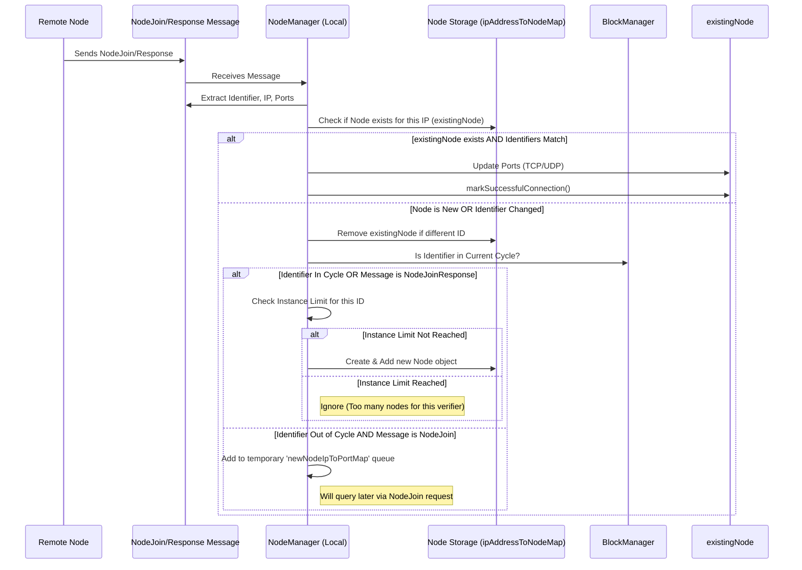
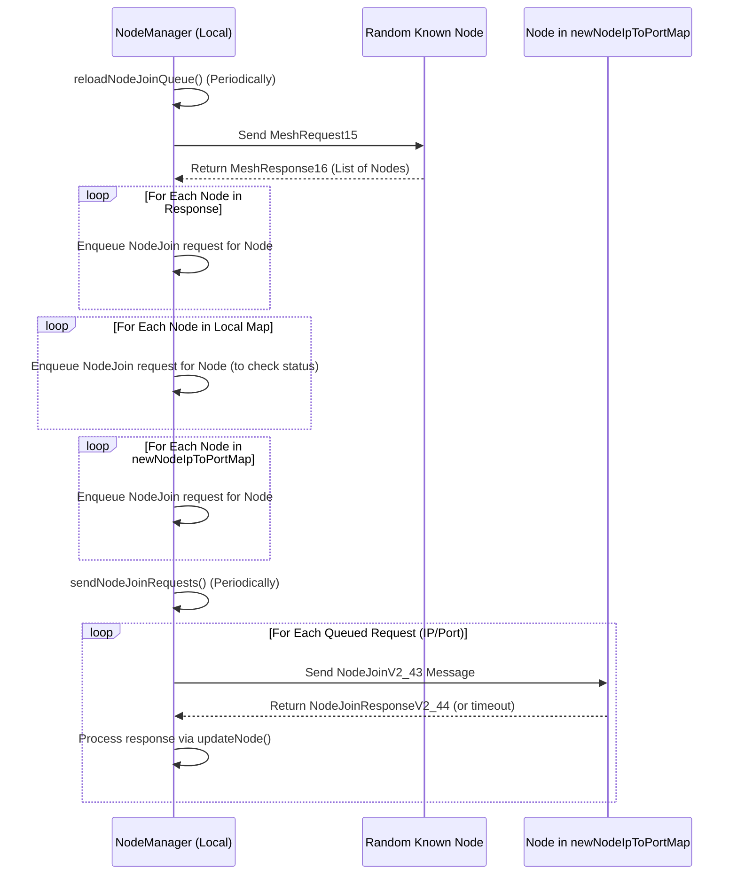

# Chapter 10: NodeManager

In [Chapter 9: Node](09_node_.md), we learned that a `Node` object is like a contact card for each computer participating in the Nyzo network, holding its ID, address, and status. That's great for representing *one* participant, but how does your Nyzo verifier keep track of *all* the participants? How does it build and maintain a complete list of who's who in the network?

Imagine you're joining a new club. You need a membership directory to know who else is in the club and how to contact them. Just having your own membership card isn't enough; you need the list of everyone else!

**Use Case:** When your Nyzo verifier starts up, it knows about itself, but how does it discover other nodes (verifiers) in the network? How does it get their IP addresses and ports to start communicating, exchanging blocks, and participating in votes? How does it keep this list up-to-date as nodes join or leave? The network needs a central manager for this directory – the `NodeManager`.

## What is the NodeManager?

Think of the `NodeManager` as the **club's membership secretary** or the **network's address book manager**. It's responsible for maintaining the master list of all known [Node](09_node_.md) participants (both those currently verifying blocks and others) in the Nyzo mesh (network).

It manages information about their IP addresses, ports, identifiers, and their status (active/inactive). It's crucial for knowing *who* to communicate with for tasks like broadcasting new blocks, sending votes, or requesting information.

## Key Responsibilities

The `NodeManager` isn't a single object you pass around; like the other managers we've seen, it's a collection of static methods and internal data structures (mostly within the `NodeManager` class) that handle the network directory.

Here's what it does:

1.  **Storing Nodes:** It keeps the main list of known [Node](09_node_.md) objects, primarily using a map (`ipAddressToNodeMap`) where the key is the node's IP address.
2.  **Discovering Nodes:** It learns about other nodes primarily through:
    *   **Node Join Messages:** When another node sends a `NodeJoin` message, the `NodeManager` processes it (`updateNode`).
    *   **Mesh Requests:** It periodically asks known nodes for *their* list of nodes (`reloadNodeJoinQueue` logic). This helps discover nodes it didn't know about.
    *   **Responses:** When your node sends a message (like a `NodeJoin`), the response often confirms the other node's details.
3.  **Providing Access:** It allows other parts of the system to get lists of nodes:
    *   `getMesh()`: Returns a list of *all* known nodes.
    *   `getCycle()`: Returns a list of nodes whose identifiers are currently in the active verifier cycle (as determined by the [BlockManager](06_blockmanager_.md)).
4.  **Maintaining Status:** It interacts with the `Node` objects' status. When communication attempts fail, the calling code might tell the `Node` object (`markFailedConnection`). The `NodeManager` periodically cleans up nodes that have been inactive for too long (`updateActiveVerifiersAndRemoveOldNodes`).
5.  **Persistence:** It saves the current list of known nodes to a file (`nodes`) so the verifier doesn't lose its entire address book when it restarts. It loads this file on startup (`loadPersistedNodes`).
6.  **Joining the Network:** It manages the process of your node announcing itself to others by sending `NodeJoin` messages (`sendNodeJoinRequests`).

## Using the NodeManager (Code Concepts)

Other parts of the verifier need to know who else is out there. They use `NodeManager`'s static methods.

```java
// --- Conceptual Example: Exploring the Network Mesh ---

// Get a list of all known nodes in the mesh
List<Node> allNodes = NodeManager.getMesh();
System.out.println("Total known nodes in the mesh: " + allNodes.size());

// Get a list of nodes currently in the active verifier cycle
List<Node> cycleNodes = NodeManager.getCycle();
System.out.println("Nodes currently in the active cycle: " + cycleNodes.size());

System.out.println("Listing first few cycle nodes:");
for (int i = 0; i < Math.min(5, cycleNodes.size()); i++) {
    Node node = cycleNodes.get(i);
    System.out.println("- ID: " + PrintUtil.compactPrintByteArray(node.getIdentifier()) +
                       ", IP: " + IpUtil.addressAsString(node.getIpAddress()) +
                       ", Active: " + node.isActive());
}

// Check if a specific IP address belongs to a node currently in the cycle
byte[] someIpAddress = IpUtil.addressFromString("1.2.3.4"); // Example IP
if (someIpAddress != null) {
    boolean isInCycle = NodeManager.ipAddressInCycle(ByteBuffer.wrap(someIpAddress));
    System.out.println("Is IP 1.2.3.4 in the active cycle? " + isInCycle);
}

// Are we successfully connected to the mesh? (Simple check)
if (NodeManager.connectedToMesh()) {
    System.out.println("Successfully connected to the mesh (found other nodes).");
} else {
    System.out.println("Still trying to discover other nodes...");
}
```

**Explanation:**

*   `NodeManager.getMesh()` gives you the full known address book.
*   `NodeManager.getCycle()` gives you the list of nodes currently responsible for verifying blocks. This is often the most important list for consensus operations.
*   We can iterate through these lists to get individual [Node](09_node_.md) objects and their details.
*   `NodeManager.ipAddressInCycle()` provides a quick check based on the IP address.
*   `NodeManager.connectedToMesh()` gives a basic indication of whether we know about any other nodes yet.

## Under the Hood: Managing the Mesh

How does the `NodeManager` actually build and maintain this list?

**1. Adding/Updating a Node (`updateNode`):**

When a message like `NodeJoinV2_43` (I want to join) or `NodeJoinResponseV2_44` (Here are my details) arrives, the `NodeManager` updates its records.



**Code Snippet (`NodeManager.java` - `updateNode` simplified):**

```java
// --- File: src/main/java/co/nyzo/verifier/NodeManager.java ---

// Map storing nodes: IP Address -> Node Object
private static final Map<ByteBuffer, Node> ipAddressToNodeMap = new ConcurrentHashMap<>();
// Temporary map for out-of-cycle nodes discovered via NodeJoin
private static final Map<ByteBuffer, Integer> newNodeIpToPortMap = new ConcurrentHashMap<>();

private static void updateNode(byte[] identifier, byte[] ipAddress, int portTcp, int portUdp,
                               boolean isNodeJoinResponse) {

    // Basic validation: ignore invalid IDs, IPs, private IPs
    if (identifier == null || identifier.length != FieldByteSize.identifier ||
        ipAddress == null || ipAddress.length != FieldByteSize.ipAddress ||
        IpUtil.isPrivate(ipAddress)) {
        return;
    }

    ByteBuffer ipAddressBuffer = ByteBuffer.wrap(ipAddress);
    Node existingNode = ipAddressToNodeMap.get(ipAddressBuffer);
    ByteBuffer identifierBuffer = ByteBuffer.wrap(identifier);

    // Case 1: Node exists at this IP with the SAME identifier
    if (existingNode != null && ByteUtil.arraysAreEqual(existingNode.getIdentifier(), identifier)) {
        existingNode.setPortTcp(portTcp); // Update ports
        if (portUdp > 0) existingNode.setPortUdp(portUdp);
        existingNode.markSuccessfulConnection(); // Mark as active
    } else {
        // Case 2: Node is new, or identifier at this IP changed
        if (existingNode != null) {
            ipAddressToNodeMap.remove(ipAddressBuffer); // Remove old node if identifier changed
        }

        // Decide whether to add immediately or queue
        boolean isInCycle = BlockManager.verifierInCurrentCycle(identifierBuffer);

        if (isInCycle || isNodeJoinResponse) {
            // Add nodes in cycle, OR nodes learned via a join RESPONSE immediately
            // (Subject to limits per verifier ID)
            int instanceCount = 0; /* ... count existing nodes with this ID ... */
            if (instanceCount < maximumNodesPerInCycleVerifier) {
                Node newNode = new Node(identifier, ipAddress, portTcp, portUdp);
                ipAddressToNodeMap.put(ipAddressBuffer, newNode);
                // Log if an out-of-cycle node was added via a response
                if (!isInCycle) LogUtil.println("Added out-of-cycle node via response: " +
                                                NicknameManager.get(identifier));
            }
        } else {
            // Add out-of-cycle nodes learned via an incoming JOIN request to a temporary queue
            newNodeIpToPortMap.put(ipAddressBuffer, portTcp);
            LogUtil.println("Queued potential new node: " + NicknameManager.get(identifier));
            // Prune queue if too large...
        }
    }
}
```

**Explanation:**

*   The method gets the details from the message (identifier, IP, ports).
*   It checks if a node already exists at that IP.
*   If it's the same node (same ID), it just updates the ports and marks it active.
*   If it's a new node for that IP (or the ID changed), it decides:
    *   If the node is *in the current cycle* OR if this information came from a `NodeJoinResponse`, it tries to add it directly to the main `ipAddressToNodeMap` (checking limits).
    *   If the node is *out of cycle* and this info came from an *incoming* `NodeJoin` request, it puts the IP/port into a temporary queue (`newNodeIpToPortMap`) to be queried later. This prevents malicious nodes from flooding the mesh map easily.

**2. Discovering Nodes (Mesh Request & Node Join):**

The `NodeManager` proactively tries to find nodes and announce itself.



**Code Snippet (`NodeManager.java` - Simplified `sendNodeJoinRequests` & `reloadNodeJoinQueue`):**

```java
// --- File: src/main/java/co/nyzo/verifier/NodeManager.java ---

// Queue for nodes we need to send a join request to: IP -> Port
private static final Map<ByteBuffer, Integer> nodeJoinRequestQueue = new ConcurrentHashMap<>();
// Counter for how long until we ask for the mesh again
private static AtomicInteger meshRequestWait = new AtomicInteger(minimumMeshRequestInterval);

// Called periodically to send out some queued join requests
public static void sendNodeJoinRequests(int count) {
    try {
        // Get some entries from the queue
        List<Map.Entry<ByteBuffer, Integer>> toSend = new ArrayList<>();
        Iterator<Map.Entry<ByteBuffer, Integer>> iterator = nodeJoinRequestQueue.entrySet().iterator();
        while (iterator.hasNext() && toSend.size() < count) {
            toSend.add(iterator.next());
            iterator.remove(); // Remove from queue as we process
        }

        // Send NodeJoinV2 message to each
        for (Map.Entry<ByteBuffer, Integer> entry : toSend) {
            byte[] ipAddress = entry.getKey().array();
            int port = entry.getValue();
            Message joinMessage = new Message(MessageType.NodeJoinV2_43, new NodeJoinMessageV2());
            // Asynchronously send the message and handle the response
            Message.fetchTcp(IpUtil.addressAsString(ipAddress), port, joinMessage,
                new MessageCallback() {
                    @Override
                    public void responseReceived(Message message) {
                        // If we get a NodeJoinResponseV2, process it
                        if (message != null && message.getContent() instanceof NodeJoinResponseV2) {
                            updateNode(message); // Call the update logic we saw earlier
                            // Store nickname if needed...
                        }
                    }
                });
        }
    } catch (Exception ignored) { /* Avoid crashing loop */ }
}

// Called periodically to repopulate the join request queue
public static void reloadNodeJoinQueue() {
    // Only run if the queue is empty and enough time has passed
    if (meshRequestWait.decrementAndGet() <= 0 && nodeJoinRequestQueue.isEmpty()) {
        meshRequestWait.set(Math.max(BlockManager.currentCycleLength(), minimumMeshRequestInterval));

        // Ask a random node for its mesh list
        Message meshRequest = new Message(MessageType.MeshRequest15, null);
        Message.fetchFromRandomNode(meshRequest, new MessageCallback() {
            @Override
            public void responseReceived(Message message) {
                if (message != null && message.getContent() instanceof MeshResponse) {
                    MeshResponse response = (MeshResponse) message.getContent();
                    // Add all nodes from the response to our queue
                    for (Node node : response.getMesh()) {
                        enqueueNodeJoinMessage(node.getIpAddress(), node.getPortTcp());
                    }
                    // Also add all nodes currently in our map (to refresh/check status)
                    for (Node node : getMesh()) {
                         enqueueNodeJoinMessage(node.getIpAddress(), node.getPortTcp());
                    }
                    // Add nodes waiting in the temporary new node map
                    for (ByteBuffer ip : newNodeIpToPortMap.keySet()) {
                        enqueueNodeJoinMessage(ip.array(), newNodeIpToPortMap.get(ip));
                    }
                    newNodeIpToPortMap.clear(); // Clear temporary map
                    LogUtil.println("Reloaded node-join queue, size: " + nodeJoinRequestQueue.size());
                } else {
                    meshRequestWait.set(0); // Try again sooner if request failed
                }
            }
        });
    }
}

// Helper to add an entry to the queue
public static void enqueueNodeJoinMessage(byte[] ipAddress, int port) {
    nodeJoinRequestQueue.put(ByteBuffer.wrap(ipAddress), port);
}
```

**Explanation:**

*   `reloadNodeJoinQueue` runs periodically. It asks a random known node for its mesh list (`MeshRequest15`).
*   When the response arrives, it adds *all* nodes from that response, *all* nodes currently in the local map, and *all* nodes from the temporary `newNodeIpToPortMap` into the `nodeJoinRequestQueue`.
*   `sendNodeJoinRequests` runs periodically, takes a few entries from the `nodeJoinRequestQueue`, and sends a `NodeJoinV2_43` message to each.
*   When the `NodeJoinResponseV2_44` comes back, the `updateNode` method is called to process the information and potentially add/update the node in the main `ipAddressToNodeMap`. This whole process helps nodes discover each other and keep their mesh lists updated.

**3. Persistence:**

```java
// --- File: src/main/java/co/nyzo/verifier/NodeManager.java ---

public static final File nodeFile = new File(Verifier.dataRootDirectory, "nodes");

// Called on startup
private static void loadPersistedNodes() {
    try (BufferedReader reader = new BufferedReader(new FileReader(nodeFile))) {
        String line;
        while ((line = reader.readLine()) != null) {
            try {
                // Parse line: ID:IP:TCP:UDP:QueueTS:DeprecatedTS:InactiveTS
                String[] parts = line.split(":");
                byte[] id = ByteUtil.byteArrayFromHexString(parts[0], FieldByteSize.identifier);
                byte[] ip = IpUtil.addressFromString(parts[1]);
                int portTcp = Integer.parseInt(parts[2]);
                int portUdp = Integer.parseInt(parts[3]);
                long queueTs = Long.parseLong(parts[4]);
                long inactiveTs = Long.parseLong(parts[6]); // Index 5 is unused

                Node node = new Node(id, ip, portTcp, portUdp);
                node.setQueueTimestamp(queueTs);
                node.setInactiveTimestamp(inactiveTs);
                ipAddressToNodeMap.put(ByteBuffer.wrap(ip), node);

            } catch (Exception ignored) { /* Skip malformed lines */ }
        }
        LogUtil.println("Loaded " + ipAddressToNodeMap.size() + " nodes from file.");
    } catch (Exception ignored) { /* File might not exist yet */ }
}

// Called periodically or on shutdown
public static void persistNodes() {
    File tempFile = new File(nodeFile.getAbsolutePath() + "_temp");
    // Write all nodes from getMesh() to tempFile in the specified format...
    // ... (Error handling omitted for brevity) ...
    try (BufferedWriter writer = new BufferedWriter(new FileWriter(tempFile))) {
         for (Node node : getMesh()) {
             // Write line: ID:IP:TCP:UDP:QueueTS:0:InactiveTS
             writer.write(/* ... format the node data ... */);
             writer.newLine();
         }
    } catch (IOException e) { /* Handle error */ }

    // Atomically replace the old file with the new one
    try {
        Files.move(Paths.get(tempFile.getAbsolutePath()), Paths.get(nodeFile.getAbsolutePath()),
                   StandardCopyOption.ATOMIC_MOVE, StandardCopyOption.REPLACE_EXISTING);
    } catch (IOException e) { /* Handle error */ }
}
```

**Explanation:**

*   `loadPersistedNodes` is called when the verifier starts. It reads the `nodes` file line by line, parses the details for each node, creates `Node` objects, and puts them into the `ipAddressToNodeMap`.
*   `persistNodes` is called periodically or when shutting down. It writes the current list of nodes from the map into a temporary file, then atomically replaces the old `nodes` file with the temporary one. This ensures the node list is saved safely.

## Conclusion

The `NodeManager` is the essential address book for the Nyzo network. It maintains the list of known [Node](09_node_.md) participants, handles discovering new nodes through joins and mesh requests, provides access to this mesh information, and ensures the list is saved and loaded across restarts. Without the `NodeManager`, nodes wouldn't know who else exists in the network or how to talk to them.

Now that we understand how nodes find each other and manage their contact information, let's look at *what* they actually say to each other. What is the structure of the messages they exchange?

Next up: [Chapter 11: Message](11_message_.md)

---

Generated by [AI Codebase Knowledge Builder](https://github.com/The-Pocket/Tutorial-Codebase-Knowledge)