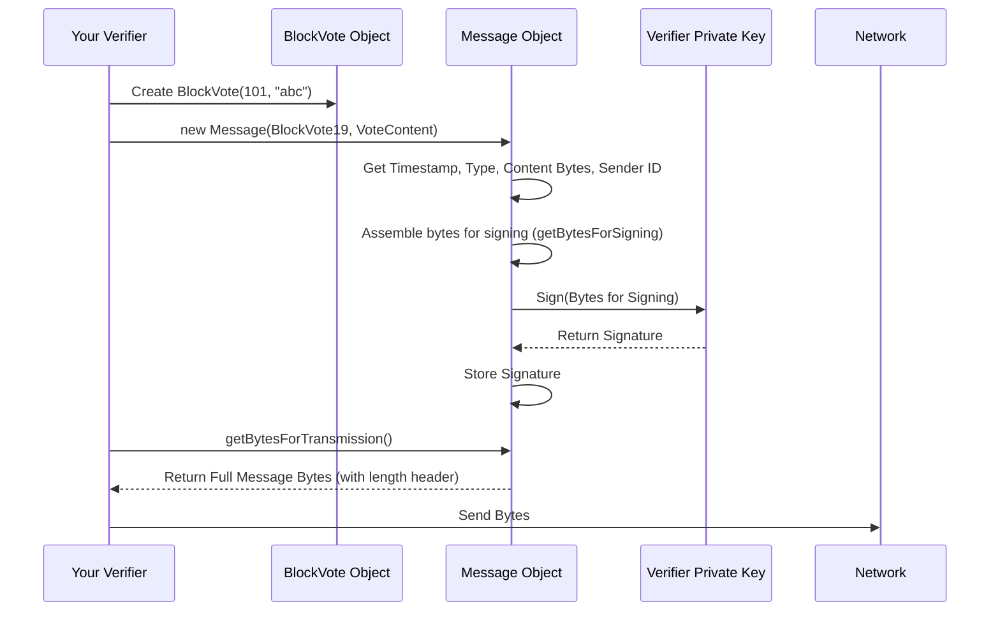
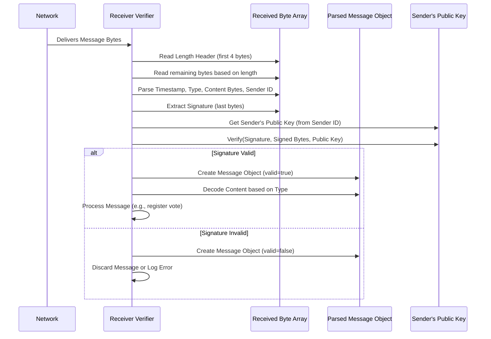

# Chapter 11: Message

Welcome back! In [Chapter 10: NodeManager](10_nodemanager_.md), we learned how the Nyzo network keeps track of all the participating computers ([Node](09_node_.md)s) using a shared directory. Now that nodes know *who* else is out there and how to find their addresses, how do they actually *talk* to each other?

If Verifier A wants to tell Verifier B about a new block it created, or if it wants to send its vote for a block, how does it package that information so Verifier B can understand it correctly? Just sending raw data would be confusing. They need a standardized format for their communication.

**Use Case:** Verifier A has decided to vote for Block `X` (with hash `abc`) at height 101. How does Verifier A package this vote information and send it to Verifier B (and others) in a way that everyone recognizes as a block vote, knows who sent it, and can be sure it hasn't been tampered with? The answer is by using a `Message`.

## What is a Message?

A `Message` is the fundamental unit of communication between Nyzo nodes. Think of it like a **standardized letter or email format** used by everyone in the network. Just like an email has a "Subject", "From", "To", "Date", and "Body", a Nyzo `Message` has specific parts that ensure every node can understand and trust the information being exchanged.

It's how nodes share information (like new transactions or blocks) and coordinate actions (like voting).

## What's Inside a Message?

Every `Message` follows a standard structure:

1.  **Type (`MessageType`):** This tells the receiving node what the message is *about*. Is it a new block proposal? A vote? A request for information? Nyzo defines many types, like `MessageType.NewBlock9`, `MessageType.BlockVote19`, or `MessageType.Transaction5`. This is like the "Subject" line of an email.
2.  **Content (`MessageObject`):** This is the actual data being sent – the "body" of the letter. The *type* of content depends on the `MessageType`. For example:
    *   If the type is `BlockVote19`, the content will be a `BlockVote` object (containing the height and hash being voted for).
    *   If the type is `NewBlock9`, the content will be a `NewBlockMessage` object (containing the actual [Block](01_block_.md) data).
    *   If the type is `Transaction5`, the content will be a [Transaction](02_transaction_.md) object.
    *   Some message types might have no content (like a simple ping). The content object must implement the `MessageObject` interface, which defines how it's turned into bytes.
3.  **Timestamp (`timestamp`):** This is the time (in milliseconds since the standard epoch) when the message was created by the sender. This helps prevent old messages from being replayed later.
4.  **Sender Identifier (`sourceNodeIdentifier`):** This is the unique public key (identifier) of the [Node](09_node_.md) that sent the message. It's like the "From" address, telling the recipient who originated the message.
5.  **Sender Signature (`sourceNodeSignature`):** This is a digital signature created by the sender using their private key. It covers the timestamp, type, content, and sender identifier. This proves that the identified sender actually sent *this specific message*, and that it hasn't been altered since it was signed. It's the sender's verified signature on the letter.

```mermaid
graph TD
    subgraph Message Structure
        direction LR
        Type[Type: MessageType (e.g., BlockVote19)]
        Timestamp[Timestamp: Creation Time]
        SenderID[Sender ID: Public Key]
        Content[Content: MessageObject (e.g., BlockVote object)]
        Signature[Sender Signature: Cryptographic Proof]
    end

    Timestamp -- Signed --> Signature
    Type -- Signed --> Signature
    Content -- Signed --> Signature
    SenderID -- Signed --> Signature
```

*(Note: The signature signs all the other parts, ensuring authenticity and integrity.)*

## How Messages are Created (Conceptual)

Let's revisit our use case: Verifier A wants to send a vote for Block X.

1.  **Prepare Content:** Verifier A creates the `BlockVote` object containing `height=101` and `hash="abc"`.
2.  **Get Time & Type:** It gets the current `timestamp` and knows the message type is `MessageType.BlockVote19`.
3.  **Identify Sender:** It knows its own `sourceNodeIdentifier`.
4.  **Sign:** It takes the timestamp, type, vote content, and its identifier, bundles them into a specific byte sequence (using `getBytesForSigning()`), and signs this sequence using its private key. This produces the `sourceNodeSignature`.
5.  **Assemble Message:** It packages the timestamp, type, content, identifier, and the newly created signature into a `Message` object.
6.  **Send:** It uses network communication functions (often involving the [MeshListener](12_meshlistener_.md) and `Message.fetchTcp` or `Message.sendUdp`) to send the bytes of this `Message` object to Verifier B.

## Using Messages in Code (Conceptual - Creating & Sending)

Let's see how Verifier A might create and conceptually send that vote message.

```java
// --- Conceptual Example: Sending a Vote ---

// 1. Prepare the content (the BlockVote object)
long heightToVoteFor = 101;
byte[] hashToVoteFor = getHashABC(); // Function to get hash "abc"
BlockVote voteContent = new BlockVote(heightToVoteFor, hashToVoteFor);

// 2. Create the Message object
//    The constructor handles getting timestamp, sender ID, and signing internally
//    using the local verifier's private key (Verifier.sign).
Message voteMessage = new Message(MessageType.BlockVote19, voteContent);

// 3. Get the target node's information
byte[] verifierB_ID = getVerifierB_Identifier(); // Get Verifier B's ID
Node nodeB = NodeManager.findNode(verifierB_ID); // Look up Node B in the NodeManager

// 4. Send the message
if (nodeB != null && nodeB.isActive()) {
    System.out.println("Sending vote to Verifier B (" + nodeB.getIpAddress() + ")");

    // Use Message.fetch (or fetchTcp/sendUdp) to send the message.
    // We might provide a 'callback' to handle any response, or null if no response needed.
    Message.fetch(nodeB, voteMessage, null);

    System.out.println("Vote message sent!");
} else {
    System.out.println("Could not find or Verifier B is inactive.");
}
```

**Explanation:**

*   We first create the specific content we want to send (a `BlockVote` object).
*   Creating the `Message` object is simple: we provide the `MessageType` and the `content` object. The `Message` constructor automatically fills in the current timestamp, gets the local verifier's ID ([Verifier](13_verifier_.md)), and signs the necessary parts using the verifier's private key.
*   We use the [NodeManager](10_nodemanager_.md) to find the target [Node](09_node_.md) object.
*   We use a static method like `Message.fetch` (which might choose TCP or UDP based on message type and node capabilities) to send the `voteMessage` to the target `nodeB`.

## Under the Hood: Sending and Receiving

Let's look closer at how a message is constructed, sent, and processed.

**1. Creating and Signing (Sending):**



**Code Snippet (`Message.java` - Constructor & Signing):**

```java
// --- File: src/main/java/co/nyzo/verifier/Message.java ---

public class Message {
    // ... fields: timestamp, type, content, sourceNodeIdentifier, sourceNodeSignature ...

    // Constructor for a new message originating from this verifier
    public Message(MessageType type, MessageObject content) {
        this.timestamp = System.currentTimeMillis(); // Get current time
        this.type = type;
        this.content = content;
        this.sourceNodeIdentifier = Verifier.getIdentifier(); // Get our ID

        // Sign the relevant parts using the Verifier's private key
        this.sourceNodeSignature = Verifier.sign(getBytesForSigning());

        this.valid = true; // Assume valid since we just created and signed it
    }

    // Gets the bytes that need to be signed
    public byte[] getBytesForSigning() {
        // Calculate size: timestamp + type + content + sender ID
        int sizeBytes = FieldByteSize.timestamp + FieldByteSize.messageType + FieldByteSize.identifier;
        if (content != null) {
            sizeBytes += content.getByteSize(); // Add content size if present
        }

        byte[] result = new byte[sizeBytes];
        ByteBuffer buffer = ByteBuffer.wrap(result);

        // Add data in specific order: timestamp, type, content (if any), sender ID
        buffer.putLong(timestamp);
        buffer.putShort((short) type.getValue());
        if (content != null) {
            buffer.put(content.getBytes()); // Add content bytes
        }
        buffer.put(sourceNodeIdentifier); // Add sender ID

        return result; // These are the bytes passed to the signing function
    }
    // ... other methods ...
}
```

**Explanation:**

*   The constructor sets the timestamp, type, and content. It gets the local verifier's identifier using `Verifier.getIdentifier()`.
*   It calls `getBytesForSigning()` to get the specific byte sequence representing the core message data (timestamp, type, content bytes, sender ID). **Crucially, the signature itself is NOT part of these bytes.**
*   It then calls `Verifier.sign()` (which uses the local verifier's private key) on the bytes returned by `getBytesForSigning()`.
*   The resulting digital signature is stored in `sourceNodeSignature`.

**2. Preparing for Transmission:**

```java
// --- File: src/main/java/co/nyzo/verifier/Message.java ---

    // Gets the full byte array to send over the network
    public byte[] getBytesForTransmission() {
        // Calculate size: 4-byte length + timestamp + type + content + sender ID + signature
        int sizeBytes = FieldByteSize.messageLength + FieldByteSize.timestamp + FieldByteSize.messageType +
                FieldByteSize.identifier + FieldByteSize.signature;
        if (content != null) {
            sizeBytes += content.getByteSize();
        }

        byte[] result = new byte[sizeBytes];
        ByteBuffer buffer = ByteBuffer.wrap(result);

        // 1. Add the total message length (including this length field itself)
        buffer.putInt(sizeBytes);

        // 2. Add the signed data fields in order
        buffer.putLong(timestamp);
        buffer.putShort((short) type.getValue());
        if (content != null) {
            buffer.put(content.getBytes());
        }
        buffer.put(sourceNodeIdentifier);

        // 3. Add the signature at the end
        buffer.put(sourceNodeSignature);

        return result; // These bytes are sent over the network
    }
```

**Explanation:**

*   `getBytesForTransmission()` prepares the *complete* byte package for sending.
*   It calculates the total size, including a 4-byte header that *states* the total size. This helps the receiver know how many bytes to expect.
*   It writes the total size first.
*   Then, it writes the timestamp, type, content (if any), and sender identifier – the same data that was signed.
*   Finally, it appends the `sourceNodeSignature` that was calculated earlier.

**3. Receiving and Parsing:**



**Code Snippet (`Message.java` - `fromBytes` Simplified):**

```java
// --- File: src/main/java/co/nyzo/verifier/Message.java ---

    // Parses a message received from the network
    public static Message fromBytes(byte[] bytes, byte[] sourceIpAddress, boolean isUdp) {

        Message message = null;
        ByteBuffer buffer = ByteBuffer.wrap(bytes);

        try {
            // For UDP, length is included. For TCP, assume 'bytes' is already the exact message (minus length).
            int bufferLength = isUdp ? buffer.getInt() : bytes.length; // Read/Assume length

            // 1. Read fixed-position fields
            long timestamp = buffer.getLong();
            MessageType type = MessageType.forValue(buffer.getShort() & 0xffff);

            // 2. Read sender ID and signature from the *end* of the message data
            int contentStartPosition = buffer.position();
            // Calculate where ID starts (end - ID size - Sig size)
            int identifierPosition = bufferLength - FieldByteSize.identifier - FieldByteSize.signature;
            buffer.position(identifierPosition);
            byte[] sourceNodeIdentifier = getByteArray(buffer, FieldByteSize.identifier);
            byte[] sourceNodeSignature = getByteArray(buffer, FieldByteSize.signature);

            // 3. Verify the signature
            int signedBytesStart = isUdp ? 4 : 0; // Start after length field if UDP
            int signedBytesEnd = identifierPosition; // End before identifier starts
            boolean signatureIsValid = SignatureUtil.signatureIsValid(
                    sourceNodeSignature,    // The signature to check
                    bytes,                  // The full byte array
                    sourceNodeIdentifier,   // Sender's public key (ID)
                    signedBytesStart,       // Start index of signed data in 'bytes'
                    signedBytesEnd          // End index (exclusive) of signed data
            );

            // 4. If valid, parse the content; otherwise, content is null
            MessageObject content = null;
            if (signatureIsValid) {
                buffer.position(contentStartPosition); // Go back to where content starts
                // Based on 'type', decode the bytes between here and 'identifierPosition'
                content = processContent(type, buffer, sourceNodeIdentifier);
            } else {
                 System.err.println("Invalid signature for message type " + type + " from " +
                                   PrintUtil.compactPrintByteArray(sourceNodeIdentifier));
            }

            // 5. Create the Message object
            message = new Message(timestamp, type, content, sourceNodeIdentifier, sourceNodeSignature,
                                  sourceIpAddress, signatureIsValid);

        } catch (Exception e) {
            System.err.println("Error parsing message: " + e.getMessage());
        }

        return message; // Returns the parsed Message object, or null on error
    }

    // Helper to decode content based on type (switches on MessageType)
    private static MessageObject processContent(MessageType type, ByteBuffer buffer, byte[] sourceNodeIdentifier) {
        switch (type) {
            case BlockVote19: return BlockVote.fromByteBuffer(buffer);
            case NewBlock9: return NewBlockMessage.fromByteBuffer(buffer, sourceNodeIdentifier);
            case Transaction5: return Transaction.fromByteBuffer(buffer);
            // ... cases for all other message types ...
            default: return null; // Or handle unknown type
        }
    }
```

**Explanation:**

*   `fromBytes` takes the received byte array.
*   It parses the timestamp and type.
*   It carefully extracts the sender ID and signature from the *end* of the byte array.
*   The most critical step is verifying the signature using `SignatureUtil.signatureIsValid`. This function cryptographically checks if the `sourceNodeSignature` matches the data segment (from after the length field up to before the identifier) using the `sourceNodeIdentifier` (which corresponds to the sender's public key).
*   If the signature is valid, it proceeds to parse the `content` based on the message `type` using the `processContent` helper. `processContent` calls the appropriate `.fromByteBuffer()` method for the expected content type (e.g., `BlockVote.fromByteBuffer`).
*   If the signature is invalid, the content is skipped (set to null), and the resulting `Message` object will have `isValid()` return `false`.
*   Finally, it creates the `Message` object with all the parsed data and the validity flag.

**4. Dispatching the Message:**

Once a valid message is parsed, the system needs to act on it. The `MeshListener.response()` method (which, despite its name, handles incoming requests and might *produce* a response) acts as a central dispatcher.

**Code Snippet (`MeshListener.java` - Simplified `response`):**

```java
// --- File: src/main/java/co/nyzo/verifier/MeshListener.java ---

    // Handles incoming messages after they are parsed and validated (simplified view)
    public static Message response(Message message) {
        Message response = null; // The response we might send back

        try {
            // Basic checks already done (isValid(), timestamp range) before calling this

            MessageType messageType = message.getType();
            MessageObject content = message.getContent(); // Already parsed if signature was valid

            // --- Decide action based on message type ---
            if (messageType == MessageType.BlockVote19) {
                BlockVoteManager.registerVote(message); // Give the vote to the vote manager
                response = new Message(MessageType.BlockVoteResponse20, null); // Acknowledge receipt

            } else if (messageType == MessageType.NewBlock9) {
                if (content instanceof NewBlockMessage) {
                    // Give the block to the unfrozen block manager
                    UnfrozenBlockManager.registerBlock(((NewBlockMessage) content).getBlock());
                }
                response = new Message(MessageType.NewBlockResponse10, null); // Acknowledge

            } else if (messageType == MessageType.Transaction5) {
                // Process the transaction (e.g., add to pool)
                TransactionResponse responseContent = new TransactionResponse((Transaction) content);
                response = new Message(MessageType.TransactionResponse6, responseContent); // Respond with status

            } else if (messageType == MessageType.MeshRequest15) {
                // Get the cycle nodes and send them back
                response = new Message(MessageType.MeshResponse16, new MeshResponse(NodeManager.getCycle()));

            } // ... cases for all other message types ...

            else {
                // Unknown type
                response = new Message(MessageType.Error65534, new ErrorMessage("unknown message type"));
            }
        } catch (Exception e) {
            // Handle errors during processing
            response = new Message(MessageType.Error65534, new ErrorMessage("Processing error: " + e.getMessage()));
        }

        return response; // Return the message to be sent back (or null)
    }
```

**Explanation:**

*   This method receives a `Message` object that has already been parsed and had its signature verified.
*   It uses a large `if-else if` structure (or a `switch` in the full code) based on `message.getType()`.
*   For each known type, it performs the appropriate action:
    *   For a `BlockVote19`, it calls `BlockVoteManager.registerVote()`.
    *   For a `NewBlock9`, it calls `UnfrozenBlockManager.registerBlock()`.
    *   For requests like `MeshRequest15`, it creates the appropriate response content (`MeshResponse`) and prepares a response message.
*   It constructs and returns a `Message` object to be sent back to the original sender, or `null` if no direct reply is needed.

## Conclusion

The `Message` object is the cornerstone of communication in the Nyzo network. It provides a standardized format encapsulating the message `type`, the actual `content`, a `timestamp`, the `sourceNodeIdentifier`, and a crucial `sourceNodeSignature` for authenticity and integrity. We've seen how messages are created, signed, transmitted, parsed, and validated, ensuring nodes can trust the information they exchange.

But how does the verifier actually *listen* for these incoming byte streams on the network and pass them off to the `Message.fromBytes` parser? That's the job of the network listener.

Next up: [Chapter 12: MeshListener](12_meshlistener_.md)

---

Generated by [AI Codebase Knowledge Builder](https://github.com/The-Pocket/Tutorial-Codebase-Knowledge)