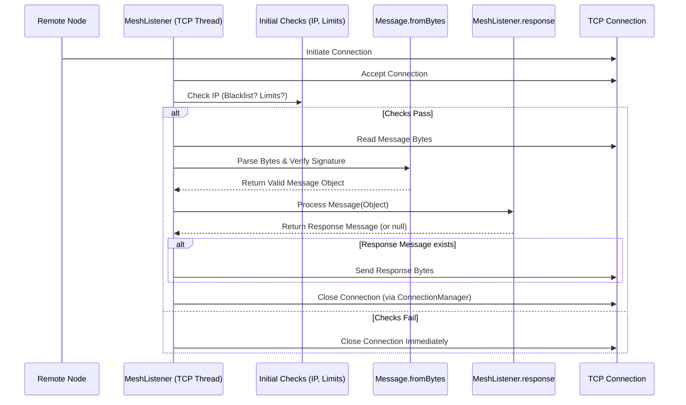
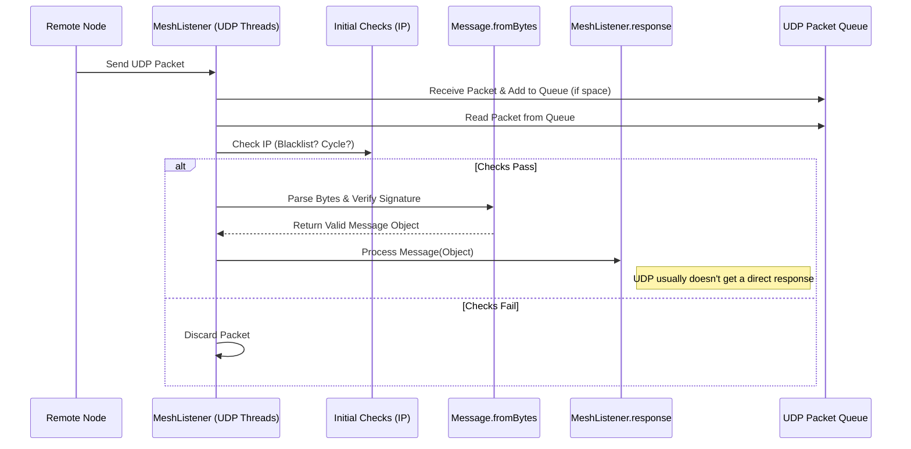

# Chapter 12: MeshListener

In [Chapter 11: Message](11_message_.md), we learned how Nyzo nodes package information into standardized `Message` objects to communicate. We saw how messages are created, signed, and sent. But how does a node *receive* these messages? If Verifier B sends a message to Verifier A, how does Verifier A actually "hear" it?

Imagine your computer is running the Nyzo verifier software. It needs an "ear" constantly listening for knocks on the door (incoming network connections) or mail arriving in the mailbox (incoming data packets). It also needs a receptionist or mailroom clerk to check who the message is from before passing it on.

**Use Case:** Verifier B sends a `BlockVote` message to your verifier (Verifier A). Your verifier needs a component that is always listening for network traffic. When the bytes containing the `BlockVote` message arrive, this component needs to receive them, do a quick check (like, "Is this sender on our blacklist?"), and then hand off the bytes to the `Message` parser (which we saw in the last chapter) to decode and validate the vote. This listening and initial screening component is the `MeshListener`.

## What is the MeshListener?

Think of the `MeshListener` as the **verifier's mailroom and reception desk**, all rolled into one. It's the part of the software that actively listens for incoming network connections from other [Node](09_node_.md)s in the mesh.

It runs continuously in the background, waiting for other nodes to send data. Nyzo uses two main ways to send data over the network:

1.  **TCP (Transmission Control Protocol):** Like a phone call. It establishes a reliable connection before sending data. Used for most request/response messages (like asking for a block, sending transactions, joining the network).
2.  **UDP (User Datagram Protocol):** Like sending a postcard. It's faster but less reliable (no guarantee of delivery or order). Used for messages where speed is important and occasional loss is acceptable, like `BlockVote`s or `NewVerifierVote`s.

The `MeshListener` listens for *both* types of communication on specific network "ports" (like different phone extensions).

## Key Responsibilities

The `MeshListener` has several important jobs:

*   **Listening on Ports:** It opens specific network ports (usually TCP port 9444 and UDP port 9446) and waits for incoming data.
*   **Accepting TCP Connections:** When another node initiates a TCP connection (like making a phone call), the `MeshListener` accepts it.
*   **Receiving UDP Packets:** When a UDP packet (like a postcard) arrives, the `MeshListener` grabs it.
*   **Initial Screening:** Before spending too much effort processing, it performs quick checks:
    *   **Blacklist Check:** Is the IP address sending this message on the `BlacklistManager`'s list? If so, ignore it.
    *   **Connection Limits:** For TCP, are there too many connections already active? Are there too many from this specific IP address? If limits are exceeded (and the IP isn't whitelisted), reject the connection.
*   **Handing Off Data:** If the initial checks pass, the `MeshListener` reads the incoming bytes and hands them over to the `Message.fromBytes()` method (from [Chapter 11: Message](11_message_.md)) to be parsed, have their signature verified, and turned into a `Message` object.
*   **Dispatching for Processing:** It takes the valid `Message` object and calls `MeshListener.response()` (which acts like a central dispatcher) to figure out what action to take based on the message type (e.g., give a vote to the [BlockVoteManager](07_blockvotemanager_.md), give a block to the [UnfrozenBlockManager](08_unfrozenblockmanager_.md)).
*   **Sending Responses (TCP):** If the processing logic (`MeshListener.response()`) generates a reply `Message`, the `MeshListener` sends those bytes back over the established TCP connection before closing it.

## Using the MeshListener (Conceptual)

You don't typically call `MeshListener` methods directly in day-to-day verifier operations. It's designed to start automatically when the verifier launches and run continuously in the background.

Its main interactions are internal:

*   It **receives** bytes from the network.
*   It **uses** `BlacklistManager` to check IPs.
*   It **uses** connection limit logic.
*   It **calls** `Message.fromBytes()` to parse data.
*   It **calls** `MeshListener.response()` to process valid messages.
*   `MeshListener.response()` **calls** other managers (like `BlockVoteManager`, `UnfrozenBlockManager`, `NodeManager`) depending on the message type.
*   It **uses** `ConnectionManager` to handle closing TCP sockets gracefully.

Essentially, it's the entry point for all incoming communication.

## Under the Hood: Listening for TCP and UDP

Let's look at how the two listening processes work.

**1. TCP Listener Flow:**



**2. UDP Listener Flow:**



*(Note: Nyzo's UDP listener often uses a separate thread to receive packets into a queue and another thread to process packets from the queue to avoid losing packets during heavy load.)*

**Code Snippets (`MeshListener.java`):**

Let's look at simplified code showing these processes.

**1. Starting the Listeners (`startSocketThreadTcp`, `startSocketThreadUdp`):**

These methods start background threads to handle TCP and UDP listening.

```java
// --- File: src/main/java/co/nyzo/verifier/MeshListener.java ---

public class MeshListener {
    // ... fields for connection limits, ports, sockets ...

    public static void start() {
        // Start TCP listener if not already running
        if (!aliveTcp.getAndSet(true)) {
            startSocketThreadTcp();
        }
        // Start UDP listener if not already running
        if (!aliveUdp.getAndSet(true)) {
            startSocketThreadUdp();
        }
    }

    private static void startSocketThreadTcp() {
        // Map to track connections per IP: IP -> Count
        Map<ByteBuffer, Integer> connectionsPerIp = new ConcurrentHashMap<>();
        // Counter for active TCP processing threads
        AtomicInteger activeReadThreads = new AtomicInteger(0);

        new Thread(() -> { // Start a new background thread
            try {
                // Create the TCP server socket on the standard port
                serverSocketTcp = new ServerSocket(standardPortTcp);
                portTcp = serverSocketTcp.getLocalPort(); // Record the actual port used

                // Loop indefinitely (until termination signal)
                while (!UpdateUtil.shouldTerminate()) {
                    try {
                        // Wait for and accept a new incoming connection
                        Socket clientSocket = serverSocketTcp.accept();
                        // Hand off the connection for processing
                        processSocket(clientSocket, activeReadThreads, connectionsPerIp);
                    } catch (Exception ignored) { /* Handle accept errors */ }
                }
                closeSockets(); // Clean up when terminating
            } catch (Exception e) { /* Handle socket creation errors */ }
            aliveTcp.set(false); // Mark as not alive if thread exits
        }, "MeshListener-serverSocketTcp").start();
    }

    private static void startSocketThreadUdp() {
        // UDP often uses a queue to avoid missing packets
        // Thread 1: Listens and puts packets into 'datagramPackets' array/queue
        new Thread(() -> {
             try {
                 datagramSocketUdp = new DatagramSocket(standardPortUdp);
                 portUdp = datagramSocketUdp.getLocalPort();
                 while (!UpdateUtil.shouldTerminate()) {
                     try {
                         DatagramPacket packet = datagramPackets[datagramPacketWriteIndex];
                         datagramSocketUdp.receive(packet); // Wait for UDP packet
                         // Add to queue (simplified - checks for full queue)
                         datagramPacketWriteIndex = (datagramPacketWriteIndex + 1) % numberOfDatagramPackets;
                     } catch (Exception ignored) { }
                 }
             } catch (Exception e) { /* Handle socket creation errors */ }
             aliveUdp.set(false);
        }, "MeshListener-datagramSocketUdp").start();

        // Thread 2: Processes packets from the 'datagramPackets' array/queue
        new Thread(() -> {
            while (!UpdateUtil.shouldTerminate()) {
                if (datagramPacketReadIndex == datagramPacketWriteIndex) {
                    ThreadUtil.sleep(30L); // Queue is empty, wait
                } else {
                    try {
                        DatagramPacket packet = datagramPackets[datagramPacketReadIndex];
                        // Process the packet (checks, parse, dispatch)
                        readMessageUdp(packet);
                        datagramPacketReadIndex = (datagramPacketReadIndex + 1) % numberOfDatagramPackets;
                    } catch (Exception ignored) { }
                }
            }
        }, "MeshListener-udpProcessingQueue").start();
    }
    // ... other methods ...
}
```

**Explanation:**

*   `start()` initiates the TCP and UDP listening threads if they aren't already running.
*   `startSocketThreadTcp` creates a `ServerSocket` that waits for incoming connections. When one arrives (`serverSocketTcp.accept()`), it calls `processSocket` to handle it in a potentially new thread.
*   `startSocketThreadUdp` typically starts two threads: one listens (`datagramSocketUdp.receive()`) and quickly adds received packets to a buffer (`datagramPackets`), the other takes packets from the buffer and processes them (`readMessageUdp`). This separation helps prevent packet loss under load.

**2. Processing a TCP Connection (`processSocket`):**

This method handles an accepted TCP connection, performing initial checks.

```java
// --- File: src/main/java/co/nyzo/verifier/MeshListener.java ---

    private static void processSocket(Socket clientSocket, AtomicInteger activeReadThreads,
                                      Map<ByteBuffer, Integer> connectionsPerIp) {

        byte[] ipAddress = clientSocket.getInetAddress().getAddress();
        // 1. Blacklist Check
        if (BlacklistManager.inBlacklist(ipAddress)) {
            numberOfMessagesRejected.incrementAndGet();
            ConnectionManager.fastCloseSocket(clientSocket); // Close immediately if blacklisted
            return; // Stop processing
        }

        ByteBuffer ipBuffer = ByteBuffer.wrap(ipAddress);
        // Increment connection count for this IP
        int connectionsForIp = connectionsPerIp.merge(ipBuffer, 1, (current, add) -> current + add);
        int totalConnections = activeReadThreads.get();

        // 2. Connection Limit Check (Simplified)
        int maxConnectionsPerIp = calculateMaxConnectionsPerIp(totalConnections);
        boolean whitelisted = Message.ipIsWhitelisted(ipAddress);

        if ((connectionsForIp > maxConnectionsPerIp || totalConnections > maximumConcurrentConnections) && !whitelisted) {
            // Too many connections & not whitelisted
            if (connectionsForIp > maximumConcurrentConnectionsPerIpAbsolute) {
                // Blacklist if exceeding absolute limit
                BlacklistManager.addToBlacklist(ipAddress);
            }
            connectionsPerIp.merge(ipBuffer, -1, (current, sub) -> current + sub); // Decrement count
            ConnectionManager.fastCloseSocket(clientSocket); // Close connection
            return; // Stop processing
        }

        // 3. Hand off to Read & Respond Thread
        numberOfMessagesAccepted.incrementAndGet();
        activeReadThreads.incrementAndGet(); // Increment active thread count
        new Thread(() -> { // Start a new thread to read/respond
            try {
                clientSocket.setSoTimeout(300); // Set a read timeout
                readMessageAndRespondTcp(clientSocket); // Read message, process, respond
            } catch (Exception ignored) { }
            // Decrement counts when thread finishes
            connectionsPerIp.merge(ipBuffer, -1, (current, sub) -> current > 0 ? current + sub : null);
            activeReadThreads.decrementAndGet();
        }, "MeshListener-clientSocketTcp").start();
    }

    // Helper to calculate dynamic connection limit (simplified)
    private static int calculateMaxConnectionsPerIp(int totalConnections) {
        // ... logic based on fields like maximumConcurrentConnectionsPerIpAbsolute,
        //     concurrentConnectionThrottleThreshold, concurrentConnectionReductionRate ...
        return maximumConcurrentConnectionsPerIpAbsolute; // Simplified placeholder
    }
```

**Explanation:**

*   Gets the connecting IP address.
*   Checks if the IP is blacklisted using `BlacklistManager.inBlacklist()`. If yes, closes the connection.
*   Increments the connection count for this IP in the `connectionsPerIp` map.
*   Checks if the connection count for this IP or the total active connections exceeds the configured limits (unless the IP is whitelisted). If limits are exceeded, it closes the connection and might blacklist the IP if it's being particularly aggressive.
*   If checks pass, it increments the `activeReadThreads` counter and starts *another* new thread (`readMessageAndRespondTcp`) to handle reading the actual message data and responding, preventing the main listening thread from getting blocked.

**3. Reading/Responding (TCP) (`readMessageAndRespondTcp`):**

This runs in the dedicated thread for a single TCP connection.

```java
// --- File: src/main/java/co/nyzo/verifier/MeshListener.java ---

    private static void readMessageAndRespondTcp(Socket clientSocket) {
        try {
            // Read the message bytes from the socket's input stream
            // Message.readFromStream handles reading the length prefix and the message body
            Message message = Message.readFromStream(clientSocket.getInputStream(),
                    clientSocket.getInetAddress().getAddress(),
                    MessageType.IncomingRequest65533); // Placeholder type for logging

            if (message != null) { // If message was read and parsed successfully
                // Dispatch the message for processing and get a potential response
                // This is where the core logic happens based on message type
                Message response = response(message);

                // If a response message was generated, send it back
                if (response != null) {
                    clientSocket.getOutputStream().write(response.getBytesForTransmission());
                    clientSocket.getOutputStream().flush();
                }
            }
        } catch (Exception ignored) { /* Handle read/write errors */ }

        // Ensure the connection is closed (gracefully, allows lingering)
        ConnectionManager.slowCloseSocket(clientSocket);
    }
```

**Explanation:**

*   Calls `Message.readFromStream()` which reads the length header, reads the message bytes, calls `Message.fromBytes()` to parse and validate the signature.
*   If a valid `Message` is returned, it calls the central `response()` dispatcher method (shown in [Chapter 11: Message](11_message_.md)) to handle the message content based on its type and potentially generate a response `Message`.
*   If `response()` returns a non-null `Message`, it's converted to bytes (`getBytesForTransmission()`) and sent back over the same socket connection.
*   Finally, it calls `ConnectionManager.slowCloseSocket()` to close the connection gracefully.

**4. Reading/Processing (UDP) (`readMessageUdp` - Simplified):**

This handles a single UDP packet from the queue.

```java
// --- File: src/main/java/co/nyzo/verifier/MeshListener.java ---

    private static void readMessageUdp(DatagramPacket packet) {
        try {
            // Do some initial checks (e.g., blacklist, node in cycle)
            // These might be done *before* calling this, in the queue processing loop
            ByteBuffer sourceIpAddress = ByteBuffer.wrap(packet.getAddress().getAddress());
            if (BlacklistManager.inBlacklist(sourceIpAddress.array())) {
                 // Ignore blacklisted
                 return;
            }
            // For UDP, often only accept from known cycle nodes for most messages
            // if (!NodeManager.ipAddressInCycle(sourceIpAddress)) {
            //      // Ignore if not from cycle node (except for specific messages like MinimalBlock)
            //      return;
            // }

            // Parse the message from the packet data
            // Note: source IP is often ignored or zeroed out for UDP parsing
            // due to potential spoofing. Identity comes from message signature.
            Message message = Message.fromBytes(packet.getData(), new byte[4], true);

            // If valid and type allowed over UDP...
            if (message != null && message.isValid() /* && !disallowedUdpTypes.contains(message.getType()) */) {
                // Dispatch for processing. UDP responses are usually not sent back.
                response(message);
            }
        } catch (Exception ignored) { /* Handle parsing errors */ }
    }
```

**Explanation:**

*   Performs preliminary checks relevant to UDP (blacklist, potentially checking if sender IP is in the cycle).
*   Calls `Message.fromBytes()` to parse the packet data. Note that the source IP from the UDP packet is often considered unreliable and might not be used directly; the sender's identity is confirmed by the message signature.
*   If a valid `Message` is parsed, it calls the `response()` dispatcher to process it. Typically, no response is sent back over UDP.

## Conclusion

The `MeshListener` is the verifier's vigilant ear and receptionist, constantly listening for incoming TCP and UDP messages on the network. It performs crucial initial checks like blacklisting and connection limiting before handing off valid data to the `Message` parsing and processing logic. It's the gateway through which all communication from other nodes enters the verifier, enabling the exchange of blocks, votes, transactions, and other essential network information.

We've now explored many core components: Blocks, Transactions, BalanceLists, Managers for Blocks, Votes, Nodes, and the Messages and Listeners that connect them. How does this all come together in the main verifier process?

Next up: [Chapter 13: Verifier](13_verifier_.md)

---

Generated by [AI Codebase Knowledge Builder](https://github.com/The-Pocket/Tutorial-Codebase-Knowledge)