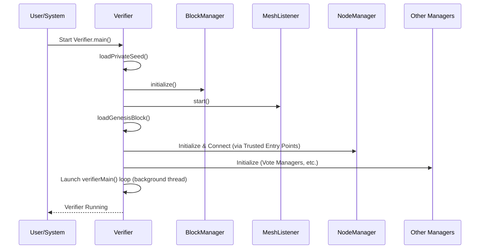

# Chapter 13: Verifier

Welcome back! In [Chapter 12: MeshListener](12_meshlistener_.md), we saw how a Nyzo node listens for incoming messages from the network, acting like a reception desk. We've now covered many pieces: Blocks, Transactions, managing balances, tracking nodes, handling votes, and listening for messages. But how does all this get put together? What component actually *runs* the show when your computer is acting as a verifier?

Imagine you have all the musicians (the managers, listeners, data structures) and their instruments (the blocks, transactions, votes). You still need a conductor to lead the orchestra, tell everyone when to play, and keep the performance coordinated.

**Use Case:** You've installed the Nyzo software and want to run it as a verifier. What part of the code is the main starting point? What orchestrates the initialization of all the necessary components ([NodeManager](10_nodemanager_.md), [BlockManager](06_blockmanager_.md), [MeshListener](12_meshlistener_.md), etc.)? What manages the core identity (private key) of *your* node? What runs the main loop that keeps the verifier participating in the network – creating blocks, voting, and processing messages? The answer is the `Verifier` class.

## What is the Verifier?

Think of the `Verifier` class as the **conductor of the orchestra** or the **manager of the entire store operation**. It's the central "brain" or coordinator when the Nyzo software is running in **verifier mode**.

It's not just *one* specific task; it's the component responsible for:

1.  **Starting Up:** Initializing everything needed for the verifier to run.
2.  **Managing Identity:** Handling the node's unique private key, public identifier, and optional nickname. This is crucial for signing messages and blocks.
3.  **Orchestrating:** Running the main operational loop, coordinating the actions of all the other managers and components we've learned about.
4.  **Participating:** Ensuring the node actively contributes to the network by creating blocks when appropriate, casting votes, and communicating with peers.

Essentially, if a Nyzo node is verifying blocks, the `Verifier` class is the primary driver of its actions.

## Key Responsibilities

The `Verifier` class contains the `main` method that often starts the verifier process. It holds critical state like the private key and orchestrates the ongoing tasks:

*   **Initialization (`start()`):**
    *   Loads the verifier's private key (seed) from a file or creates a new one. Without this, the verifier cannot sign anything.
    *   Loads the optional nickname.
    *   Starts essential background services like the [MeshListener](12_meshlistener_.md) (to receive messages) and the [BlockManager](06_blockmanager_.md) (to load the existing blockchain history).
    *   Initializes other managers like [NodeManager](10_nodemanager_.md), [BlockVoteManager](07_blockvotemanager_.md), [UnfrozenBlockManager](08_unfrozenblockmanager_.md), etc.
    *   Connects to the network by contacting trusted entry points and fetching the initial list of nodes.
*   **Identity (`privateSeed`, `getIdentifier()`, `sign()`):**
    *   Stores the 32-byte private seed securely.
    *   Provides the `getIdentifier()` method to get the node's public ID (derived from the seed).
    *   Provides the `sign()` method, which uses the private seed to create digital signatures for [Messages](11_message_.md) and [Blocks](01_block_.md). This is how the verifier proves its actions.
*   **Main Loop (`verifierMain()`):** This is the heart of the active verifier. It runs continuously:
    *   **Block Creation:** Checks if it's this verifier's turn to create the next block. If so, it gathers transactions ([Transaction](02_transaction_.md) Pool, using [BalanceManager](04_balancemanager_.md) logic), calculates the next [BalanceList](03_balancelist_.md) hash, creates the [Block](01_block_.md), signs it, and broadcasts it as a [Message](11_message_.md).
    *   **Voting:** Uses the logic within [UnfrozenBlockManager](08_unfrozenblockmanager_.md) to decide which block hash to vote for at the current height and instructs the [BlockVoteManager](07_blockvotemanager_.md) to cast the vote.
    *   **Consensus Check:** Calls [UnfrozenBlockManager](08_unfrozenblockmanager_.md) to check if any block has received enough votes to be frozen. If so, the `UnfrozenBlockManager` tells the [BlockManager](06_blockmanager_.md) to freeze it.
    *   **Network Maintenance:** Periodically interacts with the [NodeManager](10_nodemanager_.md) to request updated mesh lists, send out node join requests, and prune inactive nodes.
    *   **Other Maintenance:** Cleans up old votes ([BlockVoteManager](07_blockvotemanager_.md)), persists node lists, etc.

## How the Verifier Runs (Conceptual Flow)

1.  **Start:** The `Verifier.main()` method is executed.
2.  **Load Identity:** `loadPrivateSeed()` reads the key from disk.
3.  **Initialize Managers:** Calls `BlockManager.initialize()`, `NodeManager` setup, etc.
4.  **Start Listener:** Calls `MeshListener.start()`.
5.  **Connect:** Fetches initial nodes from trusted entry points. Waits until connected to the mesh.
6.  **Enter Main Loop (`verifierMain`):**
    *   Is it my turn to create a block? -> Create & broadcast block.
    *   Which block should I vote for? -> Cast vote.
    *   Has a block reached consensus? -> Attempt to freeze block.
    *   Time for network maintenance? -> Reload join queue, send join requests.
    *   Time for other cleanup? -> Remove old votes/data.
    *   Wait a short time.
    *   Repeat loop.

## Using the Verifier (Code Concepts)

The `Verifier` class is primarily the *entry point* and *orchestrator*. Its methods are often called internally by its own main loop or startup sequence. Other managers might access its identity information.

**1. Starting the Verifier (Entry Point):**

The standard way to start is often just running the `Verifier` class.

```java
// --- Conceptual Command Line ---
// java -cp nyzoVerifier.jar co.nyzo.verifier.Verifier
```

```java
// --- File: src/main/java/co/nyzo/verifier/Verifier.java ---

public class Verifier {

    // ... fields like privateSeed, nickname, alive ...

    public static void main(String[] args) {
        // Set the run mode (important for some configurations)
        RunMode.setRunMode(RunMode.Verifier);
        // Initialize the BlockManager (load blockchain history)
        BlockManager.initialize();
        // Start the main verifier process
        start();
    }

    public static void start() {
        if (!alive.getAndSet(true)) { // Prevent starting twice
            // 1. Load private key, nickname
            loadPrivateSeed();
            loadNickname();
            // 2. Start MeshListener
            MeshListener.start();
            // 3. Load Genesis Block if needed
            loadGenesisBlock();
            // 4. Initialize NodeManager, connect to mesh
            //    (involves fetching from trusted entry points)
            initializeNetworkConnection();
            // 5. Start background tasks (like web listener, consolidation)
            WebListener.start();
            BlockFileConsolidator.start();
            // 6. Start the main loop in a new thread
            new Thread(() -> {
                verifierMain(); // Run the main loop
                alive.set(false); // Mark as not alive if loop exits
            }, "Verifier-mainLoop").start();
        }
    }
    // ... rest of the class ...
}
```

**Explanation:**

*   The `main` method sets the `RunMode`, initializes the [BlockManager](06_blockmanager_.md) (which needs to happen early), and then calls `start()`.
*   `start()` handles loading the identity, starting the [MeshListener](12_meshlistener_.md), connecting to the network, and finally launching the `verifierMain()` loop in a separate background thread.

**2. Accessing Identity (`getIdentifier`, `sign`):**

These methods are crucial for other parts of the system that need the verifier's ID or need to sign data on its behalf.

```java
// --- File: src/main/java/co/nyzo/verifier/Verifier.java ---

public class Verifier {
    private static byte[] privateSeed = null;
    // ... other fields ...

    // Get the public identifier derived from the private seed
    public static byte[] getIdentifier() {
        // Ensure seed is loaded first
        if (privateSeed == null) { loadPrivateSeed(); }
        return KeyUtil.identifierForSeed(privateSeed);
    }

    // Sign a byte array using the private seed
    public static byte[] sign(byte[] bytesToSign) {
        // Ensure seed is loaded first
        if (privateSeed == null) { loadPrivateSeed(); }
        return SignatureUtil.signBytes(bytesToSign, privateSeed);
    }

    // Helper to load the seed from file (simplified)
    private static synchronized void loadPrivateSeed() {
        if (privateSeed == null) {
            // ... logic to read seed from file ...
            // ... or generate a new one if file doesn't exist ...
            // privateSeed = ... read or generated seed ...;
            System.out.println("Private seed loaded.");
        }
    }
    // ...
}
```

**Explanation:**

*   `getIdentifier()` uses a utility function (`KeyUtil.identifierForSeed`) to calculate the public ID from the loaded `privateSeed`.
*   `sign()` uses another utility (`SignatureUtil.signBytes`) along with the `privateSeed` to create a digital signature for the provided data.
*   These methods ensure the private seed is loaded before using it.

**3. The Main Loop (`verifierMain` - Conceptual Structure):**

This method coordinates the ongoing tasks.

```java
// --- File: src/main/java/co/nyzo/verifier/Verifier.java ---

    private static void verifierMain() {
        while (!UpdateUtil.shouldTerminate()) { // Loop until told to stop
            // Ensure we don't hog the CPU if the message queue is busy
            MessageQueue.blockThisThreadUntilClear();

            try {
                // Only proceed if connected and initialized
                if (NodeManager.connectedToMesh() && BlockManager.completedInitialization()) {

                    // === Core Verifier Actions ===

                    // 1. Maybe create the next block?
                    Block frozenEdge = BlockManager.getFrozenEdge();
                    if (/* conditions met to create block */) {
                        extendBlock(frozenEdge, false); // Create regular block
                        // Maybe create upgrade block too?
                        // extendBlock(frozenEdge, true);
                    }

                    // 2. Maybe transmit the created block?
                    if (/* nextBlock exists and is ready */) {
                        // Message.broadcast(new Message(MessageType.NewBlock9, ...));
                        // transmittedBlock = true;
                    }

                    // 3. Decide who to vote for
                    UnfrozenBlockManager.updateVote();

                    // 4. Check consensus and maybe freeze a block
                    boolean frozeBlock = UnfrozenBlockManager.attemptToFreezeBlock();
                    // if (!frozeBlock) UnfrozenBlockManager.attemptToFreezeChain(); // Recovery

                    // 5. Periodic Maintenance (Network, Votes, etc.)
                    if (/* time for mesh maintenance */) {
                        NodeManager.reloadNodeJoinQueue();
                        NodeManager.sendNodeJoinRequests(10);
                        NewVerifierVoteManager.updateTopVerifier();
                        // ... etc ...
                    }

                    // 6. Cleanup if a block was frozen
                    if (frozeBlock) {
                        // UnfrozenBlockManager.performMaintenance();
                        // BlockVoteManager.removeOldVotes();
                        // TransactionPool.updateFrozenEdge();
                        // ... etc ...
                    }

                    // 7. Maybe request missing data (blocks, votes)
                    if (inCycle() || isTopNewVerifier()) {
                         // BlockVoteManager.requestMissingFrozenBlocks();
                         // UnfrozenBlockManager.requestMissingBlocks();
                         // ... etc ...
                    }
                }
            } catch (Exception e) {
                LogUtil.println("Exception in verifier main loop: " + e);
            }

            // Wait a bit before the next loop iteration
            ThreadUtil.sleep(300L); // Sleep for 300 milliseconds
        }
    }
    // ...
```

**Explanation:**

*   The loop runs continuously as long as the `UpdateUtil.shouldTerminate()` flag is false.
*   Inside the loop, it performs a series of checks and actions:
    *   Should it create a block (`extendBlock`)?
    *   Should it broadcast the block it created?
    *   Update its vote (`UnfrozenBlockManager.updateVote`).
    *   Check if consensus allows freezing (`UnfrozenBlockManager.attemptToFreezeBlock`).
    *   Perform periodic tasks like network maintenance (`NodeManager` calls) or requesting missing data.
    *   If a block *was* frozen, perform necessary cleanup tasks.
*   It includes a short sleep at the end to prevent the loop from consuming 100% CPU.

## Under the Hood: Orchestration

The `Verifier` class itself doesn't contain *all* the logic for block creation, voting, or network management. Instead, it *calls* the methods on the specialized manager classes we've already discussed.

**Initialization Sequence Diagram:**



**Main Loop Interactions Diagram:**

```mermaid
sequenceDiagram
    participant Loop as verifierMain() Loop
    participant BM as BlockManager
    participant TxPool as TransactionPool
    participant BalMgr as BalanceManager
    participant UBM as UnfrozenBlockManager
    participant BVM as BlockVoteManager
    participant NM as NodeManager
    participant Msg as Message Sending

    Loop->>BM: Get frozenEdge
    alt Time to Create Block
        Loop->>TxPool: Get Transactions
        Loop->>BalMgr: Check Transactions
        Loop->>Loop: Create Block object
        Loop->>UBM: registerBlock(local block)
        Loop->>Msg: broadcast(NewBlock Message)
    end
    Loop->>UBM: updateVote()
    Loop->>UBM: attemptToFreezeBlock()
    UBM->>BVM: leadingHashForHeight()
    alt Consensus Reached
        UBM->>BM: freezeBlock(winning block)
        Loop->>UBM: performMaintenance()
        Loop->>BVM: removeOldVotes()
    end
    alt Time for Network Maintenance
        Loop->>NM: reloadNodeJoinQueue()
        Loop->>NM: sendNodeJoinRequests()
    end
```

## Conclusion

The `Verifier` class is the heart of a running Nyzo verifier node. It initializes all components, manages the node's crucial private key for signing, and runs the main loop that orchestrates participation in the network. It ties together all the concepts we've learned – [Blocks](01_block_.md), [Transactions](02_transaction_.md), [Nodes](09_node_.md), [Messages](11_message_.md), and the various managers ([BlockManager](06_blockmanager_.md), [BalanceManager](04_balancemanager_.md), [NodeManager](10_nodemanager_.md), [BlockVoteManager](07_blockvotemanager_.md), [UnfrozenBlockManager](08_unfrozenblockmanager_.md)) – into a functioning participant in the Nyzo blockchain consensus.

One specific type of voting we briefly mentioned is voting for *new* verifiers to join the active cycle. How does that process work?

Next up: [Chapter 14: NewVerifierVoteManager](14_newverifiervotemanager_.md)

---

Generated by [AI Codebase Knowledge Builder](https://github.com/The-Pocket/Tutorial-Codebase-Knowledge)