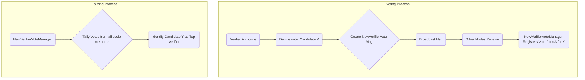
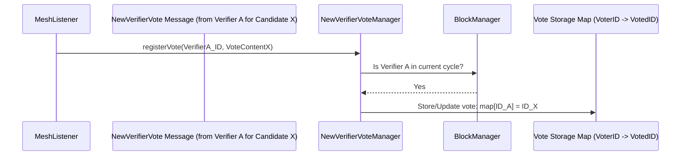
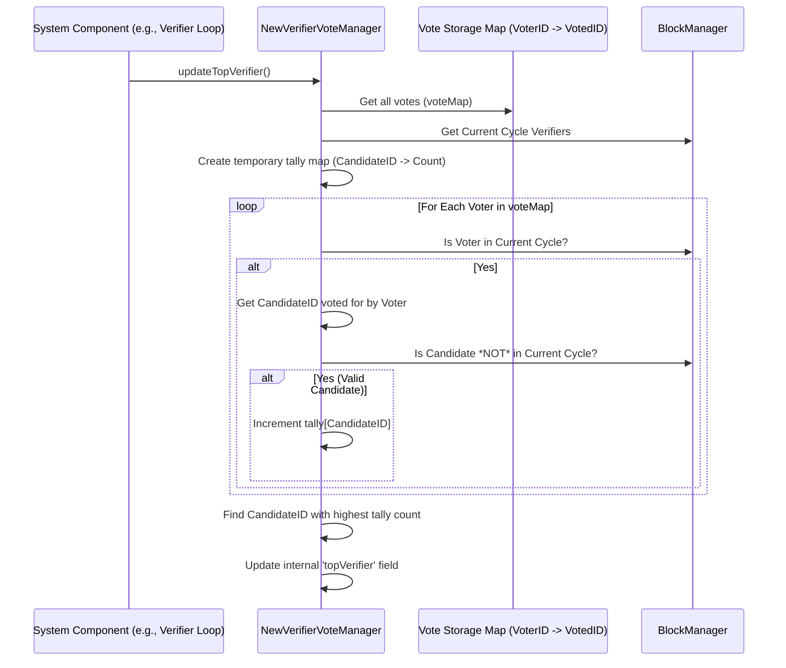

# Chapter 14: NewVerifierVoteManager

Welcome back! In [Chapter 13: Verifier](13_verifier_.md), we saw how the `Verifier` class acts as the conductor, orchestrating all the actions of a node running in verifier mode, including participating in consensus.

One crucial part of Nyzo's design is maintaining a healthy, decentralized group of active verifiers. This group isn't fixed; new members need to join over time. But how does the network decide *who* gets to join this important "verification committee"? It can't be random chaos! There needs to be a structured way for the current members to agree on the next candidate.

**Use Case:** Imagine the active verifier cycle is like an exclusive club. There are many potential members (other nodes running the software) waiting outside. How does the club decide which *one* applicant should be invited in next? They need a fair voting process. The `NewVerifierVoteManager` is the component that handles this specific election.

## What is the NewVerifierVoteManager?

Think of the `NewVerifierVoteManager` as the **election committee secretary** specifically for choosing new members to join the active verifier cycle. Its job is simple but important:

1.  **Collect Votes:** Receive votes from current cycle members about who they prefer as the next new verifier.
2.  **Tally Votes:** Keep track of how many votes each candidate (potential new verifier) receives.
3.  **Determine the Winner:** Identify the candidate with the most votes (the "top" verifier).
4.  **Handle Overrides:** Manage a mechanism (used rarely) to manually specify a candidate.

This manager ensures there's an organized way for the network to expand its active verifier set in a controlled manner.

## Key Concepts

*   **`NewVerifierVote` Message:** This is a specific [Message](11_message_.md) type (`MessageType.NewVerifierVote21`) used by verifiers to cast their vote. The content is simply the identifier (public key) of the node they are voting for.
*   **Voting Power:** Only verifiers currently *in* the active cycle (as tracked by the [BlockManager](06_blockmanager_.md)) have their votes counted. A vote from an out-of-cycle node is ignored by the tallying process.
*   **Tallying:** The manager keeps an internal map, usually tracking which active verifier voted for which candidate.
*   **Top Verifier:** The candidate identifier that has received the most votes from the current active cycle members. This node is considered the primary candidate to join the cycle when conditions allow (based on Proof of Diversity rules managed by [CycleDigest / CycleInformation](05_cycledigest___cycleinformation_.md)).
*   **Override:** A special mechanism allowing a specific identifier to be forced as the "top" verifier, usually set manually via a command or API call. This is intended for specific situations and bypasses the regular voting tally.

## How Votes are Managed (Conceptual Flow)

1.  **Determine Vote:** Each verifier in the cycle runs logic (handled by `NewVerifierQueueManager` - we won't dive deep into this) to decide which candidate it wants to vote for. This might involve a lottery system based on block hashes or considering how long candidates have been waiting.
2.  **Cast Vote:** The verifier creates a `NewVerifierVote` message containing the chosen candidate's identifier and broadcasts it.
3.  **Receive Vote:** Other nodes receive this message via their [MeshListener](12_meshlistener_.md).
4.  **Register Vote:** The `NewVerifierVoteManager` on the receiving node takes the vote. It checks if the sender is *currently in the active cycle*. If yes, it records the vote (e.g., storing that Verifier A voted for Candidate X).
5.  **Tally (On Demand):** When needed (e.g., periodically or when deciding who is near the cycle), the manager tallies the recorded votes for all candidates who are *not* already in the cycle.
6.  **Determine Top:** The candidate with the highest vote count from valid voters is identified as the `topVerifier`.



## Using the NewVerifierVoteManager (Code Concepts)

The `NewVerifierVoteManager` mostly operates based on incoming vote messages. Other parts of the system query it to find out the current election results.

```java
// --- Conceptual Example: Checking the New Verifier Election Status ---

// Get the identifier of the candidate currently leading the polls
ByteBuffer topCandidateId = NewVerifierVoteManager.topVerifier();

if (topCandidateId != null) {
    System.out.println("Current top candidate to join the cycle: " +
                       PrintUtil.compactPrintByteArray(topCandidateId.array()));

    // Get the detailed vote counts
    Map<ByteBuffer, Integer> totals = NewVerifierVoteManager.voteTotals();
    int topVotes = totals.getOrDefault(topCandidateId, 0);
    int cycleSize = BlockManager.currentCycleLength();
    System.out.println("Votes for top candidate: " + topVotes + " (out of " + cycleSize + ")");

    // Is the local verifier the top candidate?
    byte[] myId = Verifier.getIdentifier();
    if (ByteUtil.arraysAreEqual(myId, topCandidateId.array())) {
        System.out.println("Our node is the top candidate!");
        // This might mean our node should prepare to act like an in-cycle verifier soon.
    }

} else {
    System.out.println("No clear top candidate found yet (maybe split vote or insufficient data).");
}

// Check if an override is active
byte[] overrideId = NewVerifierVoteManager.getOverride();
if (!ByteUtil.isAllZeros(overrideId)) {
    System.out.println("Manual override is active for: " +
                       PrintUtil.compactPrintByteArray(overrideId));
    // The 'topVerifier' would reflect this override if active.
}
```

**Explanation:**

*   `NewVerifierVoteManager.topVerifier()` gives the identifier of the candidate currently considered the winner based on votes or an override.
*   `NewVerifierVoteManager.voteTotals()` returns a map showing how many votes each candidate received.
*   We can compare the local verifier's ID to the `topVerifier` ID.
*   `NewVerifierVoteManager.getOverride()` lets us check if a manual override is in place.

## Under the Hood: Storing and Tallying

Let's look at how the manager handles incoming votes and calculates the winner.

**1. Registering a Vote:**

This happens when a `NewVerifierVote` message arrives and is passed from the `MeshListener`.



**Code Snippet (`NewVerifierVoteManager.java` - Simplified `registerVote`):**

```java
// --- File: src/main/java/co/nyzo/verifier/NewVerifierVoteManager.java ---

public class NewVerifierVoteManager {

    // Map: Voting Verifier ID -> Voted-for Candidate ID
    private static final Map<ByteBuffer, ByteBuffer> voteMap = new ConcurrentHashMap<>();
    // Local node's vote (for convenience)
    private static NewVerifierVote localVote = new NewVerifierVote(new byte[FieldByteSize.identifier]);

    public static void registerVote(byte[] votingIdentifier, NewVerifierVote vote, boolean isLocalVote) {

        ByteBuffer votingIdentifierBuffer = ByteBuffer.wrap(votingIdentifier);

        // *** Crucial Check ***
        // Only count votes from verifiers currently in the active cycle.
        if (BlockManager.verifierInCurrentCycle(votingIdentifierBuffer)) {
            // Store the vote. The key is the voter, the value is the candidate ID.
            // Using a map automatically handles overwriting previous votes from the same voter.
            voteMap.put(votingIdentifierBuffer, ByteBuffer.wrap(vote.getIdentifier()));
        }

        // If this vote came from our own node, store it locally too.
        if (isLocalVote) {
            localVote = vote;
        }
    }
    // ... other methods ...
}
```

**Explanation:**

*   Takes the identifier of the voting verifier and the `NewVerifierVote` content (which holds the candidate identifier).
*   It checks `BlockManager.verifierInCurrentCycle()` to see if the voter has voting rights.
*   If yes, it stores the vote in `voteMap`, mapping the voter's ID to the candidate's ID they voted for.
*   If the vote was generated locally, it updates `localVote`.

**2. Tallying Votes and Finding the Top Verifier:**

This logic calculates the current winner based on the stored votes.



**Code Snippet (`NewVerifierVoteManager.java` - Simplified `voteTotals` & `updateTopVerifier`):**

```java
// --- File: src/main/java/co/nyzo/verifier/NewVerifierVoteManager.java ---

public class NewVerifierVoteManager {

    // Map: Voting Verifier ID -> Voted-for Candidate ID
    private static final Map<ByteBuffer, ByteBuffer> voteMap = new ConcurrentHashMap<>();
    // Stores the ID of the current top candidate
    private static ByteBuffer topVerifier = null;

    // Calculates the current vote counts for each candidate
    public static Map<ByteBuffer, Integer> voteTotals() {
        Map<ByteBuffer, Integer> voteTotals = new HashMap<>();

        // Iterate through all recorded votes
        for (ByteBuffer votingVerifier : voteMap.keySet()) {
            // Only count votes from verifiers currently in the cycle
            if (BlockManager.verifierInCurrentCycle(votingVerifier)) {
                ByteBuffer vote = voteMap.get(votingVerifier); // Get who they voted for

                // Only count votes FOR candidates who are NOT already in the cycle
                if (vote != null && !BlockManager.verifierInCurrentCycle(vote)) {
                    // Increment the count for this candidate
                    int currentVotes = voteTotals.getOrDefault(vote, 0);
                    voteTotals.put(vote, currentVotes + 1);
                }
            }
        }
        return voteTotals;
    }

    // Updates the cached 'topVerifier' based on current votes
    public static void updateTopVerifier() {

        // Check for manual override first
        byte[] overrideIdentifier = getOverride();
        if (!ByteUtil.isAllZeros(overrideIdentifier)) {
            topVerifier = ByteBuffer.wrap(overrideIdentifier);
            LogUtil.println("New verifier vote override is active for: " +
                           PrintUtil.compactPrintByteArray(overrideIdentifier));
            return; // Override takes precedence
        }

        // Calculate vote totals
        Map<ByteBuffer, Integer> totals = voteTotals();
        ByteBuffer currentTop = null;
        // Start threshold at majority to ensure a clear winner
        int topVoteCount = (BlockManager.currentCycleLength() + 1) / 2;

        // Find the candidate with the most votes (must exceed initial threshold)
        for (Map.Entry<ByteBuffer, Integer> entry : totals.entrySet()) {
            int count = entry.getValue();
            if (count > topVoteCount) {
                topVoteCount = count;
                currentTop = entry.getKey();
            }
        }

        // Update the static field
        topVerifier = currentTop;

        // Logging results (removed for brevity)
        // LogUtil.println(...)
    }

    // Method to get the currently calculated top verifier
    public static ByteBuffer topVerifier() {
        return topVerifier;
    }

    // ... methods for override get/set ...
}
```

**Explanation:**

*   `voteTotals()` iterates through the `voteMap`. For each vote, it confirms the *voter* is in the cycle and the *candidate* is not. If both are true, it increments the count for that candidate in a temporary `voteTotals` map.
*   `updateTopVerifier()` first checks if an override is active. If so, the override ID becomes the `topVerifier`.
*   If no override, it calls `voteTotals()` to get the counts.
*   It then iterates through the counts, looking for the candidate with the highest number of votes, requiring at least a majority (`> cycleLength / 2`) to be considered the top.
*   The identifier of the winner is stored in the static `topVerifier` field for quick access by other parts of the system.
*   `topVerifier()` simply returns the currently stored winner ID.

**3. Determining the Vote (Briefly):**

The logic for *how* a verifier decides who to vote for isn't in `NewVerifierVoteManager`. It's handled by `NewVerifierQueueManager.calculateVote()`. This logic often involves:

*   Getting a reference block hash (e.g., from a recent block height divisible by 50).
*   Calculating a "cycle hash" based on the verifiers in that reference block's cycle.
*   Considering candidate nodes that have been waiting for a sufficient time (e.g., 30 days).
*   Using a lottery mechanism based on the cycle hash and candidate IP addresses to select a winner.
*   Falling back to a simpler "longest waiting" mechanism if the lottery doesn't yield a result.

This complex process ensures a degree of fairness and unpredictability in selecting new verifiers, preventing manipulation. The `NewVerifierVoteManager` simply consumes the *result* of this calculation when a verifier casts its vote.

## Conclusion

The `NewVerifierVoteManager` manages the specific election process for allowing new verifiers into Nyzo's active cycle. It collects votes cast via `NewVerifierVote` messages, counts them (only considering votes from current cycle members for candidates *outside* the cycle), and determines the `topVerifier` – the candidate with the most support. This controlled voting mechanism is key to the network's managed growth and decentralization.

We've covered the core mechanics of Nyzo verification! But you might have noticed we often deal with long, complex identifiers (public keys) and private seeds represented as byte arrays or hex strings. Is there a more user-friendly way to handle these?

Next up: [Chapter 15: NyzoString](15_nyzostring_.md)

---

Generated by [AI Codebase Knowledge Builder](https://github.com/The-Pocket/Tutorial-Codebase-Knowledge)