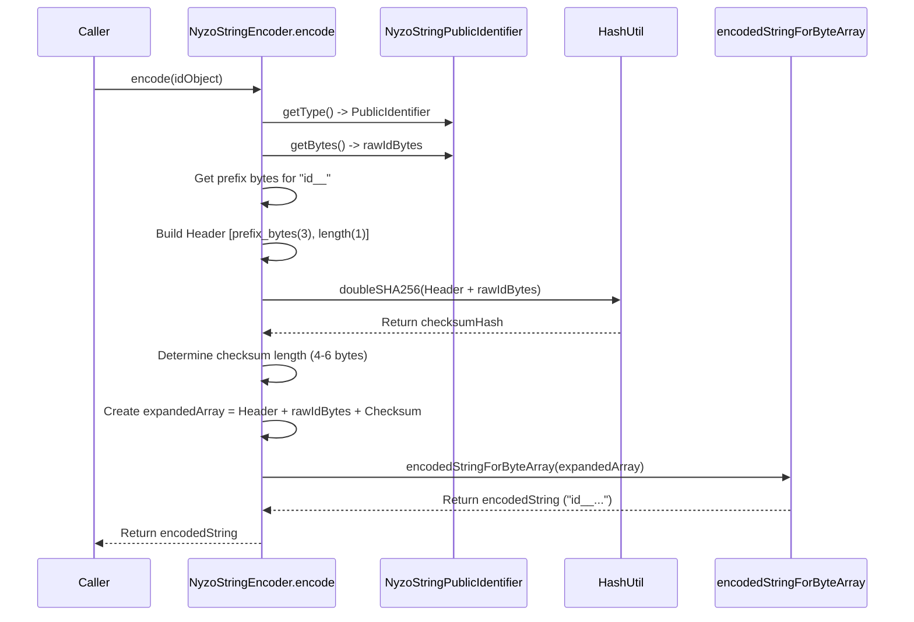
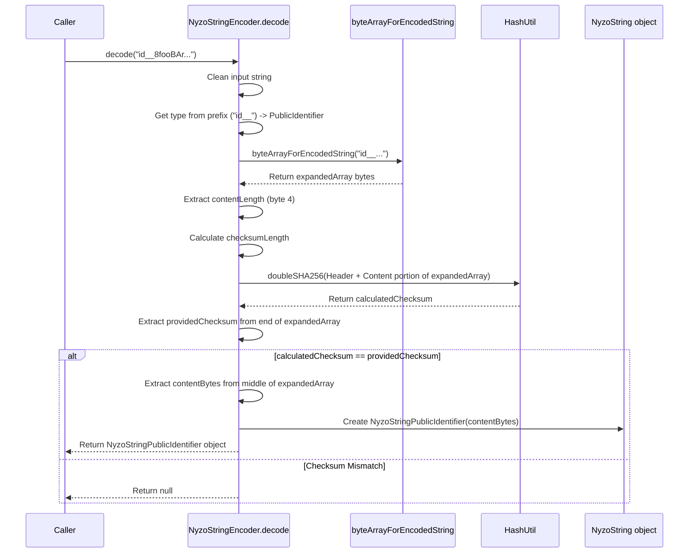

# Chapter 15: NyzoString

Welcome to the final chapter! In [Chapter 14: NewVerifierVoteManager](14_newverifiervotemanager.md), we looked at the specific process for voting new members into the active verifier cycle. Throughout these chapters, we've often talked about identifiers, keys, signatures, and transactions – usually representing them as raw sequences of bytes or long hexadecimal strings. While computers love bytes, humans find them incredibly difficult to read, copy, and share without making mistakes!

Imagine Alice wants to send Bob her Nyzo account address (her public identifier) so Bob can send her some Nyzo coins. If Alice just sends a long string of random-looking letters and numbers like `8a4f...e3b1`, it's very easy for Bob to mistype it, potentially sending coins to the wrong address! How can we make sharing important Nyzo data safer and more user-friendly?

**Use Case:** How can Alice represent her public identifier (or private key, or a transaction signature) as a simple text string that Bob can easily copy and paste, that clearly shows what kind of data it is, and that has built-in protection against typos? The answer is the `NyzoString` format!

## What is a NyzoString?

A `NyzoString` is a standardized way to represent important Nyzo data – like private keys, public identifiers (addresses), transaction details, or digital signatures – as human-readable text strings.

Think of it like a special **envelope format** designed for Nyzo data. Just like a physical envelope has a specific size, place for the address, and maybe a seal, a `NyzoString` has specific features:

1.  **Prefix:** It always starts with a short, easy-to-read prefix (like `key_` for private keys, `id__` for public identifiers, `tx__` for transactions, `sig_` for signatures). This immediately tells you what type of data is inside the "envelope."
2.  **Encoded Data:** The actual data (the bytes of the key, ID, etc.) is converted into a string using a specific set of characters (a variation of Base58/Base62, using letters and numbers but avoiding ambiguous ones like 'l' and 'O'). This makes the string relatively compact and easy to select/copy.
3.  **Checksum:** A small checksum (a calculated value based on the data) is included within the encoded string. This is like a security seal. If you accidentally change even one character when typing or copying the `NyzoString`, the checksum will likely mismatch when someone tries to use it, and the software will know the string is corrupted.

This combination makes `NyzoString`s:

*   **Human-Readable:** The prefix tells you the type.
*   **Copy-Paste Friendly:** It's just text.
*   **Error-Resistant:** The checksum catches typos.
*   **Type-Safe:** The prefix prevents you from accidentally using a private key where an address should go, for example.

## Examples of NyzoStrings

Here are what different types of NyzoStrings might look like:

*   **Private Seed:** `key_...` (Used to control an account)
*   **Public Identifier (Address):** `id__...` (Used to receive funds)
*   **Signature:** `sig_...` (Used to prove authenticity of a transaction or message)
*   **Transaction:** `tx__...` (Represents a complete transaction)
*   **Micropay:** `pay_...` (A specialized string for small, off-chain payments)
*   **Prefilled Data:** `pre_...` (Often used in QR codes to prefill transaction details like receiver and amount)

The `...` represents the encoded data and checksum part of the string.

## Using NyzoStrings (Conceptual)

Let's see how Alice would use a `NyzoString` to share her address (public identifier).

**1. Encoding (Alice's Side):**

Alice has her public identifier as raw bytes. Her wallet software uses the `NyzoStringEncoder` to create the user-friendly string.

```java
// Alice's raw public identifier (32 bytes)
byte[] alicesRawId = getAlicesIdentifierBytes();

// Create a NyzoString object for the identifier
NyzoStringPublicIdentifier idObject = new NyzoStringPublicIdentifier(alicesRawId);

// Encode it into the standardized string format
String aliceNyzoStringId = NyzoStringEncoder.encode(idObject);

// aliceNyzoStringId might look like: "id__8fooBAr..."
System.out.println("Alice's NyzoString Address: " + aliceNyzoStringId);

// Alice can now safely copy and send this string to Bob.
```

**Explanation:**

*   We start with the raw `byte[]` identifier.
*   We wrap it in a specific `NyzoString` type object (`NyzoStringPublicIdentifier`). This tells the encoder what prefix to use.
*   We call `NyzoStringEncoder.encode()` which takes the object, adds the `id__` prefix, encodes the bytes, calculates and adds the checksum, and returns the final human-readable string.

**2. Decoding (Bob's Side):**

Bob receives the `NyzoString` from Alice (`id__8fooBAr...`). His wallet software uses the `NyzoStringEncoder` to decode it and verify it.

```java
// Bob receives this string from Alice
String receivedString = "id__8fooBAr..."; // (Example string)

// Try to decode the string
NyzoString decodedObject = NyzoStringEncoder.decode(receivedString);

if (decodedObject != null) {
    // Success! Checksum was valid. Now check the type.
    if (decodedObject.getType() == NyzoStringType.PublicIdentifier) {
        // It's the correct type (an address)
        NyzoStringPublicIdentifier idObject = (NyzoStringPublicIdentifier) decodedObject;

        // Get the raw identifier bytes back
        byte[] alicesRawId = idObject.getIdentifier();
        System.out.println("Successfully decoded Alice's ID. Ready to use.");
        // Bob's wallet can now use alicesRawId to send funds.

    } else {
        // Checksum was valid, but it wasn't an ID string!
        System.out.println("Error: Received string is not a Public Identifier! Type: " +
                           decodedObject.getType());
    }
} else {
    // Decoding failed! The string might be corrupted (checksum mismatch) or invalid.
    System.out.println("Error: Invalid or corrupt NyzoString received!");
}
```

**Explanation:**

*   Bob's software calls `NyzoStringEncoder.decode()` on the received string.
*   This function first checks the prefix (`id__`) to see the expected type.
*   It then decodes the rest of the string back into bytes.
*   It recalculates the checksum based on the decoded data and compares it to the checksum embedded in the string.
*   If the checksum matches and the format is valid, it returns the appropriate `NyzoString` object (e.g., `NyzoStringPublicIdentifier`).
*   If the checksum fails or the string is malformed, it returns `null`.
*   Bob's software checks if the result is `null` and if the type is the expected `PublicIdentifier`.

## Under the Hood: Encoding

How does `NyzoStringEncoder.encode()` work?

1.  **Get Parts:** It takes the `NyzoString` object (e.g., `NyzoStringPublicIdentifier`) and gets the corresponding prefix bytes (`id__` becomes specific bytes) and the content bytes (the raw identifier).
2.  **Build Header:** It creates a 4-byte header: the first 3 bytes represent the prefix, and the 4th byte stores the length of the content bytes.
3.  **Assemble for Checksum:** It combines the 4-byte header and the content bytes.
4.  **Calculate Checksum:** It calculates a SHA-256 hash (twice!) of the combined header + content.
5.  **Determine Checksum Length:** It takes the first 4 bytes of the hash as the checksum. It might take 1 or 2 *extra* bytes from the hash if needed to make the total length (header + content + checksum) divisible by 3 (this helps with the encoding math later).
6.  **Create Expanded Array:** It creates a final byte array containing: `[Header (4 bytes)] + [Content Bytes] + [Checksum Bytes (4-6 bytes)]`.
7.  **Encode to String:** It converts this `expandedArray` into the final human-readable string using a Base62-like character set. Each character represents 6 bits of data.



**Code Snippet (`NyzoStringEncoder.java` - Simplified `encode`):**

```java
// --- File: src/main/java/co/nyzo/verifier/nyzoString/NyzoStringEncoder.java ---

public class NyzoStringEncoder {

    private static final int headerLength = 4;

    public static String encode(NyzoString stringObject) {

        // 1. Get Parts
        byte[] prefixBytes = stringObject.getType().getPrefixBytes(); // From NyzoStringType enum
        byte[] contentBytes = stringObject.getBytes(); // The raw data

        // 5. Determine Checksum Length (Needs to make total length divisible by 3 for encoding)
        int checksumLength = 4 + (3 - (contentBytes.length + 2) % 3) % 3; // 4, 5, or 6 bytes
        int expandedLength = headerLength + contentBytes.length + checksumLength;
        byte[] expandedArray = new byte[expandedLength];
        ByteBuffer expandedBuffer = ByteBuffer.wrap(expandedArray);

        // 2. Build Header & 6. Add Content
        for (int i = 0; i < 3; i++) { // First 3 bytes of prefix
            expandedBuffer.put(prefixBytes[i]);
        }
        expandedBuffer.put((byte) contentBytes.length); // 4th byte is content length
        expandedBuffer.put(contentBytes); // Add the actual content

        // 3. Assemble for Checksum (Implicitly done above)
        // 4. Calculate Checksum
        byte[] checksum = HashUtil.doubleSHA256(Arrays.copyOf(expandedArray, headerLength + contentBytes.length));

        // 6. Add Checksum
        expandedBuffer.put(checksum, 0, checksumLength); // Add the calculated checksum bytes

        // 7. Encode to String
        return encodedStringForByteArray(expandedArray); // Convert bytes to Base62-like string
    }

    // Helper function to convert bytes to the NyzoString character set (Simplified Concept)
    public static String encodedStringForByteArray(byte[] array) {
        StringBuilder encoded = new StringBuilder();
        // ... Complex bit manipulation logic to convert bytes to characters
        //     using the 'characterLookup' array (0-9, a-z except l, A-Z except O, -.~_) ...
        return encoded.toString();
    }
    // ...
}
```

## Under the Hood: Decoding

How does `NyzoStringEncoder.decode()` work?

1.  **Clean Input:** It handles potential typos (`l`->`I`, `O`->`0`) and maps characters from an older encoding if necessary.
2.  **Check Prefix:** It reads the first 4 characters to determine the expected `NyzoStringType`. If the prefix isn't recognized, it fails.
3.  **Decode String to Bytes:** It converts the Base62-like string back into the `expandedArray` of bytes.
4.  **Extract Parts:** It reads the content length from the 4th byte of the `expandedArray`. It calculates the checksum length based on the total array length and content length.
5.  **Verify Checksum:** It calculates the checksum again by hashing the header + content portion of the `expandedArray`. It compares this calculated checksum to the checksum bytes found at the end of the `expandedArray`. If they don't match, it fails (returns `null`).
6.  **Extract Content:** If the checksum is valid, it extracts the `contentBytes` from the middle of the `expandedArray`.
7.  **Create Object:** Based on the `NyzoStringType` identified in step 2, it uses the `contentBytes` to create the appropriate `NyzoString` object (e.g., `new NyzoStringPublicIdentifier(contentBytes)`).



**Code Snippet (`NyzoStringEncoder.java` - Simplified `decode`):**

```java
// --- File: src/main/java/co/nyzo/verifier/nyzoString/NyzoStringEncoder.java ---

public class NyzoStringEncoder {

    public static NyzoString decode(String encodedString) {
        NyzoString result = null;
        try {
            // 1. Clean Input
            encodedString = encodedString.replace('l', 'I').replace('O', '0');
            // ... handle old encoding characters ...

            // 2. Check Prefix
            NyzoStringType type = NyzoStringType.forPrefix(encodedString.substring(0, 4));
            if (type != null) {

                // 3. Decode String to Bytes
                byte[] expandedArray = byteArrayForEncodedString(encodedString);

                // 4. Extract Parts
                int contentLength = expandedArray[3] & 0xff; // Get length from 4th byte
                int checksumLength = expandedArray.length - contentLength - headerLength;

                if (checksumLength >= 4 && checksumLength <= 6) { // Valid checksum length?
                    // 5. Verify Checksum
                    byte[] calculatedChecksum = Arrays.copyOf(
                            HashUtil.doubleSHA256(Arrays.copyOf(expandedArray, headerLength + contentLength)),
                            checksumLength);
                    byte[] providedChecksum = Arrays.copyOfRange(expandedArray, expandedArray.length - checksumLength,
                            expandedArray.length);

                    if (ByteUtil.arraysAreEqual(calculatedChecksum, providedChecksum)) {
                        // Checksum OK!

                        // 6. Extract Content
                        byte[] contentBytes = Arrays.copyOfRange(expandedArray, headerLength,
                                expandedArray.length - checksumLength);

                        // 7. Create Object based on type
                        switch (type) {
                            case PrivateSeed: result = new NyzoStringPrivateSeed(contentBytes); break;
                            case PublicIdentifier: result = new NyzoStringPublicIdentifier(contentBytes); break;
                            case Signature: result = new NyzoStringSignature(contentBytes); break;
                            // ... cases for Transaction, Micropay, PrefilledData ...
                        }
                    }
                }
            }
        } catch (Exception ignored) { /* Return null on any error */ }

        return result; // Return the created object or null if any check failed
    }

    // Helper function to convert NyzoString characters back to bytes (Simplified Concept)
    public static byte[] byteArrayForEncodedString(String encodedString) {
        byte[] array = new byte[encodedString.length() * 6 / 8];
        // ... Complex bit manipulation logic using 'characterToValueMap' ...
        return array;
    }
    // ...
}
```

## Conclusion

The `NyzoString` format is a clever solution to the problem of handling raw cryptographic data. By adding a clear type prefix, using a specific character encoding, and including a robust checksum, it provides a way to represent keys, identifiers, signatures, and more as text strings that are much easier and safer for humans to use than raw bytes or hex. This improves usability and reduces the risk of costly errors when sending addresses or backing up private keys.

This concludes our introductory tour of the core concepts within the `nyzoVerifier` project. We hope this journey through Blocks, Transactions, Balances, Nodes, Messages, Voting, and NyzoStrings has given you a solid foundation for understanding how the Nyzo blockchain operates!

---

Generated by [AI Codebase Knowledge Builder](https://github.com/The-Pocket/Tutorial-Codebase-Knowledge)