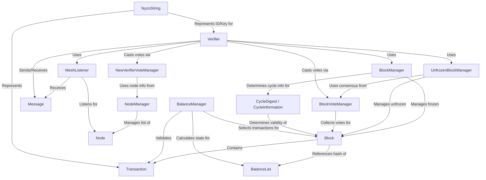

# Tutorial: nyzoVerifier

The `nyzoVerifier` project is responsible for participating in the Nyzo **blockchain** network.
Its main job is to *validate* new **blocks** and **transactions** proposed by other participants (*nodes*).
It manages the blockchain history, communicates with other nodes using **messages**, participates in **voting** to reach consensus on the next valid block, and maintains the list of account **balances**.

**Source Repository:** [None](None)

## Chapters

1. [Block
](01_block_.md)
2. [Transaction
](02_transaction_.md)
3. [BalanceList
](03_balancelist_.md)
4. [BalanceManager
](04_balancemanager_.md)
5. [CycleDigest / CycleInformation
](05_cycledigest___cycleinformation_.md)
6. [BlockManager
](06_blockmanager_.md)
7. [BlockVoteManager
](07_blockvotemanager_.md)
8. [UnfrozenBlockManager
](08_unfrozenblockmanager_.md)
9. [Node
](09_node_.md)
10. [NodeManager
](10_nodemanager_.md)
11. [Message
](11_message_.md)
12. [MeshListener
](12_meshlistener_.md)
13. [Verifier
](13_verifier_.md)
14. [NewVerifierVoteManager
](14_newverifiervotemanager_.md)
15. [NyzoString
](15_nyzostring_.md)

---

Generated by [AI Codebase Knowledge Builder](https://github.com/The-Pocket/Tutorial-Codebase-Knowledge)